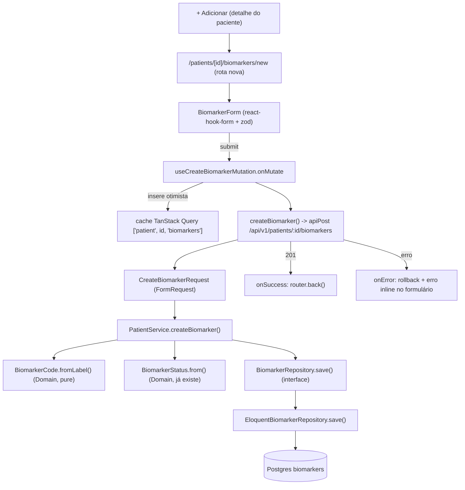

# Criação manual de biomarcador Design

**Spec**: `.specs/features/biomarcadores-criar/spec.md`
**Context**: `.specs/features/biomarcadores-criar/context.md`
**Status**: Draft

---

## Architecture Overview

Escrita nova de ponta a ponta: rota POST → FormRequest → Service → Domain (slug + status
derivados) → Repository → Eloquent. No mobile, primeiro formulário real do projeto: react-hook-form
+ zod, sem nenhum componente de dropdown novo (o campo de gravidade manual foi descartado no
discuss — sobra só texto e número).



---

## Code Reuse Analysis

### Existing Components to Leverage

| Component | Location | How to Use |
| --- | --- | --- |
| `PatientNotFound` | `api/app/Domain/Patient/PatientNotFound.php` | Reusar para 404 quando `patientId` não existe (já tratada pelo `Exceptions\Handler` global) |
| `BiomarkerStatus::from()` | `api/app/Domain/Biomarker/BiomarkerStatus.php` | Chamar direto no `PatientService.createBiomarker()` — nenhuma mudança nessa classe |
| `BiomarkerResource` | `api/app/Http/Resources/BiomarkerResource.php` | Reusar sem alteração para serializar a resposta 201 |
| `Biomarker` (Domain entity) | `api/app/Domain/Biomarker/Biomarker.php` | Reusar sem alteração — já tem todos os campos necessários |
| `UpdateFollowUpRequest` (padrão de estilo) | `api/app/Http/Requests/UpdateFollowUpRequest.php` | Template de `final class` + `authorize(): true` + `rules()` tipado para `CreateBiomarkerRequest` |
| `apiPost` / `apiGet` (http client) | `mobile/src/core/api/http.ts` | Reusar sem alteração para a chamada de criação |
| `biomarkerSchema` | `mobile/src/core/api/schemas/biomarker.ts` | Reusar para parsear a resposta 201; estender o arquivo com `createBiomarkerInputSchema` |
| `fetchPatientBiomarkers` (colocation) | `mobile/src/core/api/patients.ts` | Adicionar `createBiomarker()` no mesmo arquivo — mesmo recurso REST |
| `useDecideAiActionMutation` (padrão onMutate/onError/onSettled) | `mobile/src/core/patients/useDecideAiActionMutation.ts` | Referência de como as mutations do projeto usam `queryClient.setQueryData`; a nova mutation faz o mesmo, mas com `onMutate` (essa é a primeira mutation otimista de verdade do projeto — as duas existentes de ai-actions são explicitamente não-otimistas) |
| `createTestQueryClient` | `mobile/src/core/offline/queryClient.ts` | Reusar nos testes da nova mutation, sem alteração |
| `useTheme()` + tokens semânticos | `mobile/src/core/theme/useTheme.ts` | Todo estilo do formulário vem daqui — nenhum literal de cor/raio/fonte |
| Padrão de `TextInput` temático | `mobile/src/app/(tabs)/index.tsx:139-151` (busca de pacientes) | Mesmo estilo (`colors.surface`, `radii.md`, `spacing`) para os campos do formulário |

### Integration Points

| System | Integration Method |
| --- | --- |
| Postgres | Novo `INSERT` via `EloquentBiomarkerRepository::save()`, mesma tabela `biomarkers` (nenhuma migration nova — todas as colunas necessárias já existem) |
| TanStack Query cache | Mesma `queryKey` já usada por `usePatientBiomarkersQuery`: `['patient', patientId, 'biomarkers']` — a mutation escreve nela |
| Expo Router | Rota nova aninhada exige converter `mobile/src/app/patients/[id].tsx` (arquivo) em `mobile/src/app/patients/[id]/index.tsx` (pasta), porque Expo Router não permite um arquivo `[id].tsx` e uma pasta `[id]/` coexistindo para o mesmo segmento — ver Risks & Concerns |

---

## Components

### `BiomarkerCode` (Domain, novo)

- **Purpose**: Gerar `code` a partir de `label` sem depender de Laravel (mantém o teste mental do
  §6.1: a pasta `Domain/` compila sem framework).
- **Location**: `api/app/Domain/Biomarker/BiomarkerCode.php`
- **Interfaces**:
  - `static fromLabel(string $label): string` — minúsculas, `Transliterator` do `ext-intl`
    (`Any-Latin; Latin-ASCII`, já disponível — `CLAUDE.md` §8 lista `intl` como extensão obrigatória
    do Dockerfile) para tirar acento, depois regex `[^a-z0-9]+` → `_`, `trim` de `_` nas pontas.
- **Dependencies**: `ext-intl` (`Transliterator`), nenhuma dependência de framework.
- **Reuses**: nada — classe nova, pura.

### `CreateBiomarkerData` (Domain, novo — DTO)

- **Purpose**: Cruzar a fronteira Controller → Service sem array solto (`CLAUDE.md` §2.3/§6.1
  proíbe array associativo atravessando camada).
- **Location**: `api/app/Domain/Biomarker/CreateBiomarkerData.php`
- **Interfaces**: `readonly` — `label: string`, `value: float`, `unit: string`, `refMin: float`,
  `refMax: float`, `measuredAt: string` (ISO 8601).
- **Dependencies**: nenhuma.
- **Reuses**: nada — segue o mesmo espírito de `ListPatientsQuery` já citado em `CLAUDE.md` §6.2.

### `BiomarkerRepository` (Domain, interface existente — estendida)

- **Purpose**: Adicionar o método de escrita que falta hoje (interface só tinha `listForPatient`).
- **Location**: `api/app/Domain/Biomarker/BiomarkerRepository.php`
- **Interfaces**: `save(Biomarker $biomarker): void` (novo, além do `listForPatient` existente).
- **Dependencies**: nenhuma (continua interface pura).
- **Reuses**: a entidade `Biomarker` já existente.

### `EloquentBiomarkerRepository` (Infrastructure — estendida)

- **Purpose**: Implementar `save()` via Eloquent.
- **Location**: `api/app/Infrastructure/Persistence/Eloquent/EloquentBiomarkerRepository.php`
- **Interfaces**: `save(Biomarker $biomarker): void` → `BiomarkerModel::query()->create([...])`
  incluindo `id` explícito (o id já vem gerado do Service, ver abaixo — mesmo padrão do
  `AiActionService`, que gera `Uuid::uuid4()->toString()` antes de persistir).
- **Dependencies**: `Infrastructure/Persistence/Eloquent/Models/Biomarker` (Eloquent model —
  precisa de `'id'` adicionado a `$fillable`, hoje só tem os 8 campos de negócio).
- **Reuses**: o mesmo `BiomarkerModel` já usado por `listForPatient()`.

### `PatientService::createBiomarker()` (Application — estendida)

- **Purpose**: Orquestrar a criação — validar que o paciente existe, gerar `id`/`code`/`status`,
  persistir, devolver a entidade completa.
- **Location**: `api/app/Application/Patient/PatientService.php`
- **Interfaces**: `createBiomarker(string $patientId, CreateBiomarkerData $data): Biomarker`
- **Dependencies**: `PatientRepository` (checar existência do paciente — já injetado),
  `BiomarkerRepository` (já injetado), `Ramsey\Uuid\Uuid` (mesmo pacote já usado por
  `AiActionService`).
- **Reuses**: `PatientNotFound` (já lançada por `listBiomarkers`, mesmo padrão), `BiomarkerCode`,
  `BiomarkerStatus::from()`.

### `CreateBiomarkerRequest` (Http, novo)

- **Purpose**: Validar o payload de escrita e traduzi-lo em `CreateBiomarkerData`.
- **Location**: `api/app/Http/Requests/CreateBiomarkerRequest.php`
- **Interfaces**:
  - `rules(): array` — `label: required|string|min:2|max:120`, `value: required|numeric|gt:0`,
    `unit: required|string|max:20`, `refMin: required|numeric|gte:0`,
    `refMax: required|numeric|gt:refMin` (regra nativa do Laravel `gt:field` cobre o cross-field
    sem `Validator::after`), `measuredAt: required|date`.
  - `toData(): CreateBiomarkerData` — mapeia `$this->validated()` para o DTO (mapeamento de dados,
    não regra de negócio — permanece na camada Http, mantém o Controller com só quatro
    responsabilidades por `CLAUDE.md` §2.2).
- **Dependencies**: `CreateBiomarkerData`.
- **Reuses**: estilo de `UpdateFollowUpRequest` (`final class`, `authorize(): true`).

### `PatientController::createBiomarker()` (Http — estendida)

- **Purpose**: Fio entre FormRequest, Service e Resource — nada além disso.
- **Location**: `api/app/Http/Controllers/Api/V1/PatientController.php`
- **Interfaces**:
  `createBiomarker(CreateBiomarkerRequest $request, string $id): JsonResponse` → 201, header
  `Location` apontando para `route('...')`/URL de `/api/v1/patients/{id}/biomarkers` (não existe GET
  de biomarcador individual — o `Location` aponta para a coleção, decisão registrada em Tech
  Decisions), corpo = `new BiomarkerResource($biomarker)`.
- **Dependencies**: `PatientService`.
- **Reuses**: `BiomarkerResource` sem alteração.

### `BiomarkerCard` extraído (Mobile, refactor leve)

- **Purpose**: Antes de adicionar o botão, extrair a renderização de linha de biomarcador
  (`BiomarkerRow`, hoje inline em `[id].tsx:147-200`) para poder colocar o cabeçalho "Biomarcadores
  + botão Adicionar" sem inflar ainda mais um arquivo já grande.
- **Location**: mantém-se dentro do mesmo arquivo de rota (não vale a pena extrair para
  `core/ui/` — é usado só ali); apenas isola visualmente cabeçalho + lista + empty state num bloco
  `BiomarkersSection` local, no mesmo padrão de `AiActionsSection` mas sem precisar virar arquivo
  próprio ainda (evita abstração prematura — só um lugar de uso).
- **Interfaces**: função local `BiomarkersSection({ patientId, biomarkers })`.
- **Dependencies**: `router` do `expo-router` (para o botão "+ Adicionar").
- **Reuses**: `BiomarkerRow`, `BiomarkersEmptyState` já existentes, sem mudança de comportamento.

### `BiomarkerForm` (Mobile, novo)

- **Purpose**: Formulário de criação — react-hook-form + zod, com preview de status calculado.
- **Location**: `mobile/src/core/ui/BiomarkerForm.tsx`
- **Interfaces**: `BiomarkerForm({ patientId, onSuccess }: { patientId: string; onSuccess: () =>
  void })`. Usa `useForm({ resolver: zodResolver(createBiomarkerInputSchema) })`; observa os campos
  `value`/`refMin`/`refMax` via `watch()` para computar o selo de status ao vivo.
- **Dependencies**: `react-hook-form`, `@hookform/resolvers/zod` (dependências novas — ver Tech
  Decisions), `useCreateBiomarkerMutation`, `computeBiomarkerStatus` (função pura nova).
- **Reuses**: `useTheme()`, padrão visual do `TextInput` de `(tabs)/index.tsx`.

### `computeBiomarkerStatus` (Mobile, novo — função pura)

- **Purpose**: Espelhar `BiomarkerStatus::from()` no cliente, para (a) o selo de preview ao vivo no
  formulário e (b) o item otimista inserido no cache antes da resposta do servidor.
- **Location**: `mobile/src/core/patients/biomarkerStatus.ts`
- **Interfaces**: `computeBiomarkerStatus(value: number, refMin: number, refMax: number):
  BiomarkerStatus`
- **Dependencies**: nenhuma.
- **Reuses**: nada — é a única duplicação de regra de negócio nesta feature (ver Risks & Concerns).

### `useCreateBiomarkerMutation` (Mobile, novo)

- **Purpose**: Mutation otimista de criação.
- **Location**: `mobile/src/core/patients/useCreateBiomarkerMutation.ts`
- **Interfaces**: `useCreateBiomarkerMutation(patientId: string):
  UseMutationResult<Biomarker, ApiError, CreateBiomarkerInput>`
  - `onMutate`: cancela queries em voo da chave, salva snapshot, injeta um `Biomarker` otimista
    (`id: `optimistic-${crypto.randomUUID?.() ?? Date.now()}``, `code: ''`, status via
    `computeBiomarkerStatus`) no topo da lista em cache.
  - `onError`: restaura o snapshot salvo em `onMutate`.
  - `onSettled`: invalida `['patient', patientId, 'biomarkers']` (reconcilia com o dado real —
    id/code/status do servidor).
- **Dependencies**: `createBiomarker` (api function nova), `computeBiomarkerStatus`.
- **Reuses**: mesmo padrão de acesso à `queryClient` de `useDecideAiActionMutation`.

---

## Data Models

Nenhuma migration nova — a tabela `biomarkers` já tem todas as colunas necessárias
(`api/database/migrations/0000_12_31_000002_create_biomarkers_table.php:13-25`).

```typescript
// mobile/src/core/api/schemas/biomarker.ts (schema estendido)
export const createBiomarkerInputSchema = z
  .object({
    label: z.string().min(2).max(120),
    value: z.number().gt(0),
    unit: z.string().min(1).max(20),
    refMin: z.number().gte(0),
    refMax: z.number(),
    measuredAt: z.string(), // "YYYY-MM-DD", ver Tech Decisions
  })
  .refine((data) => data.refMax > data.refMin, {
    message: 'A faixa máxima deve ser maior que a mínima.',
    path: ['refMax'],
  });

export type CreateBiomarkerInput = z.infer<typeof createBiomarkerInputSchema>;
```

**Relationships**: `CreateBiomarkerInput` (mobile) ⇄ `CreateBiomarkerData` (backend DTO) — mesmo
formato de campos; a resposta 201 já é `biomarkerSchema` existente, sem mudança.

---

## Error Handling Strategy

| Error Scenario | Handling | User Impact |
| --- | --- | --- |
| `patientId` não existe | `PatientNotFound` lançada no Service, traduzida pelo `Exceptions\Handler` global (já existe) | 404 com envelope padrão; mobile trata como erro genérico de rede (raro na prática — só acontece com paciente deletado entre a navegação e o submit) |
| Payload inválido (client bypassado) | `CreateBiomarkerRequest` rejeita antes do Controller | 422 com erros de campo no envelope padrão |
| `refMin >= refMax` | Bloqueado nos dois lados: zod `.refine()` no mobile (P2 AC3), `gt:refMin` no `CreateBiomarkerRequest` (defesa em profundidade) | Mensagem inline no campo `refMax` antes de qualquer chamada de rede; 422 se o cliente for contornado |
| Falha de rede durante o POST | `onError` da mutation reverte o item otimista do cache | Item some da lista, formulário continua aberto com os dados digitados, mensagem de erro inline + botão de tentar de novo (reenvia o mesmo `mutate()`) |
| Sucesso (201) | `onSuccess` no `mutate()` navega de volta (`router.back()`); `onSettled` já disparou a invalidação | Usuário volta para o detalhe do paciente e vê o item já reconciliado com o dado real |

---

## Risks & Concerns

| Concern | Location (file:line) | Impact | Mitigation |
| --- | --- | --- | --- |
| Expo Router não permite arquivo `[id].tsx` e pasta `[id]/` coexistindo | `mobile/src/app/patients/[id].tsx` | Adicionar a rota aninhada `biomarkers/new` exige mover o arquivo atual para `patients/[id]/index.tsx` — mudança mecânica, mas toca um arquivo grande (269 linhas) e seu teste | Task dedicada só para o `git mv` + atualização do teste, **antes** de qualquer mudança de conteúdo — commit isolado, fácil de revisar e reverter se algo quebrar |
| Duplicação da regra `BiomarkerStatus::from()` entre backend (PHP) e mobile (`computeBiomarkerStatus`, TS) | `api/app/Domain/Biomarker/BiomarkerStatus.php` vs `mobile/src/core/patients/biomarkerStatus.ts` | Se a regra de negócio mudar um dia (ex.: banda de tolerância), alguém pode esquecer de atualizar os dois lados | Mitigação aceita conscientemente: o valor final sempre vem do servidor via `onSettled`/invalidate — a versão do cliente só vale para o preview e para o item otimista, nunca é a fonte de verdade persistida. Comentário — não, nada de comentário no código; registrar aqui e no teste do `computeBiomarkerStatus` que ele deve espelhar exatamente `BiomarkerStatus::from()` |
| Primeira mutation genuinamente otimista do projeto para uma **criação** (as existentes são para status de item já existente) | `mobile/src/core/patients/useDecideAiActionMutation.ts` (referência, não é otimista) | Um `id` temporário (`optimistic-...`) pode colidir visualmente se o usuário criar dois biomarcadores em sequência rápida antes do primeiro assentar | `queryKey` list é reconciliada inteira no `onSettled` (invalidate + refetch), então a janela de colisão é só visual e curta; sem persistência do id otimista além do ciclo da mutation |
| `PatientService` está virando um service "genérico de paciente" (lista biomarcador, agora também cria) | `api/app/Application/Patient/PatientService.php` | Pode crescer demais no futuro (ex.: se `AiAction` também precisasse de paciente) | Aceito por ora — `listBiomarkers` já mora lá, criar `createBiomarker` no mesmo lugar é a menor mudança e segue o precedente existente; se crescer mais, extrair `BiomarkerService` fica para uma feature futura, não esta |

> Nenhum risco de segurança novo identificado — sem autenticação real no projeto (`CLAUDE.md` §15),
> mass assignment do `id` em `EloquentBiomarkerRepository::save()` é controlado (gerado por
> `Uuid::uuid4()` no Service, nunca aceito do cliente).

---

## Tech Decisions (only non-obvious ones)

| Decision | Choice | Rationale |
| --- | --- | --- |
| `measuredAt` como texto `YYYY-MM-DD`, sem date picker nativo | `TextInput` simples + `zod` validando formato de data | Evita adicionar `@react-native-community/datetimepicker` (dependência nova fora da stack fixa do `CLAUDE.md`) para um único campo; se a UX pedir picker nativo depois, é uma mudança isolada nesse componente |
| Reconciliar AC2 (otimista) com AC4 (erro inline no formulário) navegando só no sucesso | `mutate(input, { onSuccess: () => router.back(), onError: () => setErrorState(...) })`, botão desabilitado via `mutation.isPending` durante o voo | Lidas ao pé da letra, as duas ACs pareciam pedir coisas conflitantes (navegar embora vs. mostrar erro na tela). Essa leitura satisfaz as duas: o cache já reflete o item otimista assim que `onMutate` roda (síncrono), e a navegação só acontece confirmada — erro mantém o usuário no formulário com os dados intactos, como a spec pede |
| `code` gerado via `ext-intl` `Transliterator`, não `Illuminate\Support\Str::slug()` | Classe pura em `Domain/Biomarker/BiomarkerCode.php` | `CLAUDE.md` §12 proíbe facade em `Domain`/`Application`; `Str::slug()` é da árvore `Illuminate\`, quebraria o teste mental do §6.1 ("copiar `Domain/` para fora do Laravel e compilar") |
| `Location` do 201 aponta para a coleção (`/api/v1/patients/{id}/biomarkers`), não para um recurso individual | Sem GET de biomarcador único no projeto | Criar um novo endpoint GET só para satisfazer o header `Location` seria escopo novo não pedido; a coleção já é o único jeito de "reler" um biomarcador hoje |
| Formulário sem componente `Input`/`Select` genérico em `core/ui/` | Campos inline dentro de `BiomarkerForm.tsx`, seguindo o estilo já usado no `TextInput` de busca | Um único ponto de uso hoje; criar uma abstração compartilhada agora é design especulativo — `CLAUDE.md` intro pede não introduzir abstração além do necessário |
| `react-hook-form` + `@hookform/resolvers` entram como dependência nova | Primeira vez usados no projeto | Já são a escolha fixa do `CLAUDE.md` (tabela de stack mobile) para formulários — não são uma dependência "nova" no sentido de desvio de stack, só a primeira vez que um formulário de verdade existe para justificá-las |

> Nenhuma dessas decisões estabelece um padrão de projeto amplo o suficiente para virar `AD-NNN`
> em `.specs/STATE.md` — são todas locais a esta feature (a mais próxima de virar convenção,
> "onde botar o Input genérico", foi explicitamente adiada até haver um segundo formulário).
