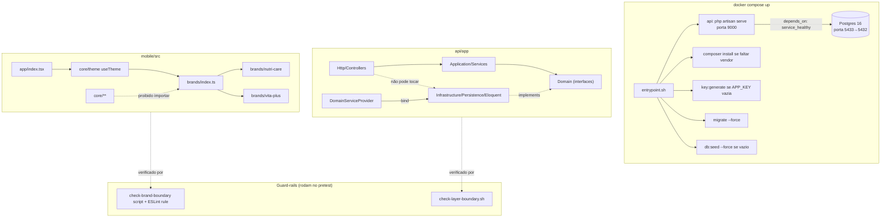

# Fase 0 — Fundação Design

**Spec**: `.specs/features/fase-0-fundacao/spec.md`
**Status**: Approved

---

## Architecture Overview

Dois projetos independentes num monorepo (`api/`, `mobile/`), sem código compartilhado (o contrato
entre eles é OpenAPI + zod, não tipos TS compartilhados — CLAUDE.md §3). A Fase 0 constrói o
esqueleto de cada um mais os dois guard-rails mecânicos que protegem as regras invioláveis mais
caras de violar tarde.



**Fluxo de configuração (a regra que o usuário pediu para deixar explícita):** nenhum dos dois
subgrafos acima lê valor hardcoded. `docker-compose.yml` usa `env_file: api/.env`;
`app.config.ts` lê `process.env.APP_BRAND` e `process.env.EXPO_PUBLIC_API_URL`. Cada projeto tem seu
próprio `.env`/`.env.example` — ver Componente "Configuração por ambiente" abaixo.

---

## Code Reuse Analysis

Projeto greenfield (`api/` e `mobile/` vazios) — não há código existente para reaproveitar. A
"reutilização" aqui é de **padrão**, não de código: tudo que a Fase 0 cria é o padrão que as Fases
1-5 devem seguir sem reinventar.

### Integration Points

| System                          | Integration Method                                                        |
| -------------------------------- | -------------------------------------------------------------------------- |
| Postgres 16                      | Eloquent, confinado a `Infrastructure/Persistence/Eloquent/`               |
| Docker Compose ↔ Laravel        | `env_file: api/.env`, entrypoint que roda migrate/seed condicionalmente    |
| Expo Router ↔ contrato de marca | `app.config.ts` injeta `extra.brandId`; `BrandProvider` na raiz lê runtime |

---

## Components

### Backend — `DomainServiceProvider` + exemplo de inversão de dependência

- **Purpose**: Provar que a camada `Domain` (interface) → `Infrastructure` (implementação) → bind
  funciona antes de qualquer feature real depender dela.
- **Location**: `api/app/Domain/FeatureFlag/FeatureFlagRepository.php` (interface),
  `api/app/Infrastructure/Persistence/Eloquent/EloquentFeatureFlagRepository.php` (implementação),
  `api/app/Infrastructure/Persistence/Eloquent/Models/FeatureFlag.php` (Eloquent Model),
  `api/app/Providers/DomainServiceProvider.php` (binding)
- **Interfaces**:
  - `FeatureFlagRepository::findByKeyAndBrand(string $key, string $brandId): ?FeatureFlag` — usada
    pela Fase 1 (endpoint `GET /feature-flags`), definida agora para o binding ter algo real de
    ponta a ponta
- **Dependencies**: nenhuma (é o ponto de partida da inversão)
- **Reuses**: n/a (greenfield)

**Por que `FeatureFlag` e não `Patient` como exemplo mínimo?** `Patient` arrasta `BiomarkerStatus`,
paginação cursor e mais regra de negócio do que a Fase 0 precisa provar. `FeatureFlag` é a tabela
mais simples do modelo de dados (id, brand_id, key, enabled) e é exatamente o que a Fase 1 consome
primeiro — o exemplo da Fase 0 vira código real da Fase 1, não código descartável.

### Backend — Guard-rail de camada (`check-layer-boundary.sh`)

- **Purpose**: Falhar `composer test` quando `Illuminate\` aparece em `Domain/`, `DB::`/`Models\`
  aparece em `Application/`/`Http/Controllers/`, ou `$request->all()` aparece em um controller.
- **Location**: `api/scripts/check-layer-boundary.sh`, chamado por um script `pretest` no
  `composer.json`
- **Interfaces**: script shell, sem args, código de saída 0/1, imprime arquivo:linha do achado
- **Dependencies**: `grep -r` (POSIX, sem dependência de pacote)
- **Reuses**: template de grep já dado em CLAUDE.md §11.2 — a Fase 0 só torna o script executável e
  o liga ao `pretest`

### Backend — Migrations + Seeder

- **Purpose**: Criar as seis tabelas do modelo de dados e popular ≥5.000 pacientes determinísticos.
- **Location**: `api/database/migrations/*`, `api/database/seeders/{DatabaseSeeder,BrandSeeder,
  PatientSeeder,FeatureFlagSeeder}.php`, `api/database/factories/{PatientFactory,
  BiomarkerFactory}.php`
- **Interfaces**: `php artisan migrate`, `php artisan db:seed`
- **Dependencies**: `fakerphp/faker` (já vem com Laravel), seed fixa `42` (`fake()->seed(42)` ou
  `mt_srand`/`Faker\Factory::create()->seed(42)` conforme a API do pacote — confirmar em Tasks)
- **Reuses**: convenção padrão de Factory/Seeder do Laravel

### Backend — Docker Compose + entrypoint

- **Purpose**: `docker compose up` sobe `db` (Postgres 16, healthcheck) e `api` (`php:8.3-cli`,
  `php artisan serve --host=0.0.0.0 --port=9000`), rodando `composer install` condicional,
  `key:generate` condicional, `migrate --force`, `db:seed --force` condicional — tudo no
  entrypoint, sem passo manual.
- **Location**: `docker-compose.yml` (raiz), `api/docker/entrypoint.sh`, `api/Dockerfile`
- **Interfaces**: `docker compose up`, `docker compose down -v`
- **Dependencies**: extensões PHP `pdo_pgsql`, `bcmath`, `intl` (CLAUDE.md §8); `api/.env` (copiado
  de `api/.env.example` se ausente — ver Componente "Configuração por ambiente")
- **Reuses**: n/a

### Mobile — Contrato de marca + registry

- **Purpose**: Tipo `Brand`, duas implementações completas, registry único que resolve
  `APP_BRAND` → objeto `Brand`.
- **Location**: `mobile/src/core/theme/brand.types.ts`, `mobile/src/core/theme/BrandProvider.tsx`,
  `mobile/src/core/theme/useTheme.ts`, `mobile/src/brands/index.ts`,
  `mobile/src/brands/nutri-care/{theme,copy,assets}.ts`, `mobile/src/brands/vita-plus/{theme,copy,
  assets}.ts`
- **Interfaces**:
  - `useTheme(): Brand` — único ponto de leitura de tokens em qualquer componente do core
  - `resolveBrand(id: string): Brand` (em `brands/index.ts`) — lança erro claro se `id` desconhecido
- **Dependencies**: `app.config.ts` (injeta `extra.brandId` a partir de `process.env.APP_BRAND`)
- **Reuses**: n/a

### Mobile — Guard-rail de fronteira de marca

- **Purpose**: ESLint (`no-restricted-imports` em `src/core/**`) + script de grep
  (`mobile/scripts/check-brand-boundary.sh`) rodando no `pretest` do `npm test`.
- **Location**: `mobile/.eslintrc.js` (override), `mobile/scripts/check-brand-boundary.sh`,
  `mobile/package.json` (`"pretest": "npm run lint && bash scripts/check-brand-boundary.sh"`)
- **Interfaces**: script shell, código de saída 0/1
- **Dependencies**: `grep -r`, ESLint já configurado no projeto Expo
- **Reuses**: template de CLAUDE.md §11.1

### Mobile — Tela de prova (`app/index.tsx`)

- **Purpose**: Renderizar logo, `displayName`, bloco com `colors.accent`, texto com
  `typography.fontFamily.regular` da marca ativa, usando só `useTheme()`.
- **Location**: `mobile/app/index.tsx`
- **Interfaces**: rota Expo Router padrão, sem props
- **Dependencies**: `core/theme/useTheme`
- **Reuses**: n/a — é a primeira tela do projeto

### Mobile + Backend — Configuração por ambiente

- **Purpose**: Centralizar toda variável dependente de ambiente em `.env` próprio de cada projeto;
  zero literal hardcoded de URL/porta/credencial/brand-id em código versionado.
- **Location**: `api/.env.example`, `mobile/.env.example` (versionados); `api/.env`, `mobile/.env`
  (gitignored); leitura em `docker-compose.yml` (`env_file`), `app.config.ts`
  (`process.env.APP_BRAND`, `process.env.EXPO_PUBLIC_API_URL`)
- **Interfaces**: n/a (é configuração, não código)
- **Dependencies**: nenhuma
- **Reuses**: n/a

---

## Data Models

Migrations da Fase 0 criam as tabelas completas do modelo de dados (CLAUDE.md §7); só
`FeatureFlag` ganha entidade de `Domain` nesta fase (ver componente acima). As demais existem só
como tabela + Eloquent Model interno a `Infrastructure`, sem entidade de `Domain` ainda — chegam nas
Fases 2/3.

```sql
brands        (id uuid pk, slug text unique, display_name text)
users         (id uuid pk, name text, email text unique, brand_id uuid fk -> brands)
patients      (id uuid pk, brand_id uuid fk -> brands, name text, birth_date date, goal text,
               status text, updated_at timestamp)
              -- índice composto (brand_id, name)
biomarkers    (id uuid pk, patient_id uuid fk -> patients, code text, label text, value numeric,
               unit text, ref_min numeric, ref_max numeric, measured_at timestamp)
              -- índice composto (patient_id, measured_at)
              -- SEM coluna de "status" — é derivado, chega como enum na Fase 2
ai_actions    (id uuid pk, patient_id uuid fk -> patients, title text, rationale text,
               priority text, biomarkers jsonb, status text default 'pending',
               input_hash text, created_at timestamp)
feature_flags (id uuid pk, brand_id uuid fk -> brands, key text, enabled boolean)
              -- índice único (brand_id, key)
```

**Relationships**: `brands 1—N users`, `brands 1—N patients`, `patients 1—N biomarkers`,
`patients 1—N ai_actions`, `brands 1—N feature_flags`.

```typescript
// mobile/src/core/theme/brand.types.ts — contrato consumido pela tela de prova
type Brand = {
  id: string
  displayName: string
  colors: {
    background: string; surface: string; surfaceMuted: string
    textPrimary: string; textSecondary: string
    accent: string; accentContrast: string
    success: string; warning: string; danger: string
    border: string
  }
  typography: {
    fontFamily: { regular: string; medium: string; bold: string }
    scale: { xs: number; sm: number; md: number; lg: number; xl: number; display: number }
  }
  radii: { sm: number; md: number; lg: number; pill: number }
  spacing: (n: number) => number
  assets: { logo: ImageSourcePropType; splashIcon: ImageSourcePropType }
  copy: { patientsTitle: string; emptyPatients: string; aiDisclaimer: string }
  defaults: FeatureFlags
}
```

---

## Error Handling Strategy

| Error Scenario                                                  | Handling                                                                 | User Impact                                          |
| ----------------------------------------------------------------- | -------------------------------------------------------------------------- | ------------------------------------------------------ |
| `APP_BRAND` aponta para marca inexistente                       | `resolveBrand()` em `brands/index.ts` lança erro síncrono no boot         | Build/app falha cedo com mensagem clara, não crash mudo |
| `api/.env` ausente no host ao rodar `docker compose up`         | Entrypoint copia `api/.env.example` → `api/.env` automaticamente e loga aviso | API sobe com placeholders (ex. `ANTHROPIC_API_KEY` vazia), sem travar a Fase 0 |
| `db` não fica saudável a tempo                                  | `depends_on: condition: service_healthy` — Compose não inicia `api`       | `docker compose up` fica esperando visivelmente, sem erro confuso de conexão |
| Violação de fronteira de marca ou de camada                     | Script sai com código ≠ 0, imprime arquivo:linha                          | `npm test` / `composer test` falham com mensagem acionável |
| Seeder roda contra banco parcialmente populado (`brands` existe, `patients` não) | Seeder verifica contagem antes de inserir `brands`, sempre insere `patients` que faltam | Nenhuma duplicata de `brands`; sempre chega a ≥5.000 pacientes |

---

## Risks & Concerns

| Concern | Location (file:line) | Impact | Mitigation |
| ------- | --------------------- | ------ | ---------- |
| `php artisan serve` é single-threaded/dev-only, pode não aguentar seed de 5k+ registros com boa performance ou concorrência real | `api/Dockerfile` (a criar) | Seed pode demorar mais, mas Fase 0 não tem carga concorrente real | Aceito conscientemente — decisão registrada em ADR 0001; se performance virar problema, plano já prevê nginx+php-fpm como alternativa documentada |
| UUID como PK em todas as tabelas aumenta tamanho de índice vs. bigint auto-increment, relevante com 5k+ `patients` e paginação cursor futura | migrations (a criar) | Paginação cursor (Fase 2) fica um pouco mais pesada em índice, mas ganha em não vazar contagem sequencial entre marcas | Aceitar UUID nesta fase (é o padrão do modelo de dados do CLAUDE.md §7, que não especifica tipo de PK); cursor da Fase 2 pagina por `(measured_at, id)` ou `(name, id)`, non-issue para o volume do projeto |
| Sem CI, os guard-rails só protegem quem lembra de rodar `npm test` / `composer test` localmente antes de commitar | `mobile/package.json`, `api/composer.json` | Alguém pode commitar uma violação sem rodar o pretest | Fora do escopo da Fase 0 (CLAUDE.md §15 exclui CI/CD do projeto); mitigação real seria hook de `pre-commit` git, não coberto aqui — registrar como possível melhoria futura, não bloqueia a fase |

---

## Tech Decisions (only non-obvious ones)

| Decision                                                   | Choice                                                      | Rationale                                                                 |
| ------------------------------------------------------------- | -------------------------------------------------------------- | ---------------------------------------------------------------------------- |
| Servidor HTTP do container `api`                             | `php artisan serve` em `php:8.3-cli`                          | Escolhido pelo usuário; ADR 0001 documenta o trade-off (CLAUDE.md §8)       |
| Entidade de `Domain` exemplo na Fase 0                       | `FeatureFlag` (não `Patient`)                                  | Menor superfície, e vira código real já na Fase 1 em vez de ser descartado |
| Tipo de PK nas migrations                                    | UUID                                                            | Consistente com não vazar contagem/ordem de registro entre marcas          |
| Como `.env` chega ao container em dev                        | `docker-compose.yml` usa `env_file: api/.env`; se ausente, entrypoint copia de `api/.env.example` | Garante subida com zero passo manual mesmo em clone limpo, sem violar "nunca hardcode" |
| `APP_BRAND` default quando env var ausente                   | `'nutri-care'`, com o literal vivendo em `app.config.ts` (não em `.env`) | `APP_BRAND` é parâmetro de build, não segredo — CLAUDE.md §5.3 já define esse default; não faz sentido exigi-lo em `.env.example` como obrigatório |
| Seed do Faker                                                | valor fixo `42`, documentado no `PatientSeeder`                | Determinismo exigido por CLAUDE.md §7; valor arbitrário, só precisa ser fixo e citado |

> **Project-level decisions:** as quatro primeiras linhas acima (servidor HTTP, PK em UUID, `.env`
> por projeto via `env_file` + `.example`, `FeatureFlag` como entidade-exemplo) valem para todo o
> projeto daqui para frente — registradas em `.specs/STATE.md` como AD-001 a AD-004.

