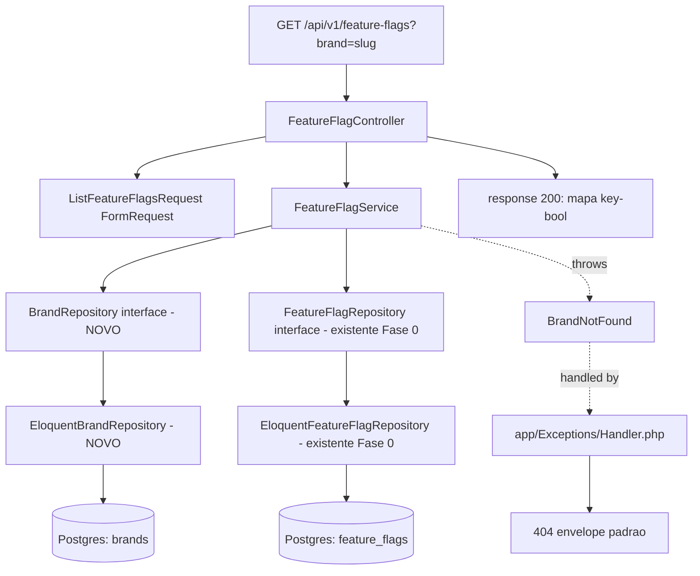

# Fase 1 — Feature Flags Backend Design

**Spec**: `.specs/features/fase-1-feature-flags-backend/spec.md`
**Status**: Approved

---

## Architecture Overview

Fecha o caminho HTTP em cima do que a Fase 0 já deixou pronto no `Domain`/`Infrastructure`. Só
`Application` e `Http` são novos.



O `FeatureFlagRepository::findByKeyAndBrand` da Fase 0 resolve uma flag por vez — não serve para
"todas as flags de uma marca". Em vez de forçar o Service a fazer N chamadas (uma por key conhecida
no tipo `FeatureFlags` do mobile, o que acopla o backend ao shape do cliente), o Repository ganha um
método novo `allForBrand(string $brandId): array<FeatureFlag>`. Isso mantém o Domain agnóstico do
consumidor e resolve o requisito FLAGSBE-01/02 (mapa completo, `{}` quando não há flags) numa query
só.

---

## Code Reuse Analysis

### Existing Components to Leverage

| Component | Location | How to Use |
| --- | --- | --- |
| `FeatureFlag` entity | `app/Domain/FeatureFlag/FeatureFlag.php` | Reusada sem alteração — já tem `key`, `brandId`, `enabled` |
| `FeatureFlagRepository` interface | `app/Domain/FeatureFlag/FeatureFlagRepository.php` | Estendida com `allForBrand()` (ver Data Models) |
| `EloquentFeatureFlagRepository` | `app/Infrastructure/Persistence/Eloquent/EloquentFeatureFlagRepository.php` | Implementa o novo método da interface |
| `DomainServiceProvider` | `app/Providers/DomainServiceProvider.php` | Ganha o binding de `BrandRepository` |
| `Brand` Eloquent model | `app/Infrastructure/Persistence/Eloquent/Models/Brand.php` | Consultado pelo novo `EloquentBrandRepository` |
| Migration `feature_flags` (índice único `brand_id+key`) | `database/migrations/0000_12_31_000004_...` | Sem alteração — `allForBrand` faz `WHERE brand_id = ?`, já coberto pelo índice |
| `scripts/check-layer-boundary.sh` (AD-010) | `api/scripts/check-layer-boundary.sh` | Já cobre `Http/Controllers/` e `Application/` — nenhuma mudança necessária, só precisa continuar passando |

### Integration Points

| System | Integration Method |
| --- | --- |
| `routes/api.php` (não existe ainda) | Criado nesta feature; registrado em `bootstrap/app.php` via `withRouting(api: __DIR__.'/../routes/api.php', apiPrefix: 'api')` — Expo/mobile já espera o prefixo `/api/v1/...`, então a rota em si carrega o `v1` no path (`Route::prefix('v1')->group(...)`) |
| `dedoc/scramble` | Novo pacote Composer; sem config manual de rotas — Scramble varre `routes/api.php` automaticamente e expõe `/docs/api` |
| `app/Exceptions/Handler.php` (não existe ainda — Laravel 11 usa closure em `bootstrap/app.php` por padrão) | Criado nesta feature para bater com a estrutura canônica do CLAUDE.md §4; `bootstrap/app.php`'s `withExceptions()` delega para métodos do Handler em vez de conter a lógica de render inline |

---

## Components

### `Application/FeatureFlag/FeatureFlagService`

- **Purpose**: Resolve o slug de marca para `brand_id` e devolve o mapa `key → bool` de flags dessa
  marca. Único ponto que conhece a regra "marca inexistente é um erro de domínio".
- **Location**: `app/Application/FeatureFlag/FeatureFlagService.php`
- **Interfaces**:
  - `listForBrandSlug(string $brandSlug): array<string, bool>` — lança `BrandNotFound` se o slug não
    existir; devolve `[]` se a marca existe mas não tem flags.
- **Dependencies**: `BrandRepository` (interface), `FeatureFlagRepository` (interface) — injetados
  por construtor, `private readonly`.
- **Reuses**: `FeatureFlagRepository::allForBrand()` (novo método), `BrandRepository::findBySlug()`
  (novo, interface nova).

### `Domain/Brand/BrandRepository` (interface nova)

- **Purpose**: Abstrai a consulta de marca por slug — o `Domain/FeatureFlag` de hoje só conhece
  `brandId`, nunca `slug`; alguém precisa traduzir, e não pode ser o Service falando Eloquent
  direto.
- **Location**: `app/Domain/Brand/BrandRepository.php` (nova pasta `Domain/Brand/`, espelhando o
  padrão de `Domain/FeatureFlag/`)
- **Interfaces**:
  - `findBySlug(string $slug): ?Brand` — `Brand` é uma entidade de domínio nova e mínima (`id`,
    `slug`), não o Eloquent model.
- **Dependencies**: nenhuma (é uma interface).
- **Reuses**: nada — é a primeira peça do domínio `Brand`. Mínima de propósito: só o suficiente para
  resolver slug→id; entidade `Brand` completa (com `displayName` etc.) não é necessária para esta
  feature e não é criada agora (YAGNI — nenhuma outra feature desta fase precisa).

### `Infrastructure/Persistence/Eloquent/EloquentBrandRepository` (nova)

- **Purpose**: Implementação Eloquent de `BrandRepository`.
- **Location**: `app/Infrastructure/Persistence/Eloquent/EloquentBrandRepository.php`
- **Interfaces**: `findBySlug(string $slug): ?Brand`
- **Dependencies**: `Brand` Eloquent model (existente).
- **Reuses**: `Models/Brand.php` existente, sem alteração.

### `Http/Requests/ListFeatureFlagsRequest` (FormRequest)

- **Purpose**: Valida que `brand` está presente e é uma string não vazia na query string. Não valida
  *existência* da marca (isso é regra de domínio, não de forma — fica no Service/exceção).
- **Location**: `app/Http/Requests/ListFeatureFlagsRequest.php`
- **Interfaces**: `rules(): array` retornando `['brand' => ['required', 'string']]`;
  `validated(): array{brand: string}`.
- **Dependencies**: nenhuma além do `FormRequest` base do Laravel.
- **Reuses**: padrão de FormRequest do CLAUDE.md §2.5/§9 (`$request->validated()`, nunca `all()`).

### `Http/Controllers/Api/V1/FeatureFlagController`

- **Purpose**: Recebe a requisição, valida via `ListFeatureFlagsRequest`, chama
  `FeatureFlagService::listForBrandSlug`, devolve JSON. Nada além disso.
- **Location**: `app/Http/Controllers/Api/V1/FeatureFlagController.php`
- **Interfaces**: `index(ListFeatureFlagsRequest $request): JsonResponse`
- **Dependencies**: `FeatureFlagService` injetado por construtor.
- **Reuses**: `Controller` base existente (`app/Http/Controllers/Controller.php`, hoje vazio).

Resposta é `response()->json($flags)` direto — não precisa de API Resource, porque o corpo não é uma
coleção de "recursos" (não tem `id`, não é uma entidade paginável); é um mapa simples de valores
primitivos. Usar `JsonResource` aqui seria complexidade sem ganho (o CLAUDE.md pede Resource para
não vazar `->toArray()` de Model, mas aqui não há Model nenhum saindo do Service — já é um `array<string,
bool>` puro).

### `Domain/FeatureFlag/Exceptions/BrandNotFound`

- **Purpose**: Exceção de domínio lançada pelo Service quando o slug não corresponde a nenhuma
  marca. Traduzida pelo `Exceptions\Handler` em `404` com `code: BRAND_NOT_FOUND`.
- **Location**: `app/Domain/FeatureFlag/Exceptions/BrandNotFound.php`
- **Interfaces**: `__construct(string $slug)`, mensagem inclui o slug (não sensível — não é dado de
  paciente).
- **Dependencies**: `\DomainException` ou `\RuntimeException` do PHP puro (nunca uma exceção do
  Illuminate — Domain não pode importar Laravel).

### `app/Exceptions/Handler.php` (novo — estrutura canônica)

- **Purpose**: Traduz exceções de domínio para o envelope de erro padrão do CLAUDE.md §6.3. Primeira
  vez que esse arquivo existe no projeto — Laravel 11 usa `withExceptions()` em `bootstrap/app.php`
  por padrão, mas o CLAUDE.md §4 define a estrutura canônica com `Handler.php` explícito.
- **Location**: `app/Exceptions/Handler.php`
- **Interfaces**: método público `render(Throwable $e, Request $request): ?JsonResponse` — mapeia
  `BrandNotFound` → 404, `\Illuminate\Validation\ValidationException` → 422 (Laravel já gera isso;
  o Handler só garante que o corpo segue o envelope custom, não o formato default do Laravel).
- **Dependencies**: nenhuma exceção de domínio nova além de `BrandNotFound` nesta feature.
- **Reuses**: nada existente — é o primeiro handler de exceção real do projeto. `bootstrap/app.php`
  passa a chamar `Handler::render()` dentro do closure de `withExceptions()`.

---

## Data Models

### `Domain/FeatureFlag/FeatureFlagRepository` (interface — método novo)

```php
interface FeatureFlagRepository
{
    public function findByKeyAndBrand(string $key, string $brandId): ?FeatureFlag; // existente

    /**
     * @return array<int, FeatureFlag>
     */
    public function allForBrand(string $brandId): array; // NOVO
}
```

`EloquentFeatureFlagRepository::allForBrand()` faz `FeatureFlagModel::query()->where('brand_id',
$brandId)->get()`, mapeando cada linha para a entidade `FeatureFlag` (mesmo padrão de
`findByKeyAndBrand`, só sem o `->first()`).

### `Domain/Brand/Brand` (entidade nova, mínima)

```php
final class Brand
{
    public function __construct(
        public readonly string $id,
        public readonly string $slug,
    ) {}
}
```

Só os dois campos que esta feature precisa (`displayName` fica para quando alguma feature realmente
precisar dele — nenhuma nesta fase precisa).

**Relationships**: `FeatureFlag.brandId` referencia `Brand.id`; a tradução slug→id acontece
inteiramente dentro do `FeatureFlagService`, nunca no Controller.

---

## Error Handling Strategy

| Error Scenario | Handling | User Impact |
| --- | --- | --- |
| `brand` ausente da query string | `ListFeatureFlagsRequest::rules()` falha → Laravel lança `ValidationException` automaticamente | `422`, envelope `{ "error": { "code": "VALIDATION_ERROR", ... } }` |
| `brand` presente mas slug não existe | `BrandRepository::findBySlug` retorna `null` → `FeatureFlagService` lança `BrandNotFound` | `404`, envelope `{ "error": { "code": "BRAND_NOT_FOUND", ... } }` |
| Marca existe, zero flags cadastradas | `allForBrand` retorna array vazio → Service devolve `[]` → Controller devolve `{}` | `200` com corpo `{}` (não é erro) |
| Erro de infraestrutura (banco fora do ar) | Não tratado nesta feature — propaga como 500 (fora do escopo; nenhuma exceção de domínio nova para isso) | `500` genérico (Laravel default) — aceitável para MVP desta fatia |

---

## Risks & Concerns

| Concern | Location (file:line) | Impact | Mitigation |
| --- | --- | --- | --- |
| `routes/api.php` e `bootstrap/app.php` nunca foram tocados — registrar `withRouting(api: ...)` errado pode quebrar o `health: '/up'` já existente (Fase 0 depende dele para o healthcheck do Docker, AD-011) | `api/bootstrap/app.php:8-12` | Regressão no healthcheck do compose se a mudança for descuidada | Task dedicada só para editar `bootstrap/app.php`, com gate rodando `curl -f localhost:9000/up` depois, antes de prosseguir |
| `app/Exceptions/Handler.php` não existe — é preciso confirmar a API exata do Laravel 11 para registrar um Handler customizado dentro de `withExceptions()` (a assinatura mudou vs. Laravel 10) | `api/bootstrap/app.php` | Se a integração for feita errado, exceções de domínio caem no handler default do Laravel (stack trace em vez do envelope) | Task de Tasks.md inclui teste Feature que injeta um `BrandNotFound` e verifica o corpo exato da resposta 404 |
| Nenhum teste de infraestrutura (500) especificado — não é uma lacuna desta feature, mas registrar para não ser assumido como coberto | — | Falha de banco em produção devolve stack trace se `APP_DEBUG` real for `true` (não é o caso — `.env.example` já fixa `false`) | Fora de escopo; `APP_DEBUG=false` já é regra do CLAUDE.md §9, não desta feature |

> Nenhum problema de código legado encontrado — toda a superfície tocada é nova ou foi criada limpa
> na Fase 0.

---

## Tech Decisions

| Decision | Choice | Rationale |
| --- | --- | --- |
| Resposta usa `response()->json()` direto, não `JsonResource` | Mapa primitivo `key→bool`, não uma entidade com `id`/relações | `JsonResource` existe para não vazar `->toArray()` de Model; aqui não há Model saindo do Service, então não se aplica — CLAUDE.md §2.2 pede Resource para status/formato correto, que o `response()->json($array, 200)` já garante |
| `FeatureFlagRepository` ganha `allForBrand()` em vez do Service fazer N chamadas a `findByKeyAndBrand` | Uma query, sem acoplar o backend às keys conhecidas pelo mobile | Evita que o Service precise de uma lista hardcoded de "quais keys existem" — o mapa reflete o que está no banco, ponto |
| `Domain/Brand/` criado como pasta nova, entidade mínima (`id`, `slug`) | Não expande para `displayName`/outros campos ainaflagsda | YAGNI — nenhuma feature desta fase consome mais que isso; expandir quando alguma feature real precisar (provável Fase 2, paginação de pacientes por marca) |
| `app/Exceptions/Handler.php` criado explicitamente, delegado por `bootstrap/app.php` | Segue a estrutura canônica do CLAUDE.md §4 em vez do padrão "tudo inline no closure" do Laravel 11 | CLAUDE.md é a fonte de verdade da arquitetura deste projeto; a estrutura de pastas é explícita sobre esse arquivo existir |
| `dedoc/scramble` instalado nesta feature | Primeiro endpoint real do projeto | CLAUDE.md §3: OpenAPI "entra junto do primeiro endpoint real" |

> **Project-level decision candidate:** a decisão de `Domain/Brand/BrandRepository` como interface
> nova (não reaproveitar/expandir `FeatureFlagRepository` para resolver slug) estabelece o padrão
> "cada agregado de domínio tem seu próprio Repository" — já implícito no CLAUDE.md §6.1, não é uma
> decisão nova, então não vira `AD-NNN` (só confirma o padrão existente).
