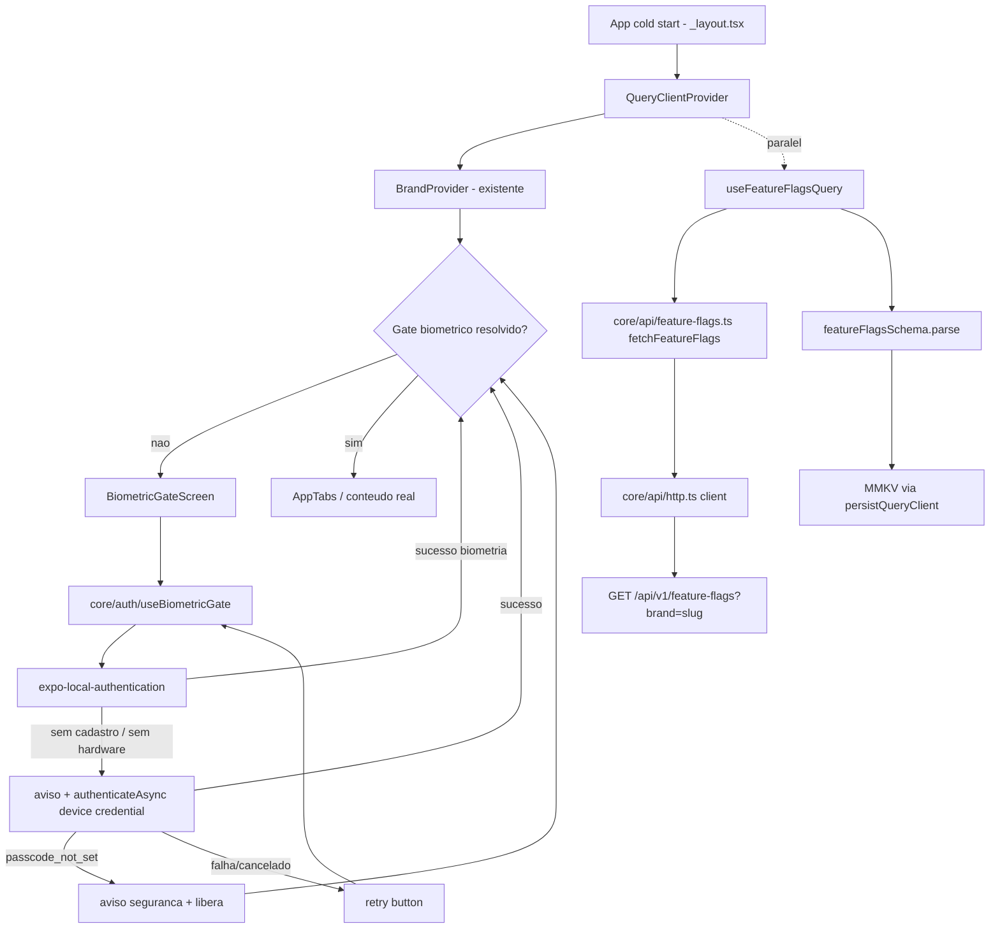

# Fase 1 — Feature Flags Mobile Design

**Spec**: `.specs/features/fase-1-feature-flags-mobile/spec.md`
**Status**: Approved

---

## Architecture Overview

Duas peças que compartilham uma base nova (`QueryClient` persistido) mas são independentes uma da
outra em runtime: o hook `useFlag` não depende do gate ter passado, e o gate não depende de flags
terem carregado.



`useFlag(key)` lê do mesmo cache que `useFeatureFlagsQuery` popula — não é um segundo fetch. O gate
biométrico não usa TanStack Query (não é dado de servidor cacheável do mesmo jeito; é um resultado
de autenticação local, resolvido uma vez por sessão de app aberto) — vive em estado local
(`useState`/`useReducer`) dentro de um hook próprio.

---

## Code Reuse Analysis

### Existing Components to Leverage

| Component | Location | How to Use |
| --- | --- | --- |
| `Brand`/`FeatureFlags` types | `src/core/theme/brand.types.ts` | `FeatureFlags` já é o shape exato do payload da API — reusado como o tipo alvo do schema zod, sem redefinir |
| `useTheme()` | `src/core/theme/useTheme.ts` | Tela de gate biométrico usa `colors`/`typography`/`copy` da marca ativa — nunca literal |
| `resolveBrand`/`BrandProvider` | `src/brands/index.ts`, `src/core/theme/BrandProvider.tsx` | Fonte do `brandId` usado para escopar o fetch (`?brand=`) e a chave de cache MMKV |
| `Constants.expoConfig.extra.brandId` | `src/app/_layout.tsx:12` | Mesmo mecanismo já usado para resolver a marca no boot — reusado para saber qual `brandId` passar no client HTTP, sem reimplementar |
| `EXPO_PUBLIC_API_URL` | `.env`/`app.config.ts` | Base URL do client HTTP — variável já existe, só não é lida em runtime por nenhum código ainda |
| `src/app/_layout.tsx` | raiz do app | Ganha `QueryClientProvider` e a decisão gate-vs-conteúdo; `BrandProvider` continua envolvendo tudo (nenhuma mudança na ordem existente) |
| `AppTabs` (`src/components/app-tabs.tsx`) | componente existente | Vira o "conteúdo real" que só renderiza depois do gate — nenhuma mudança nele mesmo |

### Integration Points

| System | Integration Method |
| --- | --- |
| Backend `GET /api/v1/feature-flags?brand=slug` (feature irmã) | Consumido via `core/api/feature-flags.ts`; contrato de payload (mapa `key→bool`) já fechado nos dois specs |
| MMKV (dependência nova) | `react-native-mmkv`, instância única em `core/offline/storage.ts`, usada tanto pelo `persistQueryClient` quanto (potencialmente, Fase 2) por outros caches |
| `expo-local-authentication` (dependência nova) | Encapsulado inteiramente em `core/auth/` — nenhum outro módulo importa o pacote diretamente |

---

## Components

### `core/offline/storage.ts`

- **Purpose**: Instância única de MMKV, e um adapter mínimo satisfazendo a interface de
  `Persister` esperada por `@tanstack/query-persist-client`.
- **Location**: `src/core/offline/storage.ts`
- **Interfaces**:
  - `mmkvStorage: MMKV` — instância nomeada (`id: 'tecsa-health-cache'`).
  - `mmkvPersister: Persister` — objeto `{ persistClient, restoreClient, removeClient }` sobre o
    `mmkvStorage`, usando `@tanstack/query-sync-storage-persister` com um adapter de `Storage`
    síncrono sobre MMKV (MMKV é sync por natureza — `getString`/`set` sem Promise).
- **Dependencies**: `react-native-mmkv`, `@tanstack/query-sync-storage-persister`.
- **Reuses**: nada — é a primeira peça de `core/offline/`.

### `core/offline/queryClient.ts`

- **Purpose**: `QueryClient` único do app, configurado e exportado; usado tanto pelo provider de
  flags quanto (Fase 2) pela carteira.
- **Location**: `src/core/offline/queryClient.ts`
- **Interfaces**: `queryClient: QueryClient` (instância), `createTestQueryClient(): QueryClient`
  (factory sem persistência, para Jest — resolve FLAGSMOB-13).
- **Dependencies**: `@tanstack/react-query`.
- **Reuses**: `mmkvPersister` de `core/offline/storage.ts`.

### `core/api/http.ts`

- **Purpose**: Client HTTP mínimo (`fetch` com base URL de `EXPO_PUBLIC_API_URL`), parse de erro em
  `ApiError` tipado. Base para esta feature e para a Fase 2.
- **Location**: `src/core/api/http.ts`
- **Interfaces**:
  - `apiGet<T>(path: string, params?: Record<string, string>): Promise<unknown>` — devolve JSON cru
    (`unknown`), NUNCA validado aqui; validação é responsabilidade de quem chama (regra CLAUDE.md
    §5.4).
  - `class ApiError extends Error { status: number; code?: string }`.
- **Dependencies**: `EXPO_PUBLIC_API_URL` via `process.env`.
- **Reuses**: nada — primeira peça de `core/api/`.

### `core/api/schemas/feature-flags.ts`

- **Purpose**: Schema zod do payload de flags + tipo inferido.
- **Location**: `src/core/api/schemas/feature-flags.ts`
- **Interfaces**:
  - `featureFlagsSchema = z.object({ aiActionsEnabled: z.boolean(), offlineBanner: z.boolean()
    }).partial()` — `.partial()` porque o backend pode omitir uma key não seedada (FLAGSBE
    Assumptions); o hook consumidor é quem preenche o buraco com o default da marca (FLAGSMOB-03),
    não o schema.
  - `type FeatureFlagsResponse = z.infer<typeof featureFlagsSchema>`.
- **Dependencies**: `zod`.
- **Reuses**: nomeia as mesmas duas keys de `FeatureFlags` em `brand.types.ts` — se uma flag nova
  entrar no tipo `Brand.defaults`, este schema precisa ganhar a chave também (não há como o
  TypeScript forçar isso automaticamente entre um `type` e um `z.object` desenhado à mão; fica
  como nota de manutenção, não um mecanismo automático).

### `core/api/feature-flags.ts`

- **Purpose**: Função de fetch tipada, seguindo o fluxo obrigatório do CLAUDE.md §5.4 (schema →
  tipo → fetch → parse → hook).
- **Location**: `src/core/api/feature-flags.ts`
- **Interfaces**: `fetchFeatureFlags(brandId: string): Promise<FeatureFlagsResponse>` — chama
  `apiGet('/api/v1/feature-flags', { brand: brandId })`, depois `featureFlagsSchema.parse(raw)`.
- **Dependencies**: `core/api/http.ts`, `core/api/schemas/feature-flags.ts`.
- **Reuses**: `apiGet`.

### `core/flags/useFeatureFlagsQuery.ts`

- **Purpose**: Hook de TanStack Query que busca as flags da marca ativa; chave de cache inclui
  `brandId` (Edge Case do spec — nunca vaza flag de uma marca para outra no cache).
- **Location**: `src/core/flags/useFeatureFlagsQuery.ts`
- **Interfaces**: `useFeatureFlagsQuery(): UseQueryResult<FeatureFlagsResponse>` — internamente lê
  `brandId` de `useTheme()` (a marca ativa já carrega um `id`), monta
  `useQuery({ queryKey: ['feature-flags', brand.id], queryFn: () => fetchFeatureFlags(brand.id) })`.
- **Dependencies**: `useTheme()`, `fetchFeatureFlags`.
- **Reuses**: `queryClient` (via `QueryClientProvider` já montado na raiz — o hook não referencia o
  client diretamente, usa `useQuery` normal).

### `core/flags/useFlag.ts`

- **Purpose**: Hook público único de consumo de flags (FLAGSMOB-06 — nenhum componente lê o cache
  diretamente).
- **Location**: `src/core/flags/useFlag.ts`
- **Interfaces**: `useFlag(key: keyof FeatureFlags): boolean` — lê `useFeatureFlagsQuery().data?.[key]`;
  se `undefined` (ainda carregando, erro, ou key ausente do payload), cai em `useTheme().defaults[key]`.
- **Dependencies**: `useFeatureFlagsQuery`, `useTheme()`.
- **Reuses**: os dois hooks acima — é uma composição fina, sem lógica de rede própria.

### `core/auth/useBiometricGate.ts`

- **Purpose**: Máquina de estado do gate biométrico — os três ramos decididos no context.md, nunca
  lança exceção para a árvore.
- **Location**: `src/core/auth/useBiometricGate.ts`
- **Interfaces**: `useBiometricGate(): { status: 'checking' | 'locked' | 'unlocked'; reason?:
  'biometric' | 'device_credential' | 'no_credential_available'; warning?: string; retry: () =>
  void }`.
  - Fluxo interno: `hasHardwareAsync()` + `isEnrolledAsync()` → se ambos `true`, chama
    `authenticateAsync()` puro (sem fallback de device, já que biometria está disponível); sucesso
    → `unlocked/biometric`; falha/cancelado → `locked` com `retry` disponível (AC3, AC do "cancelar
    = falha").
  - Se hardware ausente OU não cadastrado → `warning` setado, chama
    `authenticateAsync({ disableDeviceFallback: false })`; sucesso → `unlocked/device_credential`;
    erro `passcode_not_set` → `unlocked/no_credential_available` (com `warning` de segurança
    diferente); outra falha/cancelado → `locked` com `retry`.
- **Dependencies**: `expo-local-authentication`.
- **Reuses**: nada — primeira peça de `core/auth/`.

### `core/ui/BiometricGateScreen.tsx`

- **Purpose**: Tela que renderiza os avisos (biometria ausente / sem credencial nenhuma) e o botão
  de retry, usando os quatro estados de UI do CLAUDE.md §5.5 aplicados a este contexto (aqui:
  "verificando" / "bloqueado com retry" / os dois avisos antes de liberar).
- **Location**: `src/core/ui/BiometricGateScreen.tsx`
- **Interfaces**: `BiometricGateScreen(props: { onRetry: () => void; reason?: string; warning?:
  string })` — componente puro, recebe estado de fora (de `useBiometricGate`), não busca nada
  sozinho.
- **Dependencies**: `useTheme()` para tokens e copy.
- **Reuses**: tokens de `useTheme()`, nenhum literal de cor/raio/fonte.

### `src/app/_layout.tsx` (modificado)

- **Purpose**: Monta `QueryClientProvider` (novo) envolvendo `BrandProvider` (existente); dentro,
  decide entre `BiometricGateScreen` e `AppTabs` com base em `useBiometricGate().status`.
- **Location**: `src/app/_layout.tsx`
- **Mudança**: acrescenta `QueryClientProvider` na árvore e a leitura de `useBiometricGate()`;
  **não** cria um grupo de rotas `(protected)/` novo — o app hoje só tem duas rotas de prova
  (`index`, `explore`) dentro de `AppTabs`, nenhuma delas existe fora dessa árvore, então
  condicionar a renderização de `AppTabs` inteiro no componente de layout cobre "nenhuma rota
  protegida renderiza antes do gate" sem inventar uma estrutura de pastas que nenhuma rota real usa
  ainda. Quando a carteira (Fase 2) ganhar rotas próprias, reavaliar se elas precisam de um grupo
  dedicado — não é uma decisão desta feature.
- **Reuses**: `BrandProvider`, `AppTabs`, `AnimatedSplashOverlay` — nenhum desses muda de
  comportamento.

---

## Data Models

### `FeatureFlagsResponse` (zod-inferred)

```typescript
const featureFlagsSchema = z
  .object({
    aiActionsEnabled: z.boolean(),
    offlineBanner: z.boolean(),
  })
  .partial();

type FeatureFlagsResponse = z.infer<typeof featureFlagsSchema>;
// { aiActionsEnabled?: boolean; offlineBanner?: boolean }
```

**Relationships**: chave de cache do TanStack Query é `['feature-flags', brand.id]` — um registro
por marca, nunca compartilhado.

### `BiometricGateState` (união discriminada, não persistida)

```typescript
type BiometricGateState =
  | { status: 'checking' }
  | { status: 'locked'; retryable: true }
  | { status: 'unlocked'; reason: 'biometric' | 'device_credential' | 'no_credential_available' };
```

Vive só em memória (estado de sessão do app aberto) — reabrir o app sempre volta para `checking`,
nunca é persistido em MMKV (autenticação não é algo que se "lembra" entre sessões, isso anularia o
propósito do gate).

---

## Error Handling Strategy

| Error Scenario | Handling | User Impact |
| --- | --- | --- |
| Fetch de `/feature-flags` falha (rede, 5xx) sem cache anterior | `useQuery` fica em `isError`; `useFlag` cai no default da marca (FLAGSMOB-03/edge case) | Nenhum erro visível — comportamento idêntico a "ainda carregando" |
| Fetch falha mas existe cache MMKV de sessão anterior | `persistQueryClient` já restaurou o cache antes do primeiro render; `useQuery` mostra o dado antigo (`isStale` mas presente) enquanto a nova tentativa falha em background | `useFlag` retorna o valor persistido (FLAGSMOB-04) |
| `authenticateAsync` lança erro inesperado (não `passcode_not_set`, não cancelamento) | `useBiometricGate` trata qualquer erro não reconhecido como falha → `status: 'locked'`, `retry` disponível | Mesma tela de retry do caso "biometria não reconhecida" — nunca crash (FLAGSMOB item 7) |
| Payload de `/feature-flags` não bate com o schema (backend retorna algo inesperado) | `.parse()` lança `ZodError`; `fetchFeatureFlags` deixa propagar, `useQuery` captura como `isError` | Mesmo tratamento do "fetch falhou" acima — cai no default |

---

## Risks & Concerns

| Concern | Location (file:line) | Impact | Mitigation |
| --- | --- | --- | --- |
| `react-native-mmkv` exige rebuild nativo (não é pacote JS puro) — projeto ainda não passou por nenhum rebuild de dev client desde o scaffold Expo | `mobile/package.json` (dependências atuais são todas Expo-managed autolink) | Se o dev client não for reconstruído após instalar MMKV, `expo start` falha ao tentar carregar o módulo nativo | Task dedicada de instalação inclui rodar `npx expo prebuild`/`expo run:ios`\|`android` (ou confirmar que o EAS/dev client já cobre) como parte do "Done when"; documentar no README a necessidade de rebuild |
| `expo-local-authentication` em simulador iOS/emulador Android sem biometria configurada é o caminho MAIS comum de teste manual, não o caso raro | `src/core/auth/useBiometricGate.ts` (novo) | Se o ramo "sem hardware/sem cadastro" não for testado de verdade em simulador, o caminho principal de demonstração (CLAUDE.md §14.8) fica sem cobertura prática | `Done when` da task do hook inclui teste manual explícito em simulador sem biometria, documentado como evidência, além dos testes automatizados |
| Nenhum teste existente no projeto cobre hooks com TanStack Query ainda (Fase 0 só testou componentes de tema) | `mobile/src/**/__tests__/` (padrão atual: `index.test.tsx`, `checkBrandBoundary.test.ts`) | Primeira vez testando um hook async — risco de escolher um padrão de mock inconsistente com o que a Fase 2 vai reusar | `createTestQueryClient()` (sem persistência) fica documentado como o padrão oficial de teste para qualquer hook de query futuro — Fase 2 reusa, não reinventa |

---

## Tech Decisions

| Decision | Choice | Rationale |
| --- | --- | --- |
| TanStack Query + `persistQueryClient`/MMKV antecipados da Fase 2 | Instalados nesta feature | CLAUDE.md §3 já proíbe `fetch` em `useEffect` como estado de servidor; decisão de produto confirmada no context.md |
| Gate biométrico não usa TanStack Query | Estado local (`useState`) dentro de `useBiometricGate` | Autenticação de sessão não é "dado de servidor" cacheável — é binário, resolvido uma vez, nunca deve ser lembrado entre reaberturas do app |
| Nenhum grupo de rotas `(protected)/` criado agora | Condicional dentro de `_layout.tsx` decide `AppTabs` vs `BiometricGateScreen` | Nenhuma rota real além das duas de prova existe ainda; criar a pasta agora seria estrutura sem conteúdo — revisitar na Fase 2 quando a carteira ganhar rotas |
| `featureFlagsSchema` usa `.partial()` | Nenhuma key é `required` no schema | Backend pode legitimamente omitir uma key não seedada (Assumption da spec backend); o hook, não o schema, decide o fallback |
| `core/api/http.ts` devolve `unknown`, nunca faz parse | Parse fica em `core/api/feature-flags.ts` | Regra explícita do CLAUDE.md §5.4 — dado de rede é `unknown` até `.parse()` |

> **Project-level decision:** trazer TanStack Query + MMKV persist para a Fase 1 (em vez de Fase 2)
> estabelece o padrão de `core/offline/queryClient.ts` como o `QueryClient` único do projeto — deve
> ser registrado em `.specs/STATE.md` `## Decisions` como próximo `AD-NNN` durante o Execute desta
> feature, para a Fase 2 não reconstruir o mecanismo.
