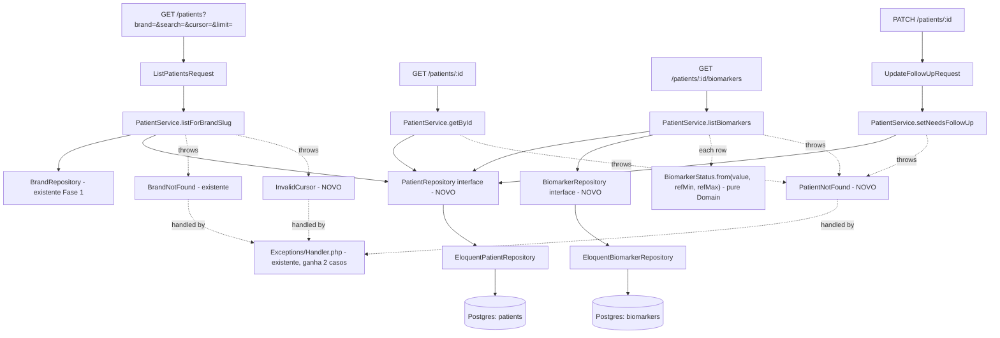

# Fase 2 — Carteira de Pacientes Backend Design

**Spec**: `.specs/features/fase-2-carteira-pacientes-backend/spec.md`
**Status**: Approved

---

## Architecture Overview

Primeira feature a introduzir dois agregados de domínio novos (`Patient`, `Biomarker`), cada um com
seu próprio Repository — mesmo padrão já estabelecido na Fase 1 (`Brand`, `FeatureFlag`: um agregado,
um Repository). Reforçado por revisão de especialista Laravel antes do fechamento desta spec: nenhum
Repository devolve `Model` Eloquent ou `LengthAwarePaginator` — cada um devolve uma DTO própria com
entidades de domínio já mapeadas, e a paginação cursor usa comparação de tupla `(name, id)`
parametrizada (`whereRaw` com bindings, sem interpolação de valor).



---

## Code Reuse Analysis

### Existing Components to Leverage

| Component | Location | How to Use |
| --- | --- | --- |
| `BrandRepository` + `EloquentBrandRepository` | `app/Domain/Brand/`, `app/Infrastructure/Persistence/Eloquent/` | Reusado sem alteração — resolve `?brand=slug` em `PatientService::listForBrandSlug`, igual à Fase 1 |
| `Models/Patient`, `Models/Biomarker` (Eloquent) | `app/Infrastructure/Persistence/Eloquent/Models/` | Consultados pelos novos Repositories; sem alteração de schema exceto a coluna nova (Data Models) |
| `app/Exceptions/Handler.php` | `app/Exceptions/Handler.php` | Ganha 2 branches novos (`PatientNotFound`→404, `InvalidCursor`→400), mesmo padrão de `BrandNotFound`→404 |
| `DomainServiceProvider` | `app/Providers/DomainServiceProvider.php` | Ganha 2 bindings novos |
| `routes/api.php`, `bootstrap/app.php` (roteamento `v1`) | `routes/api.php` | Já registrado (Fase 1) — só adiciona rotas ao grupo existente |
| `scripts/check-layer-boundary.sh` (AD-010) | `api/scripts/check-layer-boundary.sh` | Já cobre `Http/Controllers/` e `Application/` — sem mudança |
| `PatientFactory`, `BiomarkerFactory`, `PatientSeeder` | `database/factories/`, `database/seeders/` | Reusados nos testes Feature; `PatientFactory` ganha default `needs_follow_up=false` |

### Integration Points

| System | Integration Method |
| --- | --- |
| `routes/api.php` | Grupo `v1` existente ganha `Route::get('patients', ...)`, `Route::get('patients/{id}', ...)`, `Route::get('patients/{id}/biomarkers', ...)`, `Route::patch('patients/{id}', ...)` |
| `dedoc/scramble` (já instalado, Fase 1) | Sem config nova — varre as rotas novas automaticamente a partir dos FormRequests |
| Migration `needs_follow_up` | Migration nova, aditiva (`Schema::table('patients')->boolean('needs_follow_up')->default(false)`), roda no `docker-compose` `migrate --force` já existente |

---

## Components

### `Domain/Patient/Patient` (entidade)

```php
final class Patient
{
    public function __construct(
        public readonly string $id,
        public readonly string $brandId,
        public readonly string $name,
        public readonly string $birthDate,       // ISO 8601 date
        public readonly string $goal,
        public readonly string $status,
        public readonly bool $needsFollowUp,
        public readonly string $updatedAt,       // ISO 8601 datetime
    ) {}
}
```

- **Purpose**: Representação de domínio de um paciente, sem nenhum traço de Eloquent.
- **Location**: `app/Domain/Patient/Patient.php`
- **Reuses**: Nenhum — primeira entidade deste agregado.

### `Domain/Patient/PatientCursor` (Value Object)

- **Purpose**: Encapsula encode/decode do cursor opaco. Isola a regra "o que é um cursor válido" do
  Service e do Repository — nem um nem outro faz `base64_decode`/`json_decode` diretamente.
- **Location**: `app/Domain/Patient/PatientCursor.php`
- **Interfaces**:
  - `static encode(string $name, string $id): string` — `base64_encode(json_encode(['name' =>
    $name, 'id' => $id]))`.
  - `static decode(string $cursor): self` — lança `InvalidCursor` se o base64/JSON não decodifica ou
    o objeto resultante não tem exatamente `name` (string) e `id` (string).
  - propriedades públicas `readonly string $name`, `readonly string $id` após decode.
- **Dependencies**: nenhuma (PHP puro — `base64_decode`/`json_decode` são funções da linguagem, não
  do Illuminate).
- **Reuses**: nada existente — primeiro Value Object do projeto.

### `Domain/Patient/PatientPage` (DTO)

```php
final class PatientPage
{
    /**
     * @param array<int, Patient> $items
     */
    public function __construct(
        public readonly array $items,
        public readonly ?string $nextCursor,
    ) {}
}
```

- **Purpose**: Devolvido por `PatientRepository::paginate()`. Substitui `LengthAwarePaginator`
  (offset) e evita o Service precisar conhecer o formato interno da paginação do Eloquent — ponto
  levantado pela revisão de especialista antes do fechamento desta spec.
- **Location**: `app/Domain/Patient/PatientPage.php`

### `Domain/Patient/PatientRepository` (interface)

```php
interface PatientRepository
{
    public function paginate(
        string $brandId,
        ?string $search,
        ?PatientCursor $cursor,
        int $limit,
    ): PatientPage;

    public function findById(string $id): ?Patient;

    public function updateNeedsFollowUp(string $id, bool $needsFollowUp): Patient;
}
```

- **Location**: `app/Domain/Patient/PatientRepository.php`
- `updateNeedsFollowUp` devolve o `Patient` já atualizado (evita um `findById` extra no Service) e
  lança `PatientNotFound` internamente se o `id` não existir — decisão de manter a checagem de
  existência dentro do Repository, já que é o único lugar que sabe se o `UPDATE` afetou 0 linhas.

### `Infrastructure/Persistence/Eloquent/EloquentPatientRepository`

- **Purpose**: Implementação Eloquent de `PatientRepository`. Mapeia `Model\Patient` → entidade
  `Patient` linha a linha; nunca devolve `Model` nem `Builder` para fora.
- **Location**: `app/Infrastructure/Persistence/Eloquent/EloquentPatientRepository.php`
- **`paginate()`**: monta a query com `where('brand_id', $brandId)`; se `$search` não vazio,
  `where('name', 'ilike', "%{$search}%")`; `orderBy('name')->orderBy('id')`; se `$cursor` presente,
  `whereRaw('(name, id) > (?, ?)', [$cursor->name, $cursor->id])` (comparação de tupla Postgres,
  parametrizada — recomendação da revisão de especialista); busca `$limit + 1` linhas para saber se
  há próxima página sem um segundo `COUNT`; se veio a linha extra, descarta-a e monta `nextCursor =
  PatientCursor::encode(last.name, last.id)` a partir do último item **mantido**; senão
  `nextCursor = null`.
- **`findById()`**: `Model::find($id)`, `null` se não encontrado; mapeia para entidade se encontrado.
- **`updateNeedsFollowUp()`**: `Model::where('id', $id)->update(['needs_follow_up' => $v])`; se
  linhas afetadas `=== 0`, lança `PatientNotFound`; senão recarrega e mapeia (`Model::find($id)`).
- **Reuses**: `Models/Patient.php` existente (ganha a coluna `needs_follow_up` no `$fillable`/cast).

### `Domain/Patient/Exceptions/PatientNotFound`, `Domain/Patient/Exceptions/InvalidCursor`

- Mesma forma de `BrandNotFound` (Fase 1): `final class ... extends \RuntimeException`, sem import
  de Illuminate, mensagem inclui o `id`/`cursor` bruto (não é dado sensível de paciente — é um UUID
  ou uma string de cursor, não nome/documento).
- **Location**: `app/Domain/Patient/Exceptions/PatientNotFound.php`,
  `app/Domain/Patient/Exceptions/InvalidCursor.php`

### `Domain/Biomarker/Biomarker` (entidade) + `BiomarkerStatus` (enum)

```php
enum BiomarkerStatus: string
{
    case Low = 'low';
    case Normal = 'normal';
    case High = 'high';

    public static function from(float $value, float $refMin, float $refMax): self
    {
        return match (true) {
            $value < $refMin => self::Low,
            $value > $refMax => self::High,
            default => self::Normal,
        };
    }
}
```

> Nota de nomenclatura: PHP nativo já reserva o nome estático `from()` em enums *backed* para
> resolver por valor (`BiomarkerStatus::from('low')`). Definir aqui um `from()` estático com
> assinatura diferente (3 floats) sobrescreve esse uso nativo dentro desta classe — **decisão
> deliberada** para bater 1:1 com a assinatura pedida no CLAUDE.md §7 (`from(float $value, float
> $min, float $max)`) e no plano de desenvolvimento. Como consequência, o enum perde a resolução
> nativa por string (`BiomarkerStatus::from('low')` deixa de existir); usar
> `BiomarkerStatus::Low`/`::Normal`/`::High` diretamente ou `BiomarkerStatus::tryFrom()`
> (não sobrescrito) quando for necessário resolver a partir de uma string persistida. Nenhuma
> feature desta fase precisa desse caminho (o `status` nunca é lido do banco, é sempre calculado).

```php
final class Biomarker
{
    public function __construct(
        public readonly string $id,
        public readonly string $patientId,
        public readonly string $code,
        public readonly string $label,
        public readonly float $value,
        public readonly string $unit,
        public readonly float $refMin,
        public readonly float $refMax,
        public readonly string $measuredAt,
        public readonly BiomarkerStatus $status,   // calculado no momento da construção
    ) {}
}
```

- **Location**: `app/Domain/Biomarker/Biomarker.php`, `app/Domain/Biomarker/BiomarkerStatus.php`
- `status` é calculado uma única vez, no ponto onde a entidade é construída (dentro do Repository,
  ao mapear a linha do banco) — nunca recalculado no Controller/Resource.

### `Domain/Biomarker/BiomarkerRepository` (interface)

```php
interface BiomarkerRepository
{
    /**
     * @return array<int, Biomarker>
     */
    public function listForPatient(string $patientId): array;
}
```

- **Location**: `app/Domain/Biomarker/BiomarkerRepository.php`
- Segue o padrão "um agregado, um Repository" (mesma decisão já registrada como padrão confirmado na
  Fase 1) em vez de pendurar o método em `PatientRepository` — recomendação explícita da revisão de
  especialista.

### `Infrastructure/Persistence/Eloquent/EloquentBiomarkerRepository`

- **Purpose**: `listForPatient()` → `Model\Biomarker::where('patient_id',
  $patientId)->orderBy('measured_at', 'desc')->get()`, mapeando cada linha para `Biomarker` (com
  `BiomarkerStatus::from()` aplicado inline). Sem paginação (volume baixo por paciente, decisão já
  registrada em Assumptions).
- **Location**: `app/Infrastructure/Persistence/Eloquent/EloquentBiomarkerRepository.php`

### `Application/Patient/PatientService`

- **Purpose**: Único ponto que orquestra `BrandRepository` + `PatientRepository` +
  `BiomarkerRepository`. Traduz slug→brandId, decodifica cursor, aplica clamp de `limit`.
- **Location**: `app/Application/Patient/PatientService.php`
- **Interfaces**:
  - `listForBrandSlug(string $brandSlug, ?string $search, ?string $rawCursor, ?int $limit):
    PatientPage` — resolve `brandSlug` via `BrandRepository::findBySlug` (lança `BrandNotFound` se
    `null`, reusando a exceção da Fase 1); decodifica `$rawCursor` via `PatientCursor::decode()` se
    não nulo (propaga `InvalidCursor`); clampa `$limit` (`null` → 50, `> 100` → 100); delega a
    `PatientRepository::paginate()`.
  - `getById(string $id): Patient` — delega a `PatientRepository::findById()`, lança
    `PatientNotFound` se `null` (o Repository não lança essa exceção para leitura simples — só
    `updateNeedsFollowUp` lança, porque só ali existe "0 linhas afetadas" como sinal; para leitura, o
    Service é quem decide o que fazer com `null`).
  - `listBiomarkers(string $patientId): array<int, Biomarker>` — confirma existência via
    `PatientRepository::findById()` (lança `PatientNotFound` se `null`), depois delega a
    `BiomarkerRepository::listForPatient()`.
  - `setNeedsFollowUp(string $id, bool $value): Patient` — delega direto a
    `PatientRepository::updateNeedsFollowUp()` (propaga `PatientNotFound` se o Repository lançar).
- **Dependencies**: `BrandRepository`, `PatientRepository`, `BiomarkerRepository` — todas injetadas
  por construtor, `private readonly`.

### `Http/Requests/ListPatientsRequest`

- **Rules**: `brand` (`required`, `string`); `search` (`nullable`, `string`, `max:255`); `cursor`
  (`nullable`, `string`); `limit` (`nullable`, `integer`, `min:1`) — o clamp de `>100` acontece no
  Service (é uma normalização, não uma rejeição de forma).

### `Http/Requests/UpdateFollowUpRequest`

- **Rules**: `needsFollowUp` (`required`, `boolean`) — `$request->validated()` devolve só essa chave;
  nenhum outro campo do corpo chega ao Controller/Service (CLAUDE.md §9).

### `Http/Controllers/Api/V1/PatientController`

- **Purpose**: `index` (lista), `show` (detalhe), `biomarkers`, `updateFollowUp` — cada método só
  chama o `FormRequest` correspondente + `PatientService` + devolve Resource. Nada além disso.
- **Location**: `app/Http/Controllers/Api/V1/PatientController.php`
- **Resources**: `PatientResource` (campos `id, name, birthDate, goal, status, needsFollowUp,
  updatedAt` em camelCase — o mobile já espera camelCase, ver schemas zod da feature irmã),
  `PatientPageResource` (envolve `PatientResource::collection` + `nextCursor` no shape `{ data: [...],
  nextCursor: string|null }`), `BiomarkerResource` (`id, code, label, value, unit, refMin, refMax,
  measuredAt, status`).

---

## Data Models

### Migration nova: `needs_follow_up`

```php
Schema::table('patients', function (Blueprint $table) {
    $table->boolean('needs_follow_up')->default(false)->after('status');
});
```

Aditiva, sem dado a migrar (default `false` cobre os 5.000+ pacientes já seedados). `Models/Patient`
ganha `needs_follow_up` no `$fillable` e `'needs_follow_up' => 'boolean'` no `$casts`.
`PatientFactory::definition()` ganha `'needs_follow_up' => false` (estado inicial determinístico —
seed não muda, `PatientSeederTest` não precisa de alteração).

### Índices reaproveitados (sem migration nova)

- `patients(brand_id, name)` — já existe desde a Fase 0; a query de `paginate()` filtra por
  `brand_id` e ordena por `name, id`, batendo diretamente no índice composto (o `id` de tie-break não
  está no índice, mas como é sempre igualdade residual dentro do mesmo `name`, o custo extra é
  desprezível no volume do seed).
- `biomarkers(patient_id, measured_at)` — já existe desde a Fase 0; `listForPatient()` filtra por
  `patient_id` e ordena por `measured_at desc`, batendo no índice diretamente.

---

## Error Handling Strategy

| Error Scenario | Handling | User Impact |
| --- | --- | --- |
| `brand` ausente | `ListPatientsRequest` → `ValidationException` | `422`, envelope padrão |
| `brand` inexistente | `PatientService` lança `BrandNotFound` (reusada da Fase 1) | `404`, `BRAND_NOT_FOUND` |
| `cursor` ilegível | `PatientCursor::decode()` lança `InvalidCursor` | `400`, `INVALID_CURSOR` |
| `id` de paciente inexistente (GET detalhe/biomarcadores/PATCH) | `PatientService`/`PatientRepository` lança `PatientNotFound` | `404`, `PATIENT_NOT_FOUND` |
| Corpo do PATCH sem `needsFollowUp` ou tipo errado | `UpdateFollowUpRequest` → `ValidationException` | `422`, envelope padrão |
| `limit` fora do intervalo (`<1` ou não numérico) | `ListPatientsRequest` → `ValidationException` (mas `>100` é normalizado, não rejeitado — ver Tech Decisions) | `422` só para valores inválidos de forma, não para "grande demais" |

`app/Exceptions/Handler.php` ganha 2 branches: `PatientNotFound` → `envelope('PATIENT_NOT_FOUND',
..., 404)`, `InvalidCursor` → `envelope('INVALID_CURSOR', ..., 400)`. Mesmo método `envelope()`
privado já existente, sem duplicação.

---

## Risks & Concerns

| Concern | Location (file:line) | Impact | Mitigation |
| --- | --- | --- | --- |
| `whereRaw('(name, id) > (?, ?)', ...)` depende de collation consistente entre `ORDER BY name` e a comparação de tupla | `EloquentPatientRepository::paginate()` | Se o Postgres usar uma collation não-determinística para `name`, a ordem de `ORDER BY` e a comparação de tupla podem divergir sutilmente em casos de acentuação | Fora de escopo desta feature mitigar collation de banco (não pedido, projeto usa collation default do container Postgres 16); documentar como risco conhecido, revisitar só se um teste Feature com nomes acentuados demonstrar divergência real |
| `updateNeedsFollowUp` decide "não encontrado" via `affected rows === 0`, o que também é verdade quando o valor já era o mesmo e o Postgres não reporta a linha como afetada (depende do driver) | `EloquentPatientRepository::updateNeedsFollowUp()` | Falso `PatientNotFound` num PATCH idempotente (setar `true` quando já é `true`) | `Model::where('id', $id)->update([...])` do Eloquent conta a linha como afetada mesmo sem mudança de valor (Postgres via PDO reporta linhas *matched*, não linhas *changed*, nesse driver) — comportamento a confirmar com um teste Feature dedicado a PATCH idempotente (ver tasks.md) |
| Paginação varre `$limit + 1` linhas para decidir `nextCursor` — funciona, mas exige que o Repository descarte a linha extra antes de mapear todas para entidade (custo de mapear 1 entidade a mais que é descartada) | `EloquentPatientRepository::paginate()` | Custo desprezível (1 linha extra em até 101) | Nenhuma — aceito, é o padrão usual de keyset pagination "peek next" |

---

## Tech Decisions

| Decision | Choice | Rationale |
| --- | --- | --- |
| Cursor como Value Object (`PatientCursor`) em vez de string crua manipulada no Service | Isola encode/decode; `InvalidCursor` nasce no lugar certo | Revisão de especialista Laravel — evita duplicar `base64_decode`/`json_decode` em mais de um lugar |
| Repository devolve DTO (`PatientPage`), nunca `Model`/`LengthAwarePaginator` | Consistente com CLAUDE.md §6.1 ("Repository devolve entidade de domínio, não Model") | Revisão de especialista — paginação offset do Eloquent (`LengthAwarePaginator`) é semanticamente incompatível com cursor, e vazaria Eloquent para o Service de qualquer forma |
| `Domain/Biomarker/BiomarkerRepository` próprio, não método em `PatientRepository` | Um agregado, um Repository | Revisão de especialista + padrão já confirmado na Fase 1 (`Brand` ganhou Repository próprio em vez de expandir `FeatureFlagRepository`) |
| Tupla `(name, id) > (?, ?)` via `whereRaw` parametrizado | Idiomático para keyset pagination no Postgres; Eloquent não tem builder fluente para comparação de tupla | Revisão de especialista — `whereRaw` com *bindings* (não interpolação) não reintroduz risco de SQL injection |
| `limit > 100` normalizado (clamp) em vez de rejeitado com 422 | Requisito explícito do spec (Assumptions) | Evita que o cliente precise adivinhar o teto exato; simplifica o FormRequest (só valida forma, não o teto de negócio) |
| `PatientResource`/`BiomarkerResource` em camelCase | Bate com os schemas zod que a feature irmã mobile vai consumir sem transformação | CLAUDE.md §3 — contrato via zod no cliente; evitar mismatch snake_case/camelCase que o `.parse()` pegaria tarde demais (em runtime, não em design) |

> **Project-level decision candidate:** a introdução de `PatientCursor`/`PatientPage` como
> Value Objects/DTOs de retorno de Repository estabelece um padrão novo (Repository nunca devolve
> tipo do Eloquent, sempre uma forma própria de domínio) que vale a pena registrar como `AD-NNN` em
> `.specs/STATE.md` quando a Execute desta feature rodar — é mais explícito que o que a Fase 1
> precisou (que devolvia array simples de entidades, sem DTO de paginação).
