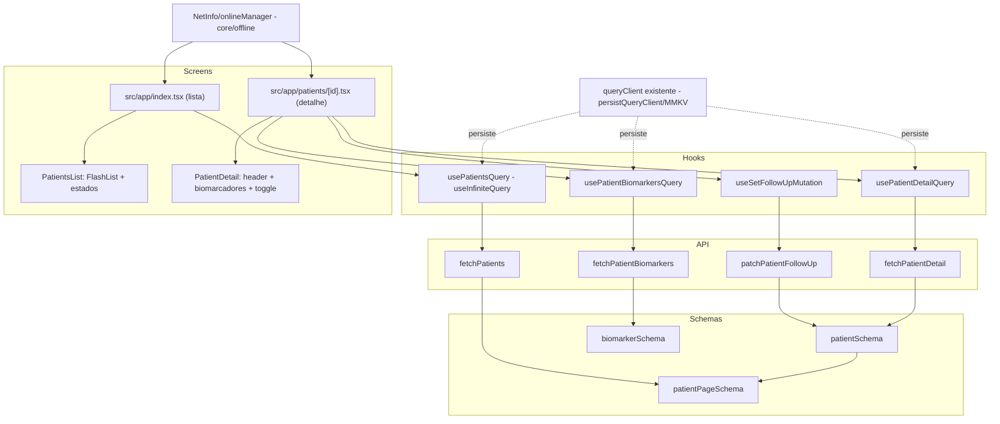

# Fase 2 — Carteira de Pacientes Mobile Design

**Spec**: `.specs/features/fase-2-carteira-pacientes-mobile/spec.md`
**Status**: Approved

---

## Architecture Overview

Fecha o fluxo `schema zod → tipo inferido → fetch → parse → hook de Query` (CLAUDE.md §5.4) para os
quatro endpoints já fechados no backend, e adiciona duas dependências novas ao projeto
(`@shopify/flash-list`, `@react-native-community/netinfo` — nenhuma delas instalada ainda,
confirmado em `package.json`). Revisado por especialista React Native/Expo antes do fechamento:
query key da lista inclui o termo de busca já debounced (troca de key reresolve sozinha, sem
invalidação manual), dados de `useInfiniteQuery` são achatados com `flatMap` memoizado antes de
entrar na `FlashList`, e a mutation otimista atualiza só o cache do detalhe (`['patient', id]`),
com `onSettled` invalidando também a lista como consistência barata (não exigida pelo AC, mas
recomendada).



---

## Code Reuse Analysis

### Existing Components to Leverage

| Component | Location | How to Use |
| --- | --- | --- |
| `apiGet` (com `ApiError`) | `src/core/api/http.ts` | Reusado sem alteração para os 3 endpoints de leitura |
| `queryClient` (com `persistQueryClient`/MMKV, AD-013) | `src/core/offline/queryClient.ts` | Reusado sem alteração — nenhum novo `QueryClient` é criado |
| `createTestQueryClient()` | `src/core/offline/queryClient.ts` | Reusado em todos os testes de hook novos, mesmo padrão de `useFeatureFlagsQuery.test.tsx` |
| `useTheme()` / `Brand` | `src/core/theme/useTheme.ts`, `brand.types.ts` | Reusado para cores/raios/tipografia/copy (`emptyPatients`) em toda tela nova — nenhum literal |
| Padrão de schema zod + fetch (`featureFlagsSchema`/`fetchFeatureFlags`) | `src/core/api/schemas/feature-flags.ts`, `src/core/api/feature-flags.ts` | Modelo exato replicado para `patient.ts`/`biomarker.ts` |
| `ListErrorBoundary`/estado de erro — **não existe ainda** | — | Primeiro componente de estado de erro/vazio/skeleton do projeto; ver Components |
| `BiometricGateScreen` (padrão de tela por `status`) | `src/core/ui/BiometricGateScreen.tsx` | Referência de estilo (não reusado por import — é outra tela), mas confirma o padrão "um componente, `status` como prop discriminante" já usado no projeto |

### Integration Points

| System | Integration Method |
| --- | --- |
| `src/app/index.tsx` | Reescrito — `BrandProofScreen` (Fase 0) é removida, vira a tela de lista de pacientes |
| `src/app/patients/[id].tsx` | Rota nova (Expo Router, arquivo dinâmico) |
| `package.json` | 2 dependências novas: `@shopify/flash-list`, `@react-native-community/netinfo` |
| `src/core/offline/` | Ganha `network.ts` (liga `onlineManager` do TanStack Query ao `NetInfo`, chamado uma vez na raiz) |

---

## Components

### `core/api/schemas/patient.ts`

```ts
export const patientSchema = z.object({
  id: z.string(),
  name: z.string(),
  birthDate: z.string(),
  goal: z.string(),
  status: z.string(),
  needsFollowUp: z.boolean(),
  updatedAt: z.string(),
});
export type Patient = z.infer<typeof patientSchema>;

export const patientPageSchema = z.object({
  data: z.array(patientSchema),
  nextCursor: z.string().nullable(),
});
export type PatientPage = z.infer<typeof patientPageSchema>;
```

### `core/api/schemas/biomarker.ts`

```ts
export const biomarkerStatusSchema = z.enum(['low', 'normal', 'high']);

export const biomarkerSchema = z.object({
  id: z.string(),
  code: z.string(),
  label: z.string(),
  value: z.number(),
  unit: z.string(),
  refMin: z.number(),
  refMax: z.number(),
  measuredAt: z.string(),
  status: biomarkerStatusSchema,
});
export type Biomarker = z.infer<typeof biomarkerSchema>;
export type BiomarkerStatus = z.infer<typeof biomarkerStatusSchema>;
```

- **Purpose**: Tipo nunca escrito à mão — `z.infer` é a única fonte. Espelha exatamente o shape dos
  Resources do backend (`PatientResource`, `PatientPageResource`, `BiomarkerResource`).
- **Location**: `src/core/api/schemas/patient.ts`, `src/core/api/schemas/biomarker.ts`

### `core/api/http.ts` (modificado — ganha `apiPatch`)

- **Purpose**: `apiGet` já existe e cobre os 3 GETs. `PATCH /patients/:id` precisa de um método
  novo, que hoje não existe no cliente HTTP.
- **New export**: `apiPatch(path: string, body: unknown): Promise<unknown>` — mesmo tratamento de
  erro de `apiGet` (envelope `{error:{code,message}}` → `ApiError`), método `PATCH`, header
  `Content-Type: application/json`, `body: JSON.stringify(body)`.
- **Reuses**: `ApiError`, `isErrorEnvelope`, `buildUrl` (privadas do módulo) — extraídas para reuso
  interno entre `apiGet` e `apiPatch` sem duplicar a lógica de parse de erro.

### `core/api/patients.ts`

```ts
export async function fetchPatients(
  brandId: string,
  search: string | undefined,
  cursor: string | undefined,
): Promise<PatientPage> {
  const raw = await apiGet('/api/v1/patients', {
    brand: brandId,
    ...(search ? { search } : {}),
    ...(cursor ? { cursor } : {}),
  });
  return patientPageSchema.parse(raw);
}

export async function fetchPatientDetail(id: string): Promise<Patient> {
  const raw = await apiGet(`/api/v1/patients/${id}`);
  return patientSchema.parse(raw);
}

export async function fetchPatientBiomarkers(id: string): Promise<Biomarker[]> {
  const raw = await apiGet(`/api/v1/patients/${id}/biomarkers`);
  return z.array(biomarkerSchema).parse(raw);
}

export async function patchPatientFollowUp(id: string, needsFollowUp: boolean): Promise<Patient> {
  const raw = await apiPatch(`/api/v1/patients/${id}`, { needsFollowUp });
  return patientSchema.parse(raw);
}
```

- **Location**: `src/core/api/patients.ts`
- Nenhum componente chama `fetch`/`apiGet`/`apiPatch` diretamente — só estas 4 funções, só chamadas
  pelos hooks abaixo.

### `core/patients/useDebouncedValue.ts` (hook utilitário novo)

- **Purpose**: Debounce genérico de 300ms para o termo de busca — não existe hook de debounce no
  projeto ainda.
- **Location**: `src/core/patients/useDebouncedValue.ts`
- **Interface**: `useDebouncedValue<T>(value: T, delayMs: number): T`

### `core/patients/usePatientsQuery.ts`

- **Purpose**: `useInfiniteQuery` da lista. Query key inclui `brand.id` + o termo de busca
  **debounced** (recomendação do especialista React Native): `['patients', brand.id,
  debouncedSearch ?? '']`. Trocar o termo de busca troca a key inteira — o TanStack Query já trata
  isso como uma query nova, sem vazar páginas da busca anterior; nenhuma invalidação manual.
- **Location**: `src/core/patients/usePatientsQuery.ts`
- **Interface**: `usePatientsQuery(search: string): UseInfiniteQueryResult<InfiniteData<PatientPage>>`
  — recebe o valor **já** debounced pelo componente (a screen aplica `useDebouncedValue` antes de
  passar pra cá, mantendo o hook simples e testável sem fake timers).
- `getNextPageParam: (lastPage) => lastPage.nextCursor` (ou `undefined` quando `null`, encerrando a
  paginação — TanStack Query trata `undefined` como "sem próxima página").
- `initialPageParam: undefined`.

### `core/patients/usePatientDetailQuery.ts` e `usePatientBiomarkersQuery.ts`

- **Purpose**: Dois hooks simples (`useQuery`), buscados em paralelo pela tela de detalhe (o React
  já paraleliza duas chamadas de `useQuery` independentes — nenhum `Promise.all` manual necessário).
- **Location**: `src/core/patients/usePatientDetailQuery.ts`,
  `src/core/patients/usePatientBiomarkersQuery.ts`
- Query keys: `['patient', id]`, `['patient', id, 'biomarkers']`.

### `core/patients/useSetFollowUpMutation.ts`

- **Purpose**: `useMutation` com `onMutate`/`onError`/`onSettled`, escopo restrito ao cache do
  detalhe (recomendação do especialista — suficiente para o AC de rollback visível na tela de
  detalhe; `onSettled` também invalida `['patients', brandId]` como consistência barata, sem exigir
  reescrita manual das páginas cacheadas).
- **Location**: `src/core/patients/useSetFollowUpMutation.ts`
- **Fluxo**:
  ```ts
  useMutation({
    mutationFn: (input: { id: string; needsFollowUp: boolean }) =>
      patchPatientFollowUp(input.id, input.needsFollowUp),
    onMutate: async (input) => {
      await queryClient.cancelQueries({ queryKey: ['patient', input.id] });
      const previous = queryClient.getQueryData<Patient>(['patient', input.id]);
      if (previous) {
        queryClient.setQueryData(['patient', input.id], {
          ...previous,
          needsFollowUp: input.needsFollowUp,
        });
      }
      return { previous };
    },
    onError: (_err, input, context) => {
      if (context?.previous) {
        queryClient.setQueryData(['patient', input.id], context.previous);
      }
    },
    onSettled: (_data, _err, input) => {
      queryClient.invalidateQueries({ queryKey: ['patient', input.id] });
      queryClient.invalidateQueries({ queryKey: ['patients', brandId] });
    },
  });
  ```
- `isPending` do resultado da mutation é o que desabilita o toggle na UI (PATMOB-18) — nenhum estado
  local duplicado.

### `core/offline/network.ts`

- **Purpose**: Liga `onlineManager` do TanStack Query a `NetInfo.addEventListener`, chamado uma vez
  na raiz do app (`src/app/_layout.tsx`). Sem isso, o TanStack Query nunca sabe que o device está
  offline, e não pausa/retoma queries automaticamente nem alimenta o hook de banner.
- **Location**: `src/core/offline/network.ts`
- **Interface**: `setupNetworkStatusListener(): () => void` (devolve unsubscribe, chamado em
  `useEffect` de `_layout.tsx`); `useIsOffline(): boolean` (hook simples sobre
  `NetInfo.useNetInfoState()`, usado pelo componente de banner).

### `core/ui/OfflineBanner.tsx`

- **Purpose**: Banner fixo, visível `WHILE useIsOffline() === true`. Não esconde conteúdo — some
  quando a conexão volta.
- **Location**: `src/core/ui/OfflineBanner.tsx`
- Copy fixa no core (não específica de marca — ver Assumptions da spec).

### `core/ui/QueryStateView.tsx` (componente novo, reusável)

- **Purpose**: Primeiro componente do projeto a formalizar os "quatro estados de UI" do CLAUDE.md
  §5.5 como uma peça reusável, em vez de cada tela reimplementar o `if/else` de status. Recebe o
  resultado bruto de uma query/infinite query e decide qual dos 4 renderizar.
- **Location**: `src/core/ui/QueryStateView.tsx`
- **Interface**:
  ```ts
  type QueryStateViewProps<T> = {
    status: 'pending' | 'error' | 'success';
    isEmpty: boolean;              // calculado pelo chamador (ex.: data.length === 0)
    onRetry: () => void;
    skeleton: ReactNode;
    emptyState: ReactNode;
    errorMessage: string;
    children: (data: T) => ReactNode;   // renderiza o sucesso não-vazio
    data: T | undefined;
  };
  ```
- Usado tanto pela lista (`isEmpty = pacientes achatados.length === 0`) quanto pelo detalhe
  (`isEmpty` não se aplica ao paciente em si, só à seção de biomarcadores — a screen de detalhe usa
  este componente duas vezes, uma por seção, ou compõe o estado manualmente; decisão de
  implementação, não estrutural).
- Estado de carregando (`skeleton`) e vazio (`emptyState`) são sempre nodes fornecidos pelo
  chamador — o componente não sabe desenhar skeleton de paciente vs. skeleton de biomarcador, só
  decide *qual* mostrar.

### `src/app/index.tsx` (reescrito)

- **Purpose**: Tela de lista. Usa `usePatientsQuery` + `useDebouncedValue` + `QueryStateView` +
  `FlashList`.
- Achatamento memoizado antes de passar para `FlashList`:
  ```ts
  const patients = useMemo(
    () => data?.pages.flatMap((page) => page.data) ?? [],
    [data],
  );
  ```
- `FlashList` com `data={patients}`, `keyExtractor={(p) => p.id}`, `estimatedItemSize` — valor
  definido durante a implementação (task dedicada mede o card real), `onEndReached={() =>
  fetchNextPage()}`, `onEndReachedThreshold={0.5}`.
- Card (`PatientCard`) mostra `name`, `goal`, selo quando `needsFollowUp`; `onPress` navega para
  `/patients/${id}` via `router.push`.

### `src/app/patients/[id].tsx` (rota nova)

- **Purpose**: Tela de detalhe. `usePatientDetailQuery(id)` + `usePatientBiomarkersQuery(id)` em
  paralelo + `useSetFollowUpMutation()`. Renderiza cabeçalho do paciente, toggle de acompanhamento
  (desabilitado durante `isPending` da mutation), e lista de biomarcadores (sem virtualização —
  volume baixo, `ScrollView` é aceitável aqui porque não é uma "lista grande de tamanho não
  limitado" no sentido do CLAUDE.md §2.5, é no máximo poucas dezenas de itens por paciente).

---

## Data Models

Nenhuma tabela/persistência local nova além do que `persistQueryClient`/MMKV já cobre — o cache das
queries novas (`['patients', ...]`, `['patient', id]`, `['patient', id, 'biomarkers']`) é
persistido automaticamente pelo mesmo persister já configurado (AD-013), sem nenhuma mudança em
`src/core/offline/storage.ts`.

---

## Error Handling Strategy

| Error Scenario | Handling | User Impact |
| --- | --- | --- |
| `apiGet`/`apiPatch` lança `ApiError` (4xx/5xx) | Hook devolve `status: 'error'`; `QueryStateView` renderiza `errorMessage` + botão retry (`onRetry` chama `refetch()`/`fetchNextPage` conforme o hook) | Estado de erro visível, distinto do vazio |
| Resposta não bate com o schema zod | `.parse()` lança `ZodError`, capturado pelo `queryFn` como qualquer outro erro — cai no mesmo estado de erro acima | Falha alta (CLAUDE.md §5.4), nunca renderiza dado parcial |
| `PATCH` falha durante a mutation otimista | `onError` reverte via snapshot; nenhum estado de erro de tela cheio — o toggle simplesmente volta, com um erro pontual (toast/mensagem inline, decisão de implementação) | Rollback visível, sem bloquear a tela |
| Device offline ao abrir a lista pela primeira vez (sem cache) | `useInfiniteQuery` fica em erro de rede; `OfflineBanner` visível simultaneamente reforça a causa | Erro + banner, nunca uma tela em branco sem explicação |
| Device offline com cache já persistido | `persistQueryClient` já entrega os dados cacheados antes de a rede ser sequer tentada; `OfflineBanner` visível, conteúdo continua | Carteira legível offline (Success Criteria da spec) |

---

## Risks & Concerns

| Concern | Location (file:line) | Impact | Mitigation |
| --- | --- | --- | --- |
| `@shopify/flash-list` e `@react-native-community/netinfo` não estão instalados (confirmado em `package.json`) | `mobile/package.json` | Tasks que assumem essas libs presentes falham até a instalação acontecer primeiro | Task dedicada de instalação como primeiro passo de Tasks, gate mínimo (`npx tsc --noEmit`) antes de qualquer outra task depender delas |
| `estimatedItemSize` não pode ser decidido em design — depende do card real | `src/app/index.tsx` | Se chutado errado, não quebra funcionalmente (FlashList tolera estimativa imprecisa), só degrada performance de scroll inicial | Task de implementação inclui abrir o app e medir/ajustar o valor observando o layout renderizado (já registrado como assumption na spec) |
| Tela de detalhe usa `ScrollView` para biomarcadores, não uma lista virtualizada | `src/app/patients/[id].tsx` | Poderia ser lido como violação do CLAUDE.md §2.5 se mal interpretado | Não é violação — a regra mira listas de tamanho *não limitado* (a carteira, 5.000+); biomarcadores por paciente são poucos (1-3 no seed, sem paginação no backend); registrar essa leitura explicitamente aqui para não virar uma dúvida no Verifier |
| `network.ts` precisa ser chamado uma única vez, na raiz — se chamado de novo em cada remount de tela, múltiplos listeners de `NetInfo` se acumulam | `src/app/_layout.tsx` | Vazamento de listener, múltiplos re-renders redundantes do banner | `setupNetworkStatusListener()` chamado em `useEffect` de `_layout.tsx` (que só monta uma vez), com cleanup no retorno do efeito |

---

## Tech Decisions

| Decision | Choice | Rationale |
| --- | --- | --- |
| Query key da lista inclui a busca já debounced | `['patients', brand.id, debouncedSearch ?? '']` | Revisão de especialista — troca de key reseta a paginação sozinha, sem invalidação manual nem vazamento de páginas antigas |
| Achatamento de `data.pages` memoizado com `useMemo` | Calculado na screen, não dentro do hook | Revisão de especialista — mantém `usePatientsQuery` genérico (devolve o resultado bruto do TanStack Query) e isola a preocupação de performance de lista na camada de UI |
| Mutation otimista escopada só a `['patient', id]`, com `onSettled` também invalidando `['patients', brandId]` | Não reescreve manualmente as páginas cacheadas da lista | Revisão de especialista — suficiente para o AC (rollback visível no detalhe); invalidar a lista por cima é barato e evita a lista mostrar um selo desatualizado quando o usuário volta |
| `QueryStateView` como componente novo e reusável | Não implementar o `if/else` de 4 estados solto em cada tela | Duas telas (lista, detalhe) precisam do mesmo padrão CLAUDE.md §5.5; evita duplicar a lógica de decisão de estado uma segunda vez já nesta mesma fase |
| `apiPatch` extraído para `core/api/http.ts`, reusando helpers privados de `apiGet` | Não duplicar parse de erro/`buildUrl` num arquivo novo | Único cliente HTTP do projeto continua sendo `http.ts` — mutations futuras (Fase 3, aceitar/descartar ação de IA) reusam o mesmo `apiPatch`/futuro `apiPost` |
| Biomarcadores do detalhe renderizados sem virtualização | `ScrollView` explicitamente aceito para essa seção | Ver Risks — volume baixo, sem paginação no backend; não é a lista que o CLAUDE.md §2.5 mira |

> **Project-level decision candidate:** `QueryStateView` estabelece o padrão oficial de "os quatro
> estados de UI" para o restante do projeto (Fase 3 também vai precisar disso para a superfície de
> IA). Vale registrar como `AD-NNN` em `.specs/STATE.md` quando a Execute desta feature rodar, para
> que a Fase 3 reuse em vez de reinventar.
