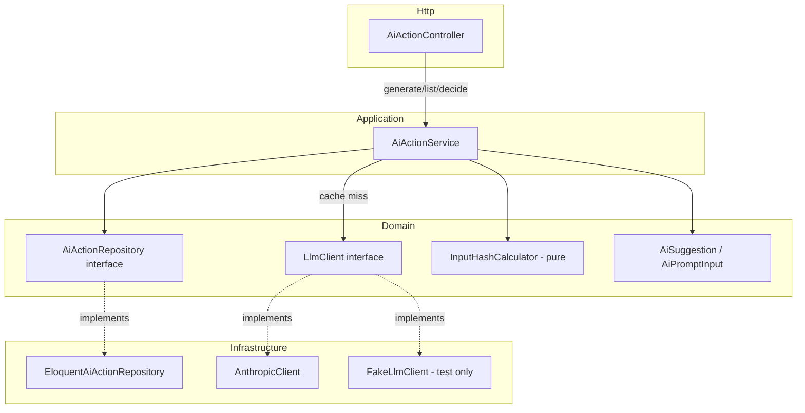
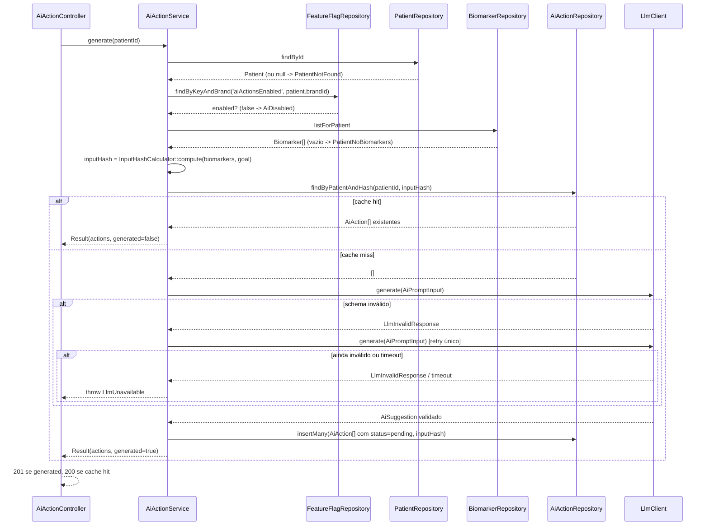

# Fase 3 — Ações de IA Backend Design

**Spec**: `.specs/features/fase-3-acoes-ia-backend/spec.md`
**Status**: Draft

---

## Architecture Overview

Mesmo padrão de camadas de `fase-2-carteira-pacientes-backend` (Controller → Service → Repository
interface → implementação Eloquent), com uma quarta peça nova: um adapter de LLM
(`Domain/AiAction/LlmClient` interface, implementado por `AnthropicClient` em produção e
`FakeLlmClient` em teste). O cache de geração não é uma camada nova — é uma consulta ao próprio
repositório de `ai_actions` por `(patient_id, input_hash)` antes de decidir chamar o LLM.



**Fluxo de `POST /patients/:id/ai-actions`:**



---

## Code Reuse Analysis

### Existing Components to Leverage

| Component | Location | How to Use |
| --- | --- | --- |
| `FeatureFlagRepository::findByKeyAndBrand` | `app/Domain/FeatureFlag/FeatureFlagRepository.php` | Já existe com a assinatura exata precisada para checar `aiActionsEnabled` por marca — nenhuma mudança na interface |
| `PatientRepository::findById` | `app/Domain/Patient/PatientRepository.php` | Resolve o paciente (dono do `brandId`, `goal`, `birthDate`) antes de gerar/listar |
| `BiomarkerRepository::listForPatient` | `app/Domain/Biomarker/BiomarkerRepository.php` | Fonte do snapshot clínico enviado ao prompt e usado no `input_hash` |
| Padrão de exceção de domínio → `Handler::render` | `app/Exceptions/Handler.php` | Mesmo padrão de `if ($e instanceof X)` já usado para `PatientNotFound`/`InvalidCursor`; só adicionar os 5 casos novos |
| Padrão de `FormRequest` + `$request->validated()` | `app/Http/Requests/UpdateFollowUpRequest.php` | Modelo direto para `DecideAiActionRequest` |
| Padrão de `JsonResource` com `$wrap = null` | `app/Http/Resources/PatientResource.php` | Modelo direto para `AiActionResource` |
| Padrão de `PatientService::assertValidId()` (regex UUID antes de bater no Postgres) | `app/Application/Patient/PatientService.php` | Reusar a mesma validação de formato de UUID em `AiActionService`, para `patientId` e `actionId` — evita 500 não mapeado (lição já registrada na Fase 2, AD/SPEC_DEVIATION documentado em `fase-2-carteira-pacientes-backend`) |
| `check-layer-boundary.sh` (varre `Application/` e `Http/Controllers/`) | `api/scripts/check-layer-boundary.sh` | Já cobre os diretórios novos automaticamente, sem alteração no script |

### Integration Points

| System | Integration Method |
| --- | --- |
| Anthropic Messages API | `Http::` do Laravel (`Illuminate\Support\Facades\Http`) dentro de `AnthropicClient`, com `timeout(15)`, lendo `config('services.anthropic.key')`/`config('services.anthropic.model')` (novos, vindos de `ANTHROPIC_API_KEY`/`ANTHROPIC_MODEL` do `.env`) |
| Tabela `ai_actions` (já migrada na Fase 0) | `EloquentAiActionRepository` + `Models\AiAction` novo, mapeando `biomarkers` (jsonb) para `array<string>` de códigos |
| `RateLimiter` do Laravel | Registrado em `AppServiceProvider::boot()` (`RateLimiter::for('ai', ...)`), aplicado via middleware `throttle:ai` só na rota `POST /patients/{id}/ai-actions` |

---

## Components

### `Domain/AiAction/AiAction.php`

- **Purpose**: Entidade de domínio — uma ação persistida.
- **Location**: `app/Domain/AiAction/AiAction.php`
- **Interfaces**: readonly properties — `id, patientId, title, rationale, priority, biomarkers (array<string>), status (AiActionStatus), inputHash, createdAt`
- **Dependencies**: `AiActionStatus`
- **Reuses**: mesmo estilo de entidade imutável de `Domain/Patient/Patient.php`

### `Domain/AiAction/AiActionStatus.php`

- **Purpose**: Enum puro (não backed, mesmo padrão de `BiomarkerStatus` — enum backed não permite
  redeclarar `from()`) com `pending`/`accepted`/`dismissed` e as transições válidas.
- **Location**: `app/Domain/AiAction/AiActionStatus.php`
- **Interfaces**:
  - `value(): string`
  - `static fromString(string $value): self`
  - `canTransitionTo(self $target): bool` — só `Pending->canTransitionTo(Accepted|Dismissed)` é `true`
- **Dependencies**: nenhuma (Domain puro, zero import de Illuminate)
- **Reuses**: mesmo padrão de `Domain/Biomarker/BiomarkerStatus.php` (enum PHP puro com método
  estático, sem herdar de enum backed)

### `Domain/AiAction/AiPromptInput.php`

- **Purpose**: Value object com exatamente o dado clínico mínimo enviado ao LLM (CLAUDE.md §6.4 —
  nunca nome/documento).
- **Location**: `app/Domain/AiAction/AiPromptInput.php`
- **Interfaces**: readonly properties — `age (int), goal (string), biomarkers (array<array{code:string, value:float, unit:string, refMin:float, refMax:float}>)`
- **Dependencies**: nenhuma
- **Reuses**: —

### `Domain/AiAction/AiSuggestion.php`

- **Purpose**: Value object da resposta validada do LLM, antes de virar `AiAction[]` persistidas.
- **Location**: `app/Domain/AiAction/AiSuggestion.php`
- **Interfaces**:
  - `static fromArray(array $validated): self` — espera o array já validado pelo `Validator` do
    adapter (CLAUDE.md §6.4: `risk_level`, `summary`, `actions[]` com `title/rationale/biomarkers/priority`)
  - readonly `riskLevel: string, summary: string, actions: array<AiSuggestedAction>`
- **Dependencies**: `AiSuggestedAction`
- **Reuses**: `riskLevel`/`summary` só circulam dentro deste objeto — nunca chegam a
  `AiActionRepository` (ver Assumption "Persistência de risk_level/summary" no spec)

### `Domain/AiAction/AiSuggestedAction.php`

- **Purpose**: Um item de `actions[]` dentro de `AiSuggestion` — vira uma linha de `AiAction` ao
  persistir.
- **Location**: `app/Domain/AiAction/AiSuggestedAction.php`
- **Interfaces**: readonly properties — `title, rationale, biomarkers (array<string>), priority`
- **Dependencies**: nenhuma

### `Domain/AiAction/AiActionRepository.php` (interface)

- **Purpose**: Contrato de persistência.
- **Location**: `app/Domain/AiAction/AiActionRepository.php`
- **Interfaces**:
  - `findById(string $id): ?AiAction`
  - `listForPatient(string $patientId): array` — ordenado `created_at desc`
  - `findByPatientAndHash(string $patientId, string $inputHash): array` — vazio = cache miss
  - `insertMany(array $actions): void` — recebe `AiAction[]` já com `id`/`status=pending` prontos
  - `updateStatus(string $id, AiActionStatus $status): AiAction`
- **Dependencies**: `AiAction`, `AiActionStatus`

### `Domain/AiAction/LlmClient.php` (interface)

- **Purpose**: Contrato do provedor de LLM.
- **Location**: `app/Domain/AiAction/LlmClient.php`
- **Interfaces**: `generate(AiPromptInput $input): AiSuggestion` — implementações lançam
  `LlmInvalidResponse` (schema quebrado) ou `LlmTimeout` (estouro de tempo); `AiActionService` decide
  o que fazer com cada uma (retry só na primeira)
- **Dependencies**: `AiPromptInput`, `AiSuggestion`

### `Domain/AiAction/InputHashCalculator.php`

- **Purpose**: Função pura que computa o `input_hash` — mesmo dado que vai para o prompt
  (biomarcadores ordenados por `code` + `goal`), nunca nome/idade calculada (idade deriva de
  `birthDate`, fora do hash por decisão registrada no spec).
- **Location**: `app/Domain/AiAction/InputHashCalculator.php`
- **Interfaces**: `static compute(array $biomarkers, string $goal): string` — `hash('sha256', json_encode(...))` sobre estrutura canônica (biomarcadores ordenados por `code` antes de serializar)
- **Dependencies**: nenhuma — testável isoladamente sem Laravel, mesmo espírito de
  `BiomarkerStatus::from()` (regra pura, barata de testar)

### `Domain/AiAction/Exceptions/{AiDisabled,LlmUnavailable,PatientNoBiomarkers,AiActionNotFound,AiActionAlreadyResolved}.php`

- **Purpose**: Exceções de domínio, uma por cenário de erro do spec, mesmo padrão de
  `Domain/Patient/Exceptions/PatientNotFound.php`.
- **Location**: `app/Domain/AiAction/Exceptions/`
- **Reuses**: `PatientNotFound`/`InvalidCursor` de `Domain/Patient` continuam sendo usadas
  diretamente (paciente inexistente é o mesmo cenário da Fase 2, não duplicado aqui)

### `Application/AiAction/AiActionService.php`

- **Purpose**: Orquestração — único ponto que decide cache hit/miss, chama o `LlmClient` com retry, e
  aplica as regras de transição de status. Mesmo padrão "um Service, vários métodos públicos" de
  `PatientService`.
- **Location**: `app/Application/AiAction/AiActionService.php`
- **Interfaces**:
  - `generate(string $patientId): AiActionGenerationResult` — `AiActionGenerationResult` é um DTO
    simples `{actions: AiAction[], generated: bool}` só para o Controller saber `201` vs `200`
  - `listForPatient(string $patientId): array` — `AiAction[]`
  - `decide(string $actionId, AiActionStatus $status): AiAction`
- **Dependencies**: `PatientRepository`, `BiomarkerRepository`, `FeatureFlagRepository`,
  `AiActionRepository`, `LlmClient`, `InputHashCalculator`
- **Reuses**: `assertValidId()` (mesma regex de `PatientService`, duplicada aqui — ver nota em Tech
  Decisions sobre por que não compartilhar via herança)

### `Infrastructure/Llm/AnthropicClient.php`

- **Purpose**: Implementação real de `LlmClient`, chama a API de mensagens da Anthropic.
- **Location**: `app/Infrastructure/Llm/AnthropicClient.php`
- **Interfaces**: `generate(AiPromptInput $input): AiSuggestion`
- **Dependencies**: `Illuminate\Support\Facades\Http`, `Illuminate\Support\Facades\Validator`,
  `config('services.anthropic.*')`
- **Reuses**: regras de validação exatas do exemplo em CLAUDE.md §6.4 (`risk_level`, `summary`,
  `actions.*.title/rationale/biomarkers/priority`)

### `Infrastructure/Llm/FakeLlmClient.php`

- **Purpose**: Implementação de teste — devolve uma `AiSuggestion` fixa ou lança
  `LlmInvalidResponse`/`LlmTimeout` conforme configurado no teste, sem nenhuma chamada de rede.
- **Location**: `app/Infrastructure/Llm/FakeLlmClient.php`
- **Interfaces**: `generate(AiPromptInput $input): AiSuggestion`, mais setters de teste
  (`respondWith(AiSuggestion $s)`, `failWith(Throwable $e)`) e um contador de chamadas
  (`timesCalled(): int`) para os testes de cache hit provarem "zero chamada extra"

### `Infrastructure/Persistence/Eloquent/Models/AiAction.php`

- **Purpose**: Eloquent model, confinado a esta pasta (CLAUDE.md §2.2).
- **Location**: `app/Infrastructure/Persistence/Eloquent/Models/AiAction.php`
- **Dependencies**: `$fillable` explícito (`id, patient_id, title, rationale, priority, biomarkers, status, input_hash, created_at`), `$casts = ['biomarkers' => 'array']`, `public $timestamps = false` (a tabela só tem `created_at`, sem `updated_at` — migration confirma)

### `Infrastructure/Persistence/Eloquent/EloquentAiActionRepository.php`

- **Purpose**: Implementação de `AiActionRepository`.
- **Location**: `app/Infrastructure/Persistence/Eloquent/EloquentAiActionRepository.php`
- **Reuses**: mesmo padrão `toDomain(Model): Entity` de `EloquentPatientRepository.php`

### `Http/Requests/DecideAiActionRequest.php`

- **Purpose**: Validação do corpo do `PATCH /ai-actions/:id`.
- **Location**: `app/Http/Requests/DecideAiActionRequest.php`
- **Interfaces**: `rules()`: `['status' => ['required', Rule::in(['accepted', 'dismissed'])]]`

### `Http/Resources/AiActionResource.php`

- **Purpose**: Serialização de `AiAction` → JSON.
- **Location**: `app/Http/Resources/AiActionResource.php`
- **Interfaces**: `toArray()`: `id, patientId, title, rationale, priority, biomarkers, status, createdAt`

### `Http/Controllers/Api/V1/AiActionController.php`

- **Purpose**: Só recebe requisição, chama `AiActionService`, devolve `Resource` com status certo.
- **Location**: `app/Http/Controllers/Api/V1/AiActionController.php`
- **Interfaces**:
  - `generate(string $patientId): JsonResponse` — `$result->generated ? 201 : 200`, corpo é
    `AiActionResource::collection($result->actions)`
  - `index(string $patientId): JsonResponse` — `200`, `AiActionResource::collection(...)`
  - `decide(DecideAiActionRequest $request, string $actionId): JsonResponse` — `200`,
    `new AiActionResource(...)`
- **Reuses**: exatamente o mesmo formato de `PatientController` (sem Eloquent, sem `if` de negócio,
  `#[DocResponse]` do Scramble documentando os erros)

---

## Data Models

```php
// Domain/AiAction/AiAction.php
final class AiAction
{
    public function __construct(
        public readonly string $id,
        public readonly string $patientId,
        public readonly string $title,
        public readonly string $rationale,
        public readonly string $priority,     // 'low' | 'medium' | 'high', já validado pelo adapter
        public readonly array $biomarkers,    // array<string> de códigos
        public readonly AiActionStatus $status,
        public readonly string $inputHash,
        public readonly string $createdAt,
    ) {}
}
```

**Relationships**: `AiAction.patientId` referencia `patients.id` (FK já existe na migration da Fase
0). Nenhuma migration nova é necessária — a tabela `ai_actions` já tem todas as colunas que esta
feature precisa.

---

## Error Handling Strategy

| Error Scenario | Handling | User Impact |
| --- | --- | --- |
| Paciente não existe (`generate`/`index`) | `PatientNotFound` (reusa a exceção da Fase 2) | `404 PATIENT_NOT_FOUND` |
| `aiActionsEnabled = false` na marca do paciente/ação | `AiDisabled` | `503 AI_DISABLED` |
| Paciente sem nenhum biomarcador (`generate`) | `PatientNoBiomarkers` | `422 PATIENT_NO_BIOMARKERS` |
| Timeout do `LlmClient` | `LlmTimeout` capturada no Service, relançada como `LlmUnavailable` | `502 AI_UNAVAILABLE` |
| Resposta do LLM fora do schema, mesmo após 1 retry | `LlmInvalidResponse` na 2ª tentativa, relançada como `LlmUnavailable` | `502 AI_UNAVAILABLE` |
| `ai_action` inexistente (`decide`) | `AiActionNotFound` | `404 AI_ACTION_NOT_FOUND` |
| `ai_action` já `accepted`/`dismissed` (`decide`) | `AiActionAlreadyResolved` | `409 AI_ACTION_ALREADY_RESOLVED` |
| Corpo do `PATCH` sem `status` válido | `ValidationException` (já tratada no Handler) | `422` |
| Mais de 10 `POST` de geração/minuto na mesma origem | Middleware `throttle:ai` do Laravel | `429` (envelope padrão do Laravel, sem exceção de domínio nova) |

---

## Risks & Concerns

| Concern | Location (file:line) | Impact | Mitigation |
| --- | --- | --- | --- |
| Duas requisições `POST` concorrentes para o mesmo paciente, sem histórico ainda, podem passar as duas pelo cache-miss e cada uma chamar o LLM e inserir seu próprio lote | `Application/AiAction/AiActionService.php` (método `generate`, sem lock) | Duplica custo de uma chamada de LLM no pior caso; paciente fica com 2 lotes de ações pendentes | Aceito explicitamente como Edge Case no spec — sem lock nesta fase, volume de uso de demo não justifica a complexidade de um lock distribuído |
| `AnthropicClient` depende de uma chave real (`ANTHROPIC_API_KEY`) para funcionar; sem ela, todo `generate()` em produção falha | `app/Infrastructure/Llm/AnthropicClient.php` (novo) | Sem chave configurada, toda geração vira `502 AI_UNAVAILABLE` | Esperado — `.env.example` já documenta `ANTHROPIC_API_KEY=` vazia (CLAUDE.md §2.4); `FakeLlmClient` garante que a suíte de testes nunca depende da chave real |
| `assertValidId()` duplicado entre `PatientService` e `AiActionService` (mesma regex de UUID) | `app/Application/Patient/PatientService.php` / novo `AiActionService.php` | Pequena duplicação de 1 método privado | Aceito — extrair para um trait/helper compartilhado é prematuro para 2 usos; ver Tech Decisions |

> Nenhum outro concern encontrado nas camadas tocadas por esta feature.

---

## Tech Decisions (only non-obvious ones)

| Decision | Choice | Rationale |
| --- | --- | --- |
| Onde vive o cálculo de `input_hash` | `Domain/AiAction/InputHashCalculator.php`, função estática pura | É regra de negócio determinística (mesmo dado → mesmo hash), não infraestrutura; vive no Domain pelo mesmo motivo de `BiomarkerStatus::from()` — testável sem Laravel, sem banco |
| `risk_level`/`summary` da resposta do LLM não têm coluna em `ai_actions` | Ficam só dentro de `AiSuggestion` (memória do request), descartados depois de persistir `AiAction[]` | Data model do CLAUDE.md §7 é a fonte de verdade da tabela; adicionar coluna nova para isso não foi pedido pelo plano (ver Assumption no spec) |
| `AiActionService` não herda de `PatientService` para reusar `assertValidId()` | Duplicar o método privado (regex idêntica) | Uma dependência entre dois Services por causa de 3 linhas de regex criaria acoplamento desnecessário entre features; herança de Service não é um padrão usado em nenhum outro lugar do projeto |
| `LlmClient::generate()` lança duas exceções diferentes (`LlmInvalidResponse` vs `LlmTimeout`) em vez de uma genérica | Interface expõe as duas | O Service precisa diferenciar "retry vale a pena" (schema inválido) de "não retry" (timeout) — ver AC6/AC5 do spec; uma exceção genérica obrigaria inspecionar mensagem de texto para decidir, frágil |
| `Models\AiAction::$timestamps = false` | Desliga o timestamp automático do Eloquent | A migration só criou `created_at` (sem `updated_at`) — comportamento padrão do Eloquent quebraria ao tentar popular uma coluna inexistente |

> Nenhuma decisão aqui estabelece uma convenção nova de projeto (todas seguem padrões já registrados
> em `.specs/STATE.md`); nada a promover para `AD-NNN`.
