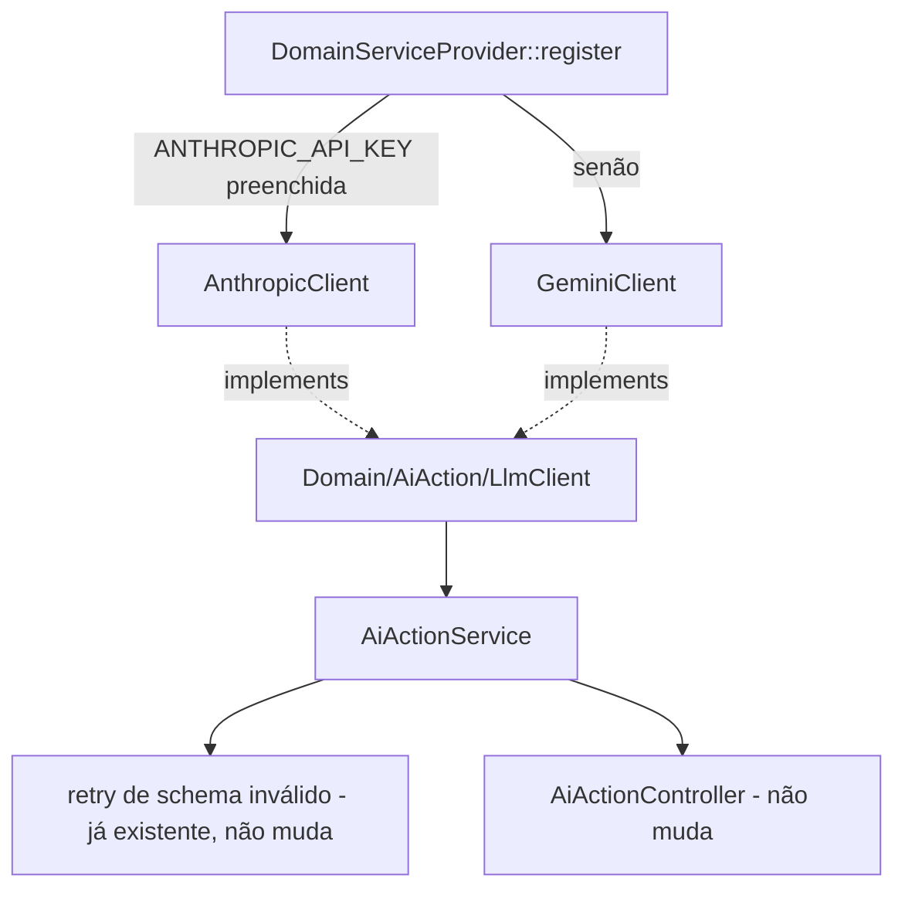

# Fase 3 — Seleção de Provedor de LLM Design

**Spec**: `.specs/features/fase-3-llm-provider-fallback/spec.md`
**Status**: Draft

---

## Architecture Overview

`LlmClient` já é uma interface do `Domain/AiAction`, bindada uma única vez no
`DomainServiceProvider`. Esta feature não introduz uma camada nova — troca o valor fixo do `bind()`
por uma closure que decide entre duas implementações concretas, e adiciona a segunda implementação
(`GeminiClient`), espelhando exatamente a forma do `AnthropicClient` existente.



Nenhuma seta nova sai de `AiActionService` ou `AiActionController` — os dois continuam dependendo só
da interface `LlmClient`, exatamente como hoje.

---

## Code Reuse Analysis

### Existing Components to Leverage

| Component | Location | How to Use |
| --- | --- | --- |
| `LlmClient` (interface) | `app/Domain/AiAction/LlmClient.php` | `GeminiClient` implementa a mesma interface, sem mudança nela |
| `AnthropicClient` | `app/Infrastructure/Llm/AnthropicClient.php` | Molde estrutural para `GeminiClient` — mesmo formato de método único `generate()`, mesmas exceptions lançadas, mesmo timeout |
| `AiPromptInput`/`AiSuggestion`/`AiSuggestedAction` | `app/Domain/AiAction/*.php` | Reusados sem alteração — são o contrato de entrada/saída dos dois adapters |
| `LlmTimeout`/`LlmInvalidResponse` | `app/Domain/AiAction/Exceptions/*.php` | Reusadas tal como estão — `GeminiClient` lança as mesmas duas classes, para o retry existente em `AiActionService` continuar funcionando sem mudança |
| `config/services.php` (bloco `anthropic`) | `api/config/services.php:31-34` | Modelo direto para o novo bloco `gemini` (`key`, `model`, ambos via `env()`) |
| `DomainServiceProviderTest` | `api/tests/Unit/DomainServiceProviderTest.php` | Mesmo padrão de teste (`$this->app->make(...)` + `assertInstanceOf`) para os dois novos testes de seleção |
| `AnthropicClientTest` | `api/tests/Unit/AnthropicClientTest.php` | Molde 1:1 para `GeminiClientTest` — `Http::fake()`, `assertSent()`, os 4 mesmos cenários (sucesso, schema inválido, JSON malformado, timeout) |

### Integration Points

| System | Integration Method |
| --- | --- |
| API REST do Google Gemini (`generativelanguage.googleapis.com`) | `Http::` do Laravel dentro de `GeminiClient`, mesmo padrão do `AnthropicClient` (nenhum SDK externo, CLAUDE.md §3 backend) |
| `DomainServiceProvider` | `register()` troca `$this->app->bind(LlmClient::class, AnthropicClient::class)` por uma closure condicional |
| `api/.env.example` | Duas linhas novas (`GEMINI_API_KEY=`, `GEMINI_MODEL=gemini-2.5-flash`), mesmo bloco visual do `ANTHROPIC_API_KEY` existente |

---

## Components

### `Infrastructure/Llm/GeminiClient.php`

- **Purpose**: Segunda implementação de `LlmClient`, fala com a API Generative Language do Google.
- **Location**: `api/app/Infrastructure/Llm/GeminiClient.php`
- **Interfaces**:
  - `generate(AiPromptInput $input): AiSuggestion` — único método exigido pela interface
- **Dependencies**: `Illuminate\Support\Facades\Http`, `Illuminate\Support\Facades\Validator`,
  `config('services.gemini.key')`, `config('services.gemini.model')`
- **Reuses**: estrutura de `AnthropicClient` (prompt building, validação via `Validator::make` com as
  mesmas regras de schema, mapeamento de exceptions); `AiSuggestion::fromArray()` sem alteração

**Diferenças de payload em relação ao `AnthropicClient`** (a única parte que não pode ser copiada
1:1 — API de provedor diferente):

- Chamada: `POST https://generativelanguage.googleapis.com/v1beta/models/{model}:generateContent?key={key}`
  (a chave vai na query string, não em header — formato da API do Google, confirmado via WebSearch)
- Corpo: `{"contents": [{"parts": [{"text": <prompt>}]}], "generationConfig": {"response_mime_type": "application/json"}}`
  — `response_mime_type: application/json` força o Gemini a devolver JSON válido nativamente, sem
  depender só da instrução em texto livre do prompt (o `AnthropicClient` não tem esse recurso
  disponível na Messages API, por isso só instrui via prompt)
- Texto da resposta: `candidates.0.content.parts.0.text` (em vez de `content.0.text` da Anthropic)
- O restante — decodificar o JSON do texto, validar contra o mesmo array de regras
  (`risk_level`/`summary`/`actions.*...`), e construir `AiSuggestion::fromArray()` — é idêntico ao
  `AnthropicClient`, byte a byte nas regras de validação.

### `config/services.php` (modify)

- **Purpose**: Novo bloco de configuração para as credenciais do Gemini.
- **Location**: `api/config/services.php`
- **Adiciona**:
  ```php
  'gemini' => [
      'key' => env('GEMINI_API_KEY'),
      'model' => env('GEMINI_MODEL', 'gemini-2.5-flash'),
  ],
  ```
- **Reuses**: mesmo formato do bloco `anthropic` já existente logo acima

### `api/.env.example` (modify)

- **Purpose**: Documentar as duas variáveis novas, mesmo padrão do `ANTHROPIC_API_KEY`.
- **Location**: `api/.env.example`
- **Adiciona**, logo abaixo do bloco `ANTHROPIC_API_KEY`/`ANTHROPIC_MODEL` existente:
  ```
  GEMINI_API_KEY=
  GEMINI_MODEL=gemini-2.5-flash
  ```

### `Providers/DomainServiceProvider.php` (modify)

- **Purpose**: Escolher a implementação de `LlmClient` no boot, por presença de
  `ANTHROPIC_API_KEY`.
- **Location**: `api/app/Providers/DomainServiceProvider.php`
- **Muda**:
  ```php
  $this->app->bind(LlmClient::class, function (): LlmClient {
      return filled(config('services.anthropic.key'))
          ? $this->app->make(AnthropicClient::class)
          : $this->app->make(GeminiClient::class);
  });
  ```
- **Reuses**: mesmo método `register()`, mesmo estilo de `bind()` usado pelos outros 5 repositórios
  já bindados na classe — só este binding vira condicional

---

## Data Models

Nenhum modelo de dado novo. `AiSuggestion`/`AiSuggestedAction`/`AiPromptInput` já existem e não
mudam — são o contrato compartilhado pelos dois adapters.

---

## Error Handling Strategy

| Error Scenario | Handling | User Impact |
| --- | --- | --- |
| Gemini responde `4xx`/`5xx` (ex.: `403` por chave inválida, `429` rate limit do free tier) | `GeminiClient` lança `LlmInvalidResponse` com o status na mensagem | Mesmo caminho já existente: `AiActionService` tenta 1 retry, se falhar de novo vira `502 AI_UNAVAILABLE` — nenhuma mudança visível na API pro mobile |
| Timeout/erro de conexão ao chamar o Gemini | `GeminiClient` lança `LlmTimeout` | Mesmo caminho existente — `502 AI_UNAVAILABLE` direto, sem retry (AIBE-05, não muda) |
| JSON do Gemini fora do schema, mesmo com `response_mime_type` forçando JSON válido (schema errado, não JSON inválido) | `GeminiClient` lança `LlmInvalidResponse` | Mesmo caminho existente |
| Nenhuma das duas chaves preenchida | `GeminiClient` é bindado, falha na primeira chamada real com erro de autenticação do Google (mapeia para `LlmInvalidResponse` → `502`) | Comportamento idêntico ao que já acontece hoje com `AnthropicClient` sem chave — não é uma regressão, é o mesmo padrão de falha explícita em vez de mascarar |

---

## Risks & Concerns

| Concern | Location (file:line) | Impact | Mitigation |
| --- | --- | --- | --- |
| Modelo Gemini padrão (`gemini-2.5-flash`) e o formato exato de erro do Google podem mudar entre a escrita desta spec e a execução — informação vem de WebSearch (2026), não de teste ao vivo contra a API real ainda | `config/services.php` (bloco `gemini` novo) | Se o nome do modelo for descontinuado ou o formato de erro divergir do assumido, a task de implementação vai descobrir isso ao testar com uma chave real (T5 do tasks.md, gate manual) | `GEMINI_MODEL` é configurável via `.env` sem precisar de deploy; a task de verificação manual com chave real (fora do Execute automatizado, já que exige uma chave paga/free real) cobre esse risco antes do usuário considerar a feature pronta |
| `DomainServiceProviderTest` hoje não testa o binding de `LlmClient` nenhuma vez (nem para `AnthropicClient`) — gap pré-existente, não desta feature | `api/tests/Unit/DomainServiceProviderTest.php` | Sem este gap ser fechado, a seleção de provedor ficaria sem cobertura de teste, que é o núcleo do valor desta feature (P2) | Fechado dentro desta feature mesmo (T6) — não é scope creep, é o requisito P2 sendo testado pela primeira vez |

> Nenhum outro concern encontrado nas camadas tocadas por esta feature.

---

## Tech Decisions (only non-obvious ones)

| Decision | Choice | Rationale |
| --- | --- | --- |
| Seleção por `bind()` com closure, não por variável de ambiente lida direto no Controller/Service | Toda a decisão fica em `DomainServiceProvider::register()` | Mantém a inversão de dependência do CLAUDE.md §6.2 — nenhuma camada acima da interface sabe qual implementação está ativa |
| `response_mime_type: application/json` no Gemini em vez de só instruir via prompt (como a Anthropic) | Usa o recurso nativo da API do Gemini | Reduz a chance de `LlmInvalidResponse` por texto solto fora de JSON — a Anthropic Messages API não expõe esse parâmetro, por isso os dois adapters diferem nesse ponto específico |
| Não criar uma "Factory" ou "Resolver" classe separada para a seleção | A closure inline no `register()` já resolve; um Resolver dedicado seria abstração para uma decisão de 1 `if` | Coding principle do próprio fluxo: "no abstractions for single-use code" |

> **Decisão de projeto:** a seleção de provedor por presença de env var no boot (Opção A, sem
> fallback em runtime) é registrada como `AD-014` em `.specs/STATE.md` — é uma escolha de arquitetura
> que qualquer feature futura envolvendo LLM deve respeitar (não adicionar um terceiro provedor sem
> revisar essa decisão).
