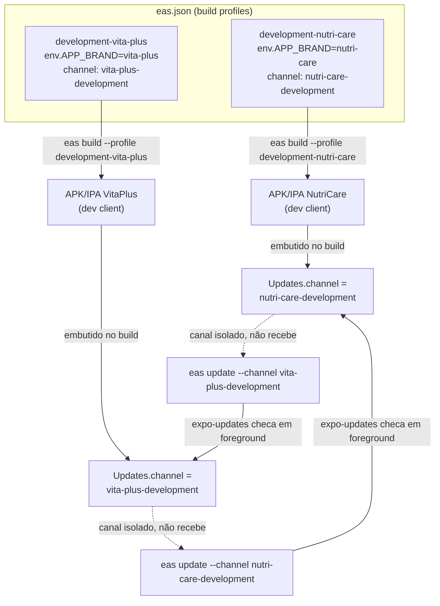

# Fase 4 — Release: OTA e build por marca (mobile) Design

**Spec**: `.specs/features/fase-4-release-ota-mobile/spec.md`
**Context**: `.specs/features/fase-4-release-ota-mobile/context.md`
**Status**: Draft

---

## Research (Knowledge Verification Chain)

- **Codebase (Step 1)**: `mobile/app.config.ts` já resolve `APP_BRAND` em build-time e gera
  `bundleIdentifier`/`package`/`icon` por marca (AD-006, Fase 0). Não existe `eas.json`, nem
  `expo-updates`/`expo-dev-client` em `package.json`. Não existe `EXPO_PUBLIC_EAS_PROJECT_ID` nem
  `extra.eas.projectId`.
- **Project docs (Step 2)**: `.specs/STATE.md` não tem nenhum AD sobre EAS/updates (feature nova,
  sem precedente a conformar ou superar).
- **Web search (Step 4, Context7 indisponível para Expo)**: `docs.expo.dev/eas-update/deployment`
  (fetched 2026-09-02) confirma: (a) perfis de `eas.json` carregam um campo `"channel"`; (b)
  `eas update:configure` gera `runtimeVersion: { policy: "appVersion" }` por padrão; (c) a política
  `"fingerprint"` existe mas a própria doc a rotula "experimental and not yet widely recommended" —
  **descartada** em favor de `appVersion` (ver correção em `spec.md`, tabela de Assumptions); (d) a
  doc recomenda manter canal e branch com o mesmo nome e tratá-los como um conceito único
  (`eas update --channel <nome>` em vez de gerenciar branch separadamente).

---

## Architecture Overview

Um projeto EAS único (`extra.eas.projectId` em `app.config.ts`) serve as duas marcas. A separação
entre marcas acontece inteiramente em **configuração de build**, nunca em código do app: cada
combinação marca+ambiente vira um **build profile** próprio em `eas.json`, com `env.APP_BRAND` fixo
e `channel` nomeado `<brand>-<profile>`. O app em runtime não escolhe canal — ele só reporta o que
foi embutido no binário no momento do build (mecanismo nativo do `expo-updates`, zero lógica
custom).



Um único `runtimeVersion` policy (`appVersion`, lido de `expo.version` em `app.config.ts`) vale
para as duas marcas — não há necessidade de política por marca, já que `version` é um campo comum
de app, e as duas marcas compartilham o mesmo código nativo/SDK.

---

## Code Reuse Analysis

### Existing Components to Leverage

| Component | Location | How to Use |
| --- | --- | --- |
| `BRAND_BUILD_CONFIG` + resolução de `APP_BRAND` | `mobile/app.config.ts` | Reusado sem alteração de forma — só ganha `extra.eas.projectId` e `updates.url`/`updates.channel` amarrados no objeto de config existente, mesma função `export default ({ config }) => ExpoConfig`. |
| Mecanismo de erro em `APP_BRAND` desconhecida | `mobile/app.config.ts` (`isKnownBrandId`) | Reusado tal como está — cobre REL-09 (falha de build com marca desconhecida) sem código novo. |
| `.env.example` / `EXPO_PUBLIC_API_URL` como referência de convenção de env | `mobile/.env.example` | Mesmo padrão para eventuais variáveis novas (nenhuma prevista — `eas.json` não usa `EXPO_PUBLIC_*` para isso). |

### Integration Points

| System | Integration Method |
| --- | --- |
| EAS Build/Update (serviço externo) | CLI `eas` (`eas-cli`, instalado como dev dependency ou via `npx`), autenticado via `eas login` (ação manual do usuário, fora do escopo automatizável). |
| `app.config.ts` | Ganha bloco `updates: { url: ... }` e `runtimeVersion: { policy: 'appVersion' }`, lidos automaticamente pelo `expo-updates` runtime — não precisa de código React novo. |

---

## Components

### `eas.json` (novo arquivo, raiz de `mobile/`)

- **Purpose**: Declarar os build profiles por marca+ambiente e seus canais de update associados.
- **Location**: `mobile/eas.json`
- **Interfaces**: arquivo de configuração declarativo, consumido pela `eas-cli` (`eas build`,
  `eas update`). Não expõe API de código.
- **Dependencies**: `extra.eas.projectId` já presente em `app.config.ts` (gerado por `eas init`).
- **Reuses**: nomes de marca (`nutri-care`, `vita-plus`) já usados como `APP_BRAND` em
  `app.config.ts` — os nomes dos profiles/canais espelham esses IDs para consistência, sem
  duplicar a lista de marcas conhecidas (`KNOWN_BRAND_IDS` continua sendo a única fonte de
  verdade de quais marcas existem; `eas.json` só referencia os IDs, não os redefine).

**Estrutura de profiles** (development apenas — únicos exigidos pelo critério de saída da fase):

```jsonc
{
  "cli": { "version": ">= 16.0.0", "appVersionSource": "remote" },
  "build": {
    "development-nutri-care": {
      "developmentClient": true,
      "distribution": "internal",
      "channel": "nutri-care-development",
      "env": { "APP_BRAND": "nutri-care" }
    },
    "development-vita-plus": {
      "developmentClient": true,
      "distribution": "internal",
      "channel": "vita-plus-development",
      "env": { "APP_BRAND": "vita-plus" }
    }
  }
}
```

### `app.config.ts` (alteração)

- **Purpose**: Declarar `updates.url` (apontando para o projeto EAS único) e `runtimeVersion`
  policy, e expor `extra.eas.projectId`, sem introduzir `if` de marca novo.
- **Location**: `mobile/app.config.ts`
- **Interfaces**: mesma assinatura `export default ({ config }: ConfigContext): ExpoConfig`; só
  acrescenta campos ao objeto retornado.
- **Dependencies**: `projectId` obtido de `eas init` (task de execução, não hardcoded a priori —
  placeholder até a task rodar).
- **Reuses**: `brandId`/`build` já resolvidos no topo do arquivo; nenhuma ramificação nova por
  marca — `updates`/`runtimeVersion` são idênticos para as duas marcas (só o `channel`, vindo do
  build profile via env, difere, e isso já é responsabilidade do `eas.json`, não do
  `app.config.ts`).

### `package.json` (alteração)

- **Purpose**: Adicionar `expo-updates` (runtime) e `expo-dev-client` (necessário para
  `developmentClient: true` no build profile) como dependências, e `eas-cli` como devDependency
  (ou uso via `npx eas-cli`, decisão de task).
- **Location**: `mobile/package.json`
- **Dependencies/Reuses**: instalados via `npx expo install` (garante versão compatível com o SDK
  57 já em uso), não `npm install` manual — convenção padrão Expo, evita mismatch de versão nativa.

### README mobile (alteração)

- **Purpose**: Documentar os comandos exatos (`eas init`, `eas build --profile ...`,
  `eas update --channel ...`) e como confirmar visualmente que o update foi aplicado — exigido por
  REL-14 do spec.
- **Location**: `mobile/README.md`
- **Reuses**: seção já existente sobre `APP_BRAND`/rodar localmente, como âncora de onde inserir a
  nova seção de release.

---

## Data Models

Não aplicável — feature de infraestrutura de build/release, sem entidade de domínio ou schema
novo.

---

## Error Handling Strategy

| Error Scenario | Handling | User Impact |
| --- | --- | --- |
| `eas build` falha (credencial, quota, rede) | Sem tratamento customizado — erro da EAS CLI propaga no terminal, documentado no README como falha esperada de ferramenta externa | Build não é gerado; usuário lê o erro da CLI e resolve (ex.: `eas login` de novo) |
| `APP_BRAND` desconhecida no build profile | Já tratado por `app.config.ts` (lança erro explícito, existente desde a Fase 0) | Build falha cedo, antes de qualquer chamada à EAS |
| Update publicado com `runtimeVersion` incompatível com o binário instalado | Comportamento nativo do `expo-updates` — update é ignorado silenciosamente pelo cliente | App permanece na versão anterior; nenhuma UI de erro (mecanismo padrão, fora do controle da app) |
| Device offline ao checar update | Comportamento nativo do `expo-updates` — checagem falha, app segue com bundle atual | Nenhuma UI de erro; próxima checagem em foreground tenta de novo |
| `eas login`/`eas init` sem confirmação do usuário | Task de execução pausa e pede confirmação explícita antes de rodar (ver Risks & Concerns) | Nenhuma ação externa acontece sem sinal verde explícito do usuário |

---

## Risks & Concerns

| Concern | Location (file:line) | Impact | Mitigation |
| --- | --- | --- | --- |
| `eas init`/`eas login` são ações externas, visíveis na conta EAS do usuário (criam projeto real) | N/A (ação de CLI, não arquivo) | Poderia ser confundido com "apenas configuração local" e rodado sem aviso | Task dedicada isola esse passo, com instrução explícita de pedir confirmação ao usuário antes de executar (alinhado à seção "Executando ações com care" do CLAUDE do harness) |
| Nenhum build nativo existe ainda — qualquer erro de configuração em `app.config.ts`/`eas.json` só aparece no primeiro `eas build`, que consome tempo de fila da EAS (minutos) | `mobile/eas.json` (novo) | Iteração lenta se a config estiver errada | Task de validação local roda `npx expo config` / `eas build:inspect --platform android` (dry-run local) antes do primeiro build real, pega erros de sintaxe sem gastar fila |
| Duas marcas = dois builds por plataforma = 4 builds (Android+iOS × 2 marcas) na fila gratuita da EAS, que tem cota mensal limitada no free tier | N/A | Poderia estourar cota do usuário sem aviso | Task de execução confirma com o usuário antes do primeiro `eas build` de cada marca/plataforma (mesma confirmação do ponto acima, mesmo gate) |
| `appVersion` runtime policy exige bump manual de `expo.version` a cada rebuild nativo, ou dois builds consecutivos compartilham o mesmo `runtimeVersion` mesmo com código nativo diferente | `mobile/app.config.ts` | Update publicado depois de uma mudança nativa não documentada poderia ser aplicado a um binário incompatível | Fora do escopo desta fase (só um build por marca é gerado); documentar a regra no README mobile como nota operacional para fases futuras |

> Nenhum outro concern encontrado no código existente relevante a esta feature.

---

## Tech Decisions (only non-obvious ones)

| Decision | Choice | Rationale |
| --- | --- | --- |
| Runtime version policy | `appVersion` (não `fingerprint`) | Confirmado via pesquisa: `fingerprint` é rotulado experimental pela própria doc Expo hoje; `appVersion` é o default gerado por `eas update:configure`. |
| Nomenclatura de build profile | `<profile>-<brand>` (ex.: `development-nutri-care`) | Convenção EAS: profile e channel podem ter nomes distintos, mas o profile precisa ser único por combinação marca+perfil dentro do mesmo `eas.json` — não dá para ter dois profiles chamados `development` com envs diferentes. |
| Nomenclatura de canal/branch | `<brand>-<profile>` (ex.: `nutri-care-development`) — canal e branch com o mesmo nome | Segue a recomendação da doc Expo de tratar canal e branch como um único conceito (`eas update --channel <nome>` sem gerenciar branch separado). |
| Instalação de dependências (`expo-updates`, `expo-dev-client`) | `npx expo install`, não `npm install` | Garante resolução de versão compatível com Expo SDK 57 já fixado no projeto — convenção padrão do ecossistema Expo. |
| `eas-cli` | Uso via `npx eas-cli@latest` nas tasks, sem fixar como dependência do projeto | Ferramenta de release, não runtime do app; fixar versão traria manutenção sem benefício nesta fase (decisão registrada aqui; se o time preferir pin explícito no futuro, é mudança de task, não de arquitetura). |

> **Nota**: nenhuma destas decisões estabelece uma convenção que outras features precisem seguir
> (são específicas de build/release desta fase) — não promovidas a `AD-NNN` em `STATE.md`.
