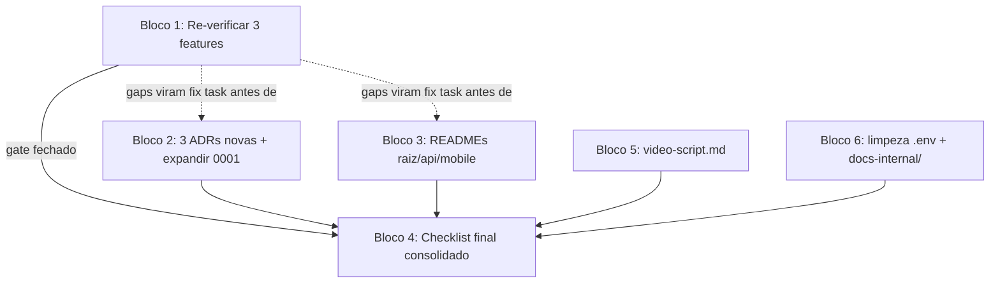

# Fase 5 — Fechamento Design

**Spec**: `.specs/features/fase-5-fechamento/spec.md`
**Status**: Approved

---

## Architecture Overview

Esta fase não introduz componente de software novo — é trabalho de verificação e documentação
sobre o que já existe. A "arquitetura" aqui é a ordem de dependência entre os blocos de trabalho:
re-verificação bloqueia documentação (não faz sentido escrever ADR/README sobre um estado não
confirmado), e o checklist final consolidado só roda depois que os outros três blocos fecham.

Blocos 2, 3, 5 e 6 não dependem entre si e podem ser feitos em qualquer ordem relativa, mas todos
dependem do Bloco 1 ter fechado (senão documentam algo não comprovado). O Bloco 4 é sempre o
último: ele é o gate de saída da fase inteira.

---

## Code Reuse Analysis

### Existing Components to Leverage

| Component | Location | How to Use |
|---|---|---|
| Fluxo de Verificação (Verifier) do skill | `tlc-spec-driven` / `references/validate.md`, `references/sub-agents.md` | Rodar 3x, uma por feature pendente, author≠verifier já garantido pelo próprio fluxo do skill |
| `check-layer-boundary.sh` / `check-brand-boundary.sh` | `api/scripts/`, `mobile/scripts/` | Reusar tal como estão no Bloco 4 (checklist final) — já comprovados limpos na investigação |
| Skill `create-adr` | `.claude/skills/create-adr/` | Usar para estruturar as 3 ADRs novas + expansão da 0001, em vez de inventar formato próprio |
| `.specs/STATE.md` AD-015 | raiz do repo | Fonte de conteúdo pronta para a ADR de ciclo de vida do paciente — só formalizar, não redecidir |
| `docker-compose.yml` + `api/docker/entrypoint.sh` | raiz / `api/docker/` | Já cobrem 100% dos passos exigidos (healthcheck, composer install, key:generate, migrate, seed, serve 9000) — Bloco 4 só executa `down -v && up`, não edita |

### Integration Points

| System | Integration Method |
|---|---|
| `.specs/features/*/validation.md` | Bloco 1 escreve/atualiza; Bloco 4 lê para confirmar que os 3 verdicts pendentes viraram PASS antes de fechar |
| `docs/adr/` | Bloco 2 adiciona 3 arquivos novos + edita `0001` in-place |
| `README.md`, `api/README.md`, `mobile/README.md` | Bloco 3 reescreve os dois de subprojeto por completo; edita a raiz adicionando seções que faltam, sem descartar o "como rodar" já existente |
| `api/.env.example`, `api/.env`, `.gitignore` | Bloco 6 edita in-place |

---

## Blocos de Trabalho

### Bloco 1 — Re-verificação

- **Propósito**: fechar o gate das 3 features sem PASS confirmado.
- **Como**: um Verifier fresco (sub-agente `general-purpose`, author≠verifier) por feature, seguindo
  `references/validate.md` do skill — spec-anchored outcome check + sensor de discriminação.
  `fase-0-fundacao` primeiro (é a base de tudo, e já tem um FAIL documentado — precisa confirmar
  se os blockers antigos ainda existem ou já foram corrigidos por trabalho posterior antes de gerar
  evidência nova). `fase-4-release-ota-mobile` e `detalhe-paciente-abas-mobile` podem rodar em
  paralelo entre si depois, já que não têm relação de dependência uma com a outra.
- **Saída**: `validation.md` atualizado/criado nas 3 pastas, todos PASS. Gaps viram fix tasks
  numeradas dentro desta fase (T-fix-N), implementadas e commitadas antes do Bloco 2/3 começarem
  de fato (podem já ter sido escritos em paralelo, mas não fecham sem o Bloco 1 verde).

### Bloco 2 — ADRs

- **Propósito**: 3 ADRs novas + expansão da `0001`.
- **Conteúdo por ADR** (usar skill `create-adr`; cada uma cita arquivo/caminho real):
  1. **Estrutura do repo e camadas do backend** — monorepo `api/`+`mobile/`, separação
     `Domain/Application/Infrastructure/Http`, por que Repository devolve entidade de domínio e não
     Model Eloquent, OpenAPI via `dedoc/scramble` como contrato em vez de tipos compartilhados
     (trade-off já citado em `CLAUDE.md` §3, mas nunca virou ADR formal).
  2. **Stack e arquitetura mobile** — TanStack Query v5 (por que não Redux Toolkit Query/SWR),
     Zustand para estado de cliente, `persistQueryClient`+MMKV para offline, paginação por cursor
     (por que não offset, com 5000+ pacientes), `expo-updates`/EAS Update para OTA (por que não
     CodePush — já descontinuado).
  3. **Ciclo de vida do paciente** — formaliza AD-015: `status` (`active`/`inactive`/`completed`)
     como mecanismo independente de soft delete (`deleted_at`), 4 transições válidas, por que não
     um enum único misturando os dois.
  4. **`0001` expandida** — mantém a decisão de servidor embutido já escrita, adiciona seção sobre
     biometria (`expo-local-authentication`) no lugar de HealthKit, já que os dois são decisões do
     mesmo tema ("capacidade nativa e infra", `CLAUDE.md` §14 item 11 alínea c).
- **Saída**: `docs/adr/0001-servidor-http-embutido.md` (editado),
  `docs/adr/0002-selecao-de-provedor-llm.md` (intocada),
  `docs/adr/0003-estrutura-repo-camadas-backend.md`,
  `docs/adr/0004-stack-arquitetura-mobile.md`,
  `docs/adr/0005-ciclo-de-vida-paciente.md`.

### Bloco 3 — READMEs

- **Propósito**: eliminar boilerplate de scaffold, completar README raiz.
- **`api/README.md`**: arquitetura em camadas (com o diagrama de `CLAUDE.md` §6.1), como rodar
  testes (`composer test`), Pint, PHPStan, lista de endpoints principais, link para `/docs/api`
  (Scramble).
- **`mobile/README.md`**: estrutura `core/`/`brands/`, como trocar marca via `APP_BRAND`, como
  rodar testes/lint/`tsc`, como publicar OTA (`eas update`), seletor de marca em dev (`__DEV__`).
- **README raiz**: manter "como rodar" existente; adicionar diagrama de arquitetura (mermaid,
  visão macro mobile↔API↔DB↔LLM), tabela de justificativa de biblioteca (uma linha por escolha da
  Stack Fixa do `CLAUDE.md` §3, o "porquê" e não só o "o quê"), seção "o que ficou de fora" (resumo
  inline do `CLAUDE.md` §15, não só link), e o relatório de uso de IA (como o Claude Code foi usado
  neste projeto — spec-driven, sub-agentes, Verifier independente — sem inflar nem esconder).
- Corrige `mobile/package.json` para `"version": "1.1.0"`.

### Bloco 4 — Checklist final consolidado

- **Propósito**: rodar `docs/plano-de-desenvolvimento.md` §3 item a item, numa sessão só, e
  reportar cada um.
- **Ordem de execução** (do próprio checklist, todos automatizáveis exceto o grupo "device físico"):
  1. `docker compose down -v && docker compose up -d --wait` do zero (AD-011 já documenta a flag
     `--wait` como obrigatória).
  2. `composer test` (api) e `npm test` (mobile).
  3. `tsc --noEmit`, `phpstan analyse`, `pint --test`.
  4. `check-layer-boundary.sh`, `check-brand-boundary.sh`.
  5. Grep de segredo no histórico do git + confirmação que `api/.env`/`mobile/.env` nunca foram
     commitados.
  6. Grep de marca dentro de `mobile/src/core/`.
- **Itens não automatizáveis** (checklist manual, entregue ao usuário como parte da Fase 5, task
  fica "aguardando confirmação"): app instalado nas duas marcas lado a lado, kill switch virado no
  banco (visual, não só teste automatizado), modo avião, OTA aplicado num device real, gate
  biométrico num device sem biometria cadastrada.

### Bloco 5 — `docs/video-script.md`

- **Propósito**: roteiro cronometrado de 3-5 min, ordenado pelo peso da rubrica (32/23/14/13/10/8%).
- Cada seção do roteiro nomeia a tela/comando exato a mostrar (ex.: "trocar `APP_BRAND` e mostrar
  os dois apps lado a lado", "virar flag no banco via `psql`/Tinker e mostrar 503").

### Bloco 6 — Limpeza de ambiente e docs internos

- **Propósito**: remover vars de scaffold não usadas de `api/.env.example`/`api/.env`, criar
  `docs-internal/` gitignored.
- Confirmar via `grep -rE "REDIS_|AWS_|MEMCACHED_|VITE_APP_NAME|BROADCAST_CONNECTION" api/config/ api/app/`
  antes de remover qualquer variável — só remove o que não aparece.

---

## Error Handling Strategy

| Cenário | Tratamento | Impacto |
|---|---|---|
| Verifier do Bloco 1 encontra gap bloqueante | Fix task dentro da Fase 5, commit próprio, Verifier roda de novo (bounded a 3 iterações, igual ao padrão do skill) | Atrasa Blocos 2/3 até fechar, não afeta o resto do projeto |
| Variável de `.env.example` parece não usada mas na verdade é referenciada em algum teste | Mantida, motivo registrado no próprio `.env.example` como comentário | Nenhum — evita quebrar teste por limpeza cega |
| Item do checklist manual falha no device do usuário | Fase 5 permanece aberta só para aquele item, resto pode ser considerado fechado | Usuário decide se é bloqueante para a entrega ou aceita o risco |

---

## Risks & Concerns

| Concern | Location | Impact | Mitigation |
|---|---|---|---|
| `fase-0-fundacao` validation.md antigo em FAIL pode esconder um blocker real ainda não corrigido, não só um gap cosmético | `.specs/features/fase-0-fundacao/validation.md` | Re-verificação pode revelar retrabalho de código, não só documentação | Bloco 1 roda primeiro e isolado; qualquer fix vira task explícita antes de qualquer ADR/README ser escrito sobre a feature |
| Escrever 3 ADRs novas + expandir 1 é trabalho de redação longo, risco de virar texto genérico/fraco | `docs/adr/` | ADR fraca não defende a decisão de verdade, perde nota nos 14% de peso de documentação | Design já lista o conteúdo mínimo exigido por ADR (contexto real, alternativa considerada, consequência); skill `create-adr` reforça a estrutura |
| Checklist manual de device físico é a única parte que fica "pendente de usuário" — risco de a fase nunca fechar 100% sem essa confirmação | Bloco 4 | Critério de aceite final do plano não fecha sozinho | Já é a decisão explícita do usuário (ver `context.md`); o gate distingue "automatizável, feito" de "manual, aguardando confirmação" em vez de fingir que está tudo pronto |

> Nenhum risco de código/segurança encontrado — esta fase não toca lógica de negócio.

---

## Tech Decisions (only non-obvious ones)

| Decision | Choice | Rationale |
|---|---|---|
| Ordem de execução dos blocos | 1 → (2,3,5,6 em qualquer ordem) → 4 | Bloco 1 é pré-condição de veracidade para tudo que vem depois; Bloco 4 é sempre o gate final |
| Sub-agentes para o Bloco 1 | Um `general-purpose` por feature, sequencial para `fase-0` (é a mais arriscada), depois paralelo para as outras duas | `fase-0` tem histórico de FAIL — vale isolar antes de paralelizar o resto |
| ADR de biometria/infra fundida em `0001` em vez de arquivo novo | Expandir `0001` in-place | Decisão explícita do usuário (context.md item 3) — os dois temas foram pedidos como um único agrupamento |

---
