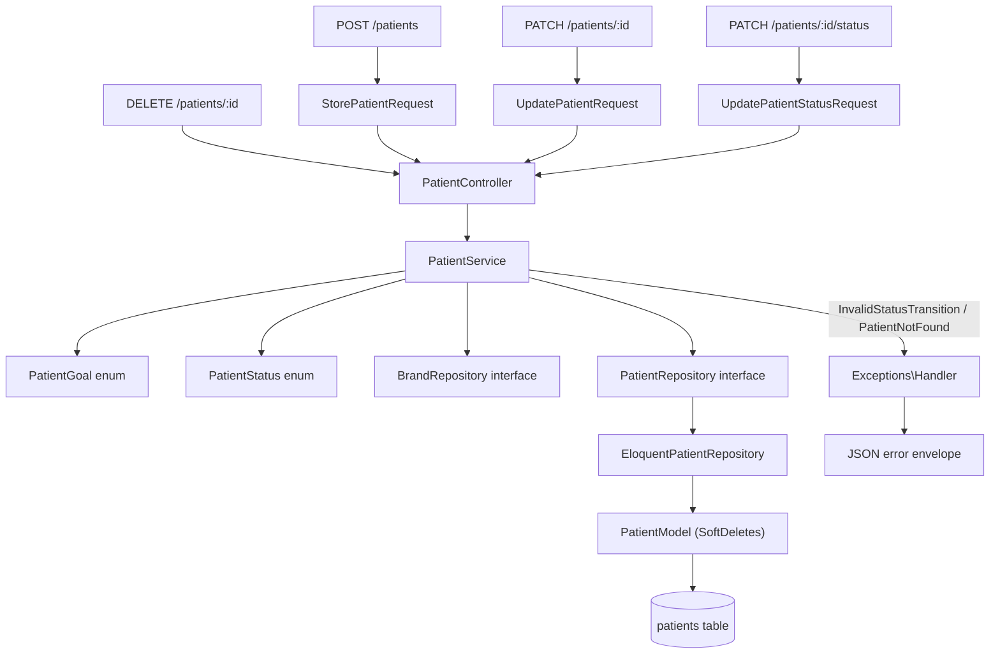

# Fase 6 — Melhorias UX Backend Design

**Spec**: `.specs/features/fase-6-melhorias-ux-backend/spec.md`
**Context**: `.specs/features/fase-6-melhorias-ux-backend/context.md`
**Status**: Draft

---

## Architecture Overview

Extensão pura das camadas já existentes de `Patient` (CLAUDE.md §6.1) — nenhuma camada nova é
introduzida, nenhuma dependência nova entra no `composer.json`. `PatientController` ganha 4 métodos
(`store`, `update` ampliado, `updateStatus`, `destroy`), todos finos (FormRequest → Service →
Resource). `PatientService` ganha a lógica de state machine de status e delega toda persistência ao
`PatientRepository` (interface), cuja implementação Eloquent passa a usar `SoftDeletes`. Dois enums
novos em `Domain/Patient/` (`PatientGoal`, `PatientStatus`) formalizam o vocabulário que hoje só vive
implícito na `PatientFactory`.



---

## Code Reuse Analysis

### Existing Components to Leverage

| Component | Location | How to Use |
| --- | --- | --- |
| `PatientController` | `app/Http/Controllers/Api/V1/PatientController.php` | Adiciona `store`, amplia `updateFollowUp`→`update`, adiciona `updateStatus`, `destroy` — mesmo padrão fino já usado por `show`/`biomarkers` |
| `PatientService` | `app/Application/Patient/PatientService.php` | Reaproveita `assertValidId()` (linha 82-87) e `clampLimit()`; adiciona `create`, `update`, `changeStatus`, `delete` |
| `PatientRepository` (interface) | `app/Domain/Patient/PatientRepository.php` | Estende com `insert`, `update`, `updateStatus`, `delete` — mesma assinatura de estilo de `updateNeedsFollowUp` |
| `EloquentPatientRepository` | `app/Infrastructure/Persistence/Eloquent/EloquentPatientRepository.php` | Reaproveita `toDomain()` (linha 81-93, ganha 2 campos); os novos métodos seguem o padrão de `updateNeedsFollowUp` (update + `findOrFail` + `toDomain`) |
| `BrandRepository` (interface) | `app/Domain/Brand/BrandRepository.php` | Reaproveitado em `PatientService::create()` exatamente como já é em `listForBrandSlug()` (linha 37-41) — mesmo padrão de resolver slug → `BrandNotFound` se ausente |
| `App\Domain\FeatureFlag\Exceptions\BrandNotFound` | já existe | Reaproveitada tal qual — é a mesma exceção que `listForBrandSlug` já lança; não criar uma segunda `BrandNotFound` em outro namespace |
| `App\Domain\Patient\Exceptions\PatientNotFound` | já existe | Reaproveitada em `update`, `changeStatus`, `delete` — mesmo 404 que `getById`/`updateNeedsFollowUp` já produzem |
| `Exceptions\Handler` | `app/Exceptions/Handler.php` | Ganha 1 `if` novo para `InvalidStatusTransition` → `409`, seguindo o mesmo padrão de `AiActionAlreadyResolved` (linha 47-49, também um 409 de transição de estado) |
| `check-layer-boundary.sh` | `api/scripts/` | Nenhuma mudança — a feature inteira respeita o contrato já verificado |
| `PatientFactory`/`PatientSeeder` | `database/factories/`, `database/seeders/` | `PatientFactory::definition()` passa a usar `PatientGoal::cases()`/`PatientStatus::Active->value` em vez de array solto — mesmo `randomElement`, fonte agora é o enum |

### Integration Points

| System | Integration Method |
| --- | --- |
| Postgres 16 | Novas colunas via migration aditiva (`0000_12_31_000006_...`); `CHECK` constraint via `DB::statement()` (Laravel 11 não tem builder nativo de `check()` para Postgres) |
| `config/app.php` | `faker_locale` default muda de `env('APP_FAKER_LOCALE', 'en_US')` para `env('APP_FAKER_LOCALE', 'pt_BR')` |
| OpenAPI (`dedoc/scramble`) | Novos `#[DocResponse(...)]` nos 4 métodos novos/alterados do controller, mesmo padrão dos existentes — nenhuma config nova do Scramble |

---

## Components

### `Domain/Patient/PatientGoal` (enum, novo)

- **Purpose**: Vocabulário fechado de objetivo do paciente — hoje só existe implícito na factory.
- **Location**: `app/Domain/Patient/PatientGoal.php`
- **Interfaces**:
  - `case LoseWeight = 'lose_weight'`, `GainMuscle = 'gain_muscle'`, `Maintain = 'maintain'`,
    `ManageCondition = 'manage_condition'` (enum backed em `string`, PHP puro — sem `Illuminate\`)
  - `values(): array<int, string>` — usado pela `Rule::in()` do `StorePatientRequest`/
    `UpdatePatientRequest` e pela `PatientFactory`
- **Dependencies**: nenhuma (Domain puro)
- **Reuses**: nada — vocabulário novo, mas os 4 valores já eram usados por convenção em
  `PatientFactory.php:26`

### `Domain/Patient/PatientStatus` (enum, novo)

- **Purpose**: State machine do ciclo de vida do acompanhamento, incluindo a regra de transição
  válida — é a peça "mais fácil de testar" desta feature, no mesmo espírito de `BiomarkerStatus`
  (CLAUDE.md §7).
- **Location**: `app/Domain/Patient/PatientStatus.php`
- **Interfaces**:
  - `case Active = 'active'`, `Inactive = 'inactive'`, `Completed = 'completed'`
  - `canTransitionTo(self $target): bool` — só `true` para as 4 combinações válidas (ver spec P3
    AC1-AC4); qualquer outra combinação, incluindo `$this === $target`, retorna `false`
  - `values(): array<int, string>` — usado por `Rule::in()` do `UpdatePatientStatusRequest`
- **Dependencies**: nenhuma
- **Reuses**: mesmo padrão de enum PHP puro que `BiomarkerStatus` já estabeleceu (enum não-backed com
  método estático, conforme AD registrado na Fase 2 — aqui backed em `string` porque o valor
  persiste literalmente na coluna `status`, diferente de `BiomarkerStatus` que é só calculado)

### `Domain/Patient/Exceptions/InvalidStatusTransition` (novo)

- **Purpose**: Sinaliza uma transição de status fora das 4 válidas.
- **Location**: `app/Domain/Patient/Exceptions/InvalidStatusTransition.php`
- **Interfaces**: `__construct(string $from, string $to)` — mensagem inclui os dois valores, mesmo
  estilo de `PatientNotFound`
- **Dependencies**: `RuntimeException`
- **Reuses**: mesmo padrão de `PatientNotFound`/`InvalidCursor` (uma classe final, um construtor,
  extends `RuntimeException`)

### `Http/Requests/StorePatientRequest` (novo)

- **Purpose**: Valida o corpo de `POST /patients`.
- **Location**: `app/Http/Requests/StorePatientRequest.php`
- **Interfaces**: `rules(): array` — `name: required|string|max:255`; `birthDate:
  required|date_format:Y-m-d|before_or_equal:today`; `goal: required|string|Rule::in(PatientGoal::values())`;
  `brand: required|string` (existência da marca resolvida no Service, não aqui — ver Assumptions do
  spec)
- **Dependencies**: `PatientGoal`
- **Reuses**: mesmo esqueleto de `UpdateFollowUpRequest`/`ListPatientsRequest` (`authorize(): true`,
  `rules()`)

### `Http/Requests/UpdatePatientRequest` (novo, substitui o uso direto de `UpdateFollowUpRequest` no cadastro)

- **Purpose**: Valida o corpo de `PATCH /patients/:id` (cadastro parcial).
- **Location**: `app/Http/Requests/UpdatePatientRequest.php`
- **Interfaces**: `rules(): array` — todos os 4 campos `sometimes` (`name`, `birthDate`, `goal`,
  `needsFollowUp`), mesmas regras de formato do `StorePatientRequest` para os 3 primeiros; regra
  adicional a nível de request (`withValidator`) exigindo ao menos um campo presente no corpo
- **Dependencies**: `PatientGoal`
- **Reuses**: `UpdateFollowUpRequest` é removido (funcionalidade absorvida por este request mais
  amplo) — ver Tech Decisions

### `Http/Requests/UpdatePatientStatusRequest` (novo)

- **Purpose**: Valida o corpo de `PATCH /patients/:id/status`.
- **Location**: `app/Http/Requests/UpdatePatientStatusRequest.php`
- **Interfaces**: `rules(): array` — `status: required|string|Rule::in(PatientStatus::values())`
- **Dependencies**: `PatientStatus`
- **Reuses**: mesmo esqueleto dos requests acima

### `PatientController` (modificado)

- **Purpose**: 4 métodos novos/alterados, todos seguindo o padrão fino já estabelecido.
- **Location**: `app/Http/Controllers/Api/V1/PatientController.php`
- **Interfaces**:
  - `store(StorePatientRequest $request): JsonResponse` — `201` + header `Location`
  - `update(UpdatePatientRequest $request, string $id): JsonResponse` — substitui `updateFollowUp`
    (rota `PATCH patients/{id}` continua igual, o método é que muda de nome e de amplitude)
  - `updateStatus(UpdatePatientStatusRequest $request, string $id): JsonResponse`
  - `destroy(string $id): JsonResponse` — `204`
- **Dependencies**: `PatientService`
- **Reuses**: `PatientResource` para as 3 respostas com corpo; nenhum acesso a Eloquent/query/regra
  (verificável pelo `check-layer-boundary.sh` já existente)

### `PatientService` (modificado)

- **Purpose**: Orquestra criação, edição, transição de status e exclusão.
- **Location**: `app/Application/Patient/PatientService.php`
- **Interfaces**:
  - `create(string $name, string $birthDate, string $goal, string $brandSlug): Patient` — resolve
    `brand` via `BrandRepository::findBySlug()` (mesmo padrão de `listForBrandSlug`, linha 37-41),
    lança `BrandNotFound` se ausente; delega a criação ao Repository
  - `update(string $id, array $fields): Patient` — `$fields` é o subconjunto validado
    (`name`/`birthDate`/`goal`/`needsFollowUp`) já filtrado pelo `FormRequest::validated()`;
    `assertValidId` + `PatientNotFound` se o paciente não existe
  - `changeStatus(string $id, string $targetStatus): Patient` — busca o paciente atual, calcula
    `PatientStatus::from($current->status)->canTransitionTo(PatientStatus::from($targetStatus))`;
    lança `InvalidStatusTransition` se `false`
  - `delete(string $id): void` — `assertValidId` + `PatientNotFound` se já não existe/já excluído
- **Dependencies**: `BrandRepository`, `PatientRepository` (ambos já injetados)
- **Reuses**: `assertValidId()` (linha 82-87) reaproveitado tal qual nos 4 métodos novos

### `PatientRepository` (interface, modificada)

- **Purpose**: Contrato ampliado de persistência.
- **Location**: `app/Domain/Patient/PatientRepository.php`
- **Interfaces** (adições):
  - `insert(string $brandId, string $name, string $birthDate, string $goal): Patient`
  - `update(string $id, array $fields): Patient` — `$fields` já validado pelo Service
  - `updateStatus(string $id, string $status, string $statusChangedAt): Patient`
  - `delete(string $id): void`
- **Dependencies**: nenhuma (é uma interface, `Domain/` puro)
- **Reuses**: assinatura no mesmo estilo de `updateNeedsFollowUp` já existente

### `EloquentPatientRepository` (modificado)

- **Purpose**: Implementação Postgres/Eloquent do contrato ampliado.
- **Location**: `app/Infrastructure/Persistence/Eloquent/EloquentPatientRepository.php`
- **Interfaces**: implementa os 4 métodos novos da interface
  - `insert(...)`: `PatientModel::create([...])` com `id` UUID gerado (mesmo padrão de UUID PK do
    projeto, AD-002), `status = PatientStatus::Active->value`, `needs_follow_up = false`,
    `status_changed_at = now()`
  - `update(...)`: `PatientModel::query()->where('id', $id)->update($fields)` seguindo o padrão de
    `updateNeedsFollowUp` (affected rows = 0 → `PatientNotFound`)
  - `updateStatus(...)`: mesmo padrão, grava `status` e `status_changed_at` juntos
  - `delete(...)`: `PatientModel::query()->where('id', $id)->delete()` — `SoftDeletes` grava
    `deleted_at`; affected rows = 0 → `PatientNotFound`
- **Dependencies**: `PatientModel` (agora usa trait `SoftDeletes`)
- **Reuses**: `toDomain()` (linha 81-93) ganha 1 campo (`statusChangedAt`); nenhuma outra mudança de
  forma

### `Infrastructure/Persistence/Eloquent/Models/Patient` (modificado)

- **Purpose**: Model Eloquent ganha soft delete e scope de status.
- **Location**: `app/Infrastructure/Persistence/Eloquent/Models/Patient.php`
- **Interfaces**: `use SoftDeletes;` (trait do Laravel) — global scope de `deleted_at IS NULL`
  automático em toda query, cobrindo P4 AC2 do spec sem lógica manual
- **Dependencies**: `Illuminate\Database\Eloquent\SoftDeletes`
- **Reuses**: nenhuma mudança de campo `$fillable` além de incluir os campos novos usados por
  `insert`/`update`

---

## Data Models

### Migration `0000_12_31_000006_add_lifecycle_and_soft_delete_to_patients_table.php`

```php
Schema::table('patients', function (Blueprint $table) {
    $table->timestamp('status_changed_at')->nullable();
    $table->softDeletes(); // deleted_at, nullable
});

DB::statement(
    "ALTER TABLE patients ADD CONSTRAINT patients_goal_check " .
    "CHECK (goal IN ('lose_weight', 'gain_muscle', 'maintain', 'manage_condition'))"
);
DB::statement(
    "ALTER TABLE patients ADD CONSTRAINT patients_status_check " .
    "CHECK (status IN ('active', 'inactive', 'completed'))"
);
```

`down()` remove as duas constraints (`DROP CONSTRAINT`) e as duas colunas, nessa ordem.

### `Domain/Patient/Patient` (entidade, campo novo)

```php
final class Patient
{
    public function __construct(
        public readonly string $id,
        public readonly string $brandId,
        public readonly string $name,
        public readonly string $birthDate,
        public readonly string $goal,
        public readonly string $status,
        public readonly bool $needsFollowUp,
        public readonly string $statusChangedAt, // novo
        public readonly string $updatedAt,
    ) {}
}
```

**Relationships**: inalterado — continua 1:N com `Biomarker`, 1:N com `AiAction` (não tocadas nesta
feature).

### `PatientResource` (campo novo exposto)

```php
return [
    'id' => $this->resource->id,
    'name' => $this->resource->name,
    'birthDate' => $this->resource->birthDate,
    'goal' => $this->resource->goal,
    'status' => $this->resource->status,
    'needsFollowUp' => $this->resource->needsFollowUp,
    'statusChangedAt' => $this->resource->statusChangedAt, // novo
    'updatedAt' => $this->resource->updatedAt,
];
```

---

## Error Handling Strategy

| Error Scenario | Handling | User Impact |
| --- | --- | --- |
| `POST /patients` com `name`/`birthDate`/`goal` inválido | `StorePatientRequest` rejeita antes do Controller (`ValidationException` → `422`) | Corpo de erro com o campo específico, via envelope já existente |
| `POST /patients` com `brand` inexistente | `PatientService::create()` lança `BrandNotFound` (reaproveitada) | `404 BRAND_NOT_FOUND` — mesmo comportamento já visto em `GET /patients` |
| `PATCH /patients/:id` sem nenhum campo | `UpdatePatientRequest::withValidator` adiciona erro customizado | `422`, mensagem "informe ao menos um campo" |
| `PATCH /patients/:id/status` com transição inválida | `PatientService::changeStatus()` lança `InvalidStatusTransition` | `409 INVALID_STATUS_TRANSITION`, registro inalterado |
| Qualquer operação sobre paciente excluído ou inexistente | `PatientRepository`/`PatientService` lançam `PatientNotFound` (reaproveitada) | `404 PATIENT_NOT_FOUND` |
| `DELETE` de paciente já excluído | `SoftDeletes` já exclui da query padrão → `affected = 0` → `PatientNotFound` | `404`, idêntico a excluir um paciente que nunca existiu |

---

## Risks & Concerns

| Concern | Location (file:line) | Impact | Mitigation |
| --- | --- | --- | --- |
| `UpdateFollowUpRequest` some, `PATCH /patients/:id` muda de forma | `app/Http/Requests/UpdateFollowUpRequest.php` (arquivo inteiro) | Qualquer teste/consumidor que hoje só manda `needsFollowUp` continua funcionando (P2 AC5 do spec exige isso), mas o teste de Feature que hoje cobre esse request precisa migrar para `UpdatePatientRequest` | Task dedicada de migração dos testes existentes de `UpdateFollowUpRequest` (T na fase de Tasks), rodando a suíte antes/depois para confirmar nenhuma regressão |
| `CHECK` constraint via `DB::statement()` bruto (fora do query builder) | migration nova | Constraint específica de Postgres — se o projeto trocasse de banco (não previsto, CLAUDE.md fixa Postgres 16), a migration quebraria | Aceitável: CLAUDE.md §3 já fixa Postgres 16 como stack, não há portabilidade a proteger |
| `PatientFactory` gera dado que pode violar a nova constraint durante testes antigos não atualizados | `database/factories/PatientFactory.php:26` | Testes de outras fases que criam `Patient::factory()->make(['goal' => 'algo solto'])` passariam a falhar no `INSERT` | Migration + enum entram *depois* de rodar a suíte completa da Fase 2/3 uma vez para confirmar que nenhum teste usa valor fora do enum (checagem rápida, não é uma mudança de comportamento esperada — os 4 valores já são os únicos usados) |
| Nenhum índice novo em `status`/`deleted_at` | tabela `patients` | `GET /patients?status=...` faz filtro adicional sobre a coluna `status` já coberta pelo índice composto `(brand_id, name)` só parcialmente (não inclui `status`) | Aceitável nesta fase — 5.000 registros por marca é barato de filtrar mesmo sem índice dedicado (mesmo raciocínio já usado para `search` na Fase 2); registrar como possível otimização futura, não bloqueante |

---

## Tech Decisions (only non-obvious ones)

| Decision | Choice | Rationale |
| --- | --- | --- |
| `PATCH /patients/:id` consolida `needsFollowUp` | Um único `UpdatePatientRequest` substitui `UpdateFollowUpRequest` | Mesmo endpoint HTTP, mesmo recurso — criar um segundo endpoint para o mesmo verbo/rota não faz sentido; `UpdateFollowUpRequest` é removido, não mantido em paralelo |
| Mudança de status é endpoint próprio, não parte do `PATCH` de cadastro | `PATCH /patients/:id/status` | Separa claramente o `422` de validação de campo do `409` de transição de state machine; evita um único FormRequest com duas semânticas de erro diferentes |
| `PatientStatus` é enum backed (`string`), diferente de `BiomarkerStatus` (enum puro não-backed) | Enum `string`-backed | O valor de `PatientStatus` persiste literalmente na coluna do banco (precisa de `->value`); `BiomarkerStatus` é só calculado em runtime, nunca persiste — a mesma razão que levou a Fase 2 a evitar enum backed ali (redeclarar `from()`) não se aplica aqui, porque `PatientStatus` não precisa de um método `from()` customizado, o `from()` nativo do PHP já serve |
| Soft delete via trait `SoftDeletes` do Laravel, não coluna/enum manual | `Illuminate\Database\Eloquent\SoftDeletes` | Já é Eloquent (permitido em `Infrastructure/`); dá global scope automático de exclusão em toda query sem precisar reescrever `paginate`/`findById` manualmente — a alternativa (filtro manual `WHERE deleted_at IS NULL` em cada query) duplicaria lógica que o framework já resolve |

> **Nenhuma decisão desta tabela é um AD-NNN de projeto** — todas são específicas desta feature
> (extensão pontual de um recurso já existente), não convenções que outras features precisam seguir.
> A única decisão de projeto que sai desta feature (modelagem de ciclo de vida separado de exclusão)
> já está registrada como **AD-015** em `.specs/STATE.md`, para virar ADR formal na Fase 5.

---

## Tips

Nenhuma nota adicional — a feature reaproveita 100% do padrão de camadas já estabelecido nas Fases
0-3, sem introduzir tecnologia ou padrão novo.
