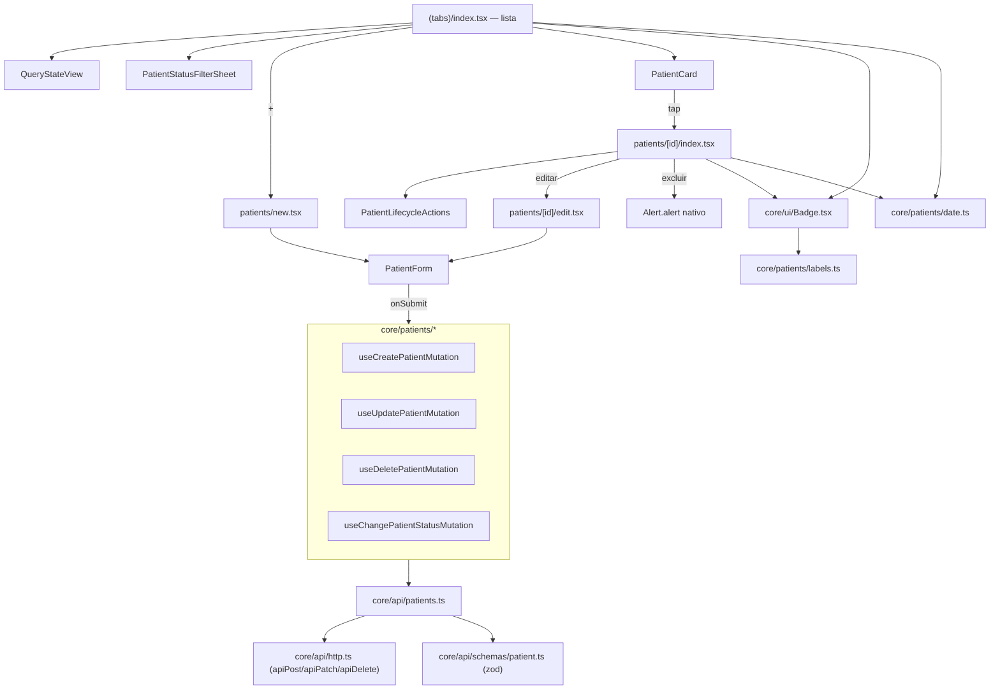

# Fase 6 — Melhorias UX Mobile Design

**Spec**: `.specs/features/fase-6-melhorias-ux-mobile/spec.md`
**Context**: `.specs/features/fase-6-melhorias-ux-mobile/context.md`
**Status**: Draft

---

## Architecture Overview

Segue o fluxo já estabelecido pelo core (CLAUDE.md §5.1/§5.4): schema zod → função de fetch →
`.parse()` → hook de TanStack Query → componente. Nenhuma camada nova — só amplia `core/api/patients.ts`,
`core/patients/*` (hooks) e `core/ui/*` (componentes), mais duas rotas novas do Expo Router.



---

## Code Reuse Analysis

### Existing Components to Leverage

| Component | Location | How to Use |
| --- | --- | --- |
| `QueryStateView` | `core/ui/QueryStateView.tsx` | Reaproveitado tal qual na lista (já em uso) e passa a ser adotado também na tela de detalhe (hoje reimplementa os 4 estados manualmente — não é redesign, é troca de implementação por trás da mesma UI) |
| `useTheme()` | `core/theme/useTheme.ts` | Fonte de `colors`/`radii`/`typography`/`spacing`/`copy` para todo componente novo — nenhum literal |
| `usePatientsQuery` | `core/patients/usePatientsQuery.ts` | Ganha um parâmetro `status` (default implícito do backend); assinatura muda de `(search)` para `(search, statusFilter)` |
| `useSetFollowUpMutation` | `core/patients/useSetFollowUpMutation.ts` | Padrão de referência para o rollback com `previous`/`previousLists` — **não** é reaproveitado para as mutations novas (elas não são otimistas, ver context.md), mas o padrão de cancelamento de query + invalidação em `onSettled` é copiado |
| `apiPost`/`apiPatch`/`apiDelete` | `core/api/http.ts` | Já existem e já tratam o envelope de erro (`ApiError` com `status`/`code`) — nenhuma mudança nesse arquivo |
| `PatientCard` | `(tabs)/index.tsx:16-74` | Ganha o `Badge` de objetivo e a idade no lugar do `<Text>{patient.goal}</Text>` atual (linha 48) |
| `PatientHeader` (tela de detalhe) | `patients/[id].tsx:76-135` | Ganha `Badge`, idade, e o novo `PatientLifecycleActions` logo abaixo do toggle de acompanhamento existente |
| `BiomarkerRow` (pill de status) | `patients/[id].tsx:147-200` | O pill inline (linha 169-187) é substituído por `<Badge>` — primeiro consumidor real do componente novo além do goal |
| `copy.emptyPatients` / tipo `Brand['copy']` | `core/theme/brand.types.ts:50-54`, `brands/*/copy.ts` | Ganha 2 chaves novas (`emptyBiomarkers`, `emptyFilteredPatients`) nas duas marcas |
| `patientSchema` | `core/api/schemas/patient.ts` | `goal`/`status` viram `z.enum([...])`; ganha `statusChangedAt: z.string()` |
| Rota `patients/[id].tsx` | `src/app/patients/[id].tsx` | **Movida** para `src/app/patients/[id]/index.tsx` (mesmo conteúdo, só de local) — necessário para caber `patients/[id]/edit.tsx` como rota irmã sem colisão de segmento dinâmico no Expo Router |

### Integration Points

| System | Integration Method |
| --- | --- |
| Backend `fase-6-melhorias-ux-backend` | 4 endpoints novos/ampliados (`POST`, `PATCH` ampliado, `PATCH .../status`, `DELETE`) consumidos via `core/api/patients.ts` |
| `react-hook-form` + `zod` | `PatientForm` usa `zodResolver` sobre um schema de formulário derivado de `patientSchema` (campos de entrada, não de exibição — `birthDate` continua string `YYYY-MM-DD` no formulário) |
| EAS Update | `app.json` `version` bump + `eas update --branch <canal>` nos dois canais existentes, sem mudança de config |

---

## Components

### `core/ui/Badge.tsx` (novo)

- **Purpose**: Pill genérico de rótulo curto, cor neutra única — substitui os dois pills inline hoje
  duplicados (`needsFollowUp` no card, status de biomarcador no detalhe).
- **Location**: `mobile/src/core/ui/Badge.tsx`
- **Interfaces**: `Badge({ label: string, testID?: string }): JSX.Element` — usa
  `colors.surfaceMuted`/`colors.textSecondary`/`radii.pill` via `useTheme()`, sem prop de cor (cor
  neutra única, decisão do usuário)
- **Dependencies**: `useTheme`
- **Reuses**: nenhum — é o componente base que os outros passam a reusar

### `core/patients/labels.ts` (novo)

- **Purpose**: Tradução fixa de `goal` (e função de rótulo do botão de ciclo de vida por status de
  origem) — vive em `core/` porque não varia por marca (ver Assumptions do spec).
- **Location**: `mobile/src/core/patients/labels.ts`
- **Interfaces**:
  - `GOAL_LABELS: Record<Patient['goal'], string>` — `lose_weight`→"Emagrecimento",
    `gain_muscle`→"Ganho de massa", `maintain`→"Manutenção",
    `manage_condition`→"Controle de condição clínica"
  - `lifecycleActionLabel(status: Patient['status']): { label: string; target: Patient['status'] } | null`
    — `active`→ duas ações (tratado à parte no componente, ver abaixo), `inactive`→`{label:
    'Reativar', target: 'active'}`, `completed`→`{label: 'Reabrir acompanhamento', target: 'active'}`
- **Dependencies**: `Patient` (tipo)
- **Reuses**: nada — vocabulário novo espelhando o enum do backend

### `core/patients/date.ts` (novo)

- **Purpose**: Funções puras de idade e formatação de data, testáveis isoladamente sem RN.
- **Location**: `mobile/src/core/patients/date.ts`
- **Interfaces**:
  - `calculateAge(birthDateIso: string, today: Date = new Date()): number` — anos completos
  - `formatDateBR(iso: string): string` — `YYYY-MM-DD` → `dd/MM/yyyy`
- **Dependencies**: nenhuma (funções puras, sem lib de data nova — `Date` nativo é suficiente para os
  dois casos)
- **Reuses**: nada

### `core/api/schemas/patient.ts` (modificado)

- **Purpose**: Fecha o mesmo buraco de tipagem que o backend fecha com enum.
- **Location**: `mobile/src/core/api/schemas/patient.ts`
- **Interfaces**:
  ```ts
  export const patientGoalSchema = z.enum(['lose_weight', 'gain_muscle', 'maintain', 'manage_condition']);
  export const patientStatusSchema = z.enum(['active', 'inactive', 'completed']);

  export const patientSchema = z.object({
    id: z.string(),
    name: z.string(),
    birthDate: z.string(),
    goal: patientGoalSchema,
    status: patientStatusSchema,
    needsFollowUp: z.boolean(),
    statusChangedAt: z.string(),
    updatedAt: z.string(),
  });
  ```
- **Dependencies**: `zod`
- **Reuses**: `patientPageSchema` inalterado (só usa `patientSchema` já estendido)

### `core/api/patients.ts` (modificado)

- **Purpose**: 4 funções novas de fetch, cada uma com `.parse()` obrigatório (CLAUDE.md §5.4).
- **Location**: `mobile/src/core/api/patients.ts`
- **Interfaces**:
  - `createPatient(input: { name: string; birthDate: string; goal: string; brand: string }): Promise<Patient>`
  - `updatePatient(id: string, fields: Partial<{ name: string; birthDate: string; goal: string; needsFollowUp: boolean }>): Promise<Patient>`
  - `updatePatientStatus(id: string, status: Patient['status']): Promise<Patient>`
  - `deletePatient(id: string): Promise<void>`
  - `fetchPatients(brandId, search, cursor, status)` — assinatura ganha o 4º parâmetro `status`
- **Dependencies**: `apiPost`, `apiPatch`, `apiDelete` (já existem)
- **Reuses**: `patchPatientFollowUp` passa a ser um alias fino de `updatePatient(id, { needsFollowUp })`
  — mantém a função exportada (nenhuma mudança no `useSetFollowUpMutation` existente)

### `core/patients/useCreatePatientMutation.ts` / `useUpdatePatientMutation.ts` / `useDeletePatientMutation.ts` / `useChangePatientStatusMutation.ts` (novos)

- **Purpose**: 4 mutations novas, nenhuma otimista (ver context.md).
- **Location**: `mobile/src/core/patients/`
- **Interfaces**: cada uma segue o padrão `useMutation({ mutationFn, onSuccess, onError })` — sem
  `onMutate`; `onSuccess` invalida `['patients', brand.id]` (todas as variações de filtro) e, quando
  aplicável, `['patient', id]`
- **Dependencies**: `useTheme` (para `brand.id`), `useQueryClient`
- **Reuses**: mesma forma de query key (`['patients', brand.id, ...]`, `['patient', id]`) já
  estabelecida por `usePatientsQuery`/`usePatientDetailQuery`/`useSetFollowUpMutation`

### `core/ui/PatientForm.tsx` (novo)

- **Purpose**: Formulário único de criar/editar, `react-hook-form` + `zodResolver`.
- **Location**: `mobile/src/core/ui/PatientForm.tsx`
- **Interfaces**:
  ```ts
  type PatientFormValues = { name: string; birthDate: string; goal: Patient['goal'] };
  function PatientForm(props: {
    mode: 'create' | 'edit';
    initialValues?: PatientFormValues;
    onSubmit: (values: PatientFormValues) => Promise<void>;
    submitting: boolean;
    fieldErrors?: Partial<Record<keyof PatientFormValues, string>>; // erro 422 mapeado de volta
  }): JSX.Element
  ```
- **Dependencies**: `react-hook-form`, `@hookform/resolvers/zod`, `GOAL_LABELS` (para o seletor de
  objetivo)
- **Reuses**: os mesmos tokens de `useTheme()` já usados no `TextInput` de busca da lista
  (`(tabs)/index.tsx:139-154`) como referência de estilo de campo

### `core/ui/PatientStatusFilterSheet.tsx` (novo)

- **Purpose**: Bottom-sheet/modal com as duas opções de filtro.
- **Location**: `mobile/src/core/ui/PatientStatusFilterSheet.tsx`
- **Interfaces**: `PatientStatusFilterSheet({ visible, current, onSelect, onClose }): JSX.Element` —
  `current`/`onSelect` usam um tipo `'active' | 'inactive_completed'` (não o enum de status cru, para
  deixar explícito que é uma seleção de *visão*, não de status individual)
- **Dependencies**: React Native `Modal` (built-in, sem lib nova)
- **Reuses**: nenhum

### `core/ui/PatientLifecycleActions.tsx` (novo)

- **Purpose**: Renderiza os botões corretos por status atual + a linha "desde quando" (P9).
- **Location**: `mobile/src/core/ui/PatientLifecycleActions.tsx`
- **Interfaces**:
  ```ts
  function PatientLifecycleActions(props: {
    status: Patient['status'];
    statusChangedAt: string;
    pending: boolean;
    onChangeStatus: (target: Patient['status']) => void;
  }): JSX.Element
  ```
- **Dependencies**: `formatDateBR`, `lifecycleActionLabel` (de `core/patients/labels.ts`/`date.ts`)
- **Reuses**: mesmo padrão visual de botão de `DetailErrorView` (`patients/[id].tsx:52-71`, botão
  "Tentar novamente") para consistência de toque/estilo

### Rotas novas do Expo Router

- **`src/app/patients/new.tsx`**: monta `PatientForm mode="create"`, chama
  `useCreatePatientMutation`, navega para `patients/${novo id}` em caso de sucesso.
- **`src/app/patients/[id]/edit.tsx`**: monta `PatientForm mode="edit"` com `initialValues` do
  `usePatientDetailQuery`, chama `useUpdatePatientMutation`, navega de volta ao detalhe em caso de
  sucesso.
- **`src/app/patients/[id]/index.tsx`**: conteúdo idêntico ao atual `src/app/patients/[id].tsx`
  (move de arquivo), acrescido de `PatientLifecycleActions` e do botão/`Alert` de excluir.

---

## Data Models

### `Patient` (zod, tipo inferido — sem mudança manual)

```ts
type Patient = {
  id: string;
  name: string;
  birthDate: string; // YYYY-MM-DD
  goal: 'lose_weight' | 'gain_muscle' | 'maintain' | 'manage_condition';
  status: 'active' | 'inactive' | 'completed';
  needsFollowUp: boolean;
  statusChangedAt: string; // ISO 8601
  updatedAt: string;
};
```

**Relationships**: inalterado — `Patient` continua consumido por `Biomarker`/`AiAction` sem mudança.

### `Brand['copy']` (tipo, 2 chaves novas)

```ts
copy: {
  patientsTitle: string;
  emptyPatients: string;
  aiDisclaimer: string;
  emptyBiomarkers: string;        // novo — substitui EMPTY_BIOMARKERS_MESSAGE hardcoded
  emptyFilteredPatients: string;  // novo — filtro "Inativos e concluídos" sem resultado
};
```

As duas marcas (`nutri-care/copy.ts`, `vita-plus/copy.ts`) ganham as 2 chaves, com tom de voz
consistente com as já existentes (`emptyPatients` de cada marca é o modelo de tom).

---

## Error Handling Strategy

| Error Scenario | Handling | User Impact |
| --- | --- | --- |
| `422` de `POST`/`PATCH` de paciente | `ApiError.code`/mensagem mapeados para o campo do `PatientForm` via `fieldErrors` | Erro aparece embaixo do campo específico, dado preservado no form |
| Erro de rede em qualquer mutation nova | `onError` mostra mensagem com ação de tentar de novo; nenhum estado otimista para reverter (mutations não são otimistas) | Usuário vê erro, tenta de novo manualmente |
| `409 INVALID_STATUS_TRANSITION` | Tratado como erro genérico de mutation (mensagem "não foi possível atualizar o status, atualize a tela e tente de novo") | Botões voltam ao estado anterior, sem mudança visual até novo sucesso |
| `.parse()` falha (goal/status fora do enum conhecido) | Mesmo caminho de erro de payload inválido já usado pela camada de API (`ApiError`/exceção de parse propagada para o `QueryStateView`) | Tela de erro padrão, nunca renderiza valor cru |
| Excluir com paciente já removido por outra sessão (`404`) | `onError` mostra "paciente não encontrado" e navega de volta para a lista | Sem crash, navegação seguindo o edge case do spec |

---

## Risks & Concerns

| Concern | Location (file:line) | Impact | Mitigation |
| --- | --- | --- | --- |
| Mover `[id].tsx` para `[id]/index.tsx` pode quebrar testes que importam o arquivo por caminho relativo | `mobile/src/app/patients/[id].tsx` e seu teste companheiro (se existir por convenção `__tests__`) | Suite quebra silenciosamente se o import não for atualizado junto | Task dedicada faz o `git mv` + atualiza qualquer import/teste na mesma tarefa, gate roda antes do commit |
| Tela de detalhe hoje implementa os 4 estados manualmente, não via `QueryStateView` | `patients/[id].tsx:244-273` | Trocar por `QueryStateView` é tecnicamente um "redesign", mas foi decidido como fora de escopo (só telas novas) | Decisão: **não** trocar nesta feature — só adicionar `PatientLifecycleActions`/exclusão por cima da implementação atual, para não reabrir uma tela já verificada. Ver Tech Decisions |
| `usePatientsQuery` muda de assinatura (`search` → `search, statusFilter`) | `core/patients/usePatientsQuery.ts:9` | Qualquer chamador existente (só `(tabs)/index.tsx:126`) precisa ser atualizado no mesmo commit | Task única cobre hook + chamador juntos (não é um caso de "compilação quebrada entre tasks", ver tasks.md) |
| Nenhum teste de snapshot deve ser usado para `PatientForm`/`Badge` (CLAUDE.md §10 proíbe) | novo código | Cobertura fraca se só houver snapshot | Tasks exigem teste de comportamento (render + interação), nunca só snapshot |

---

## Tech Decisions (only non-obvious ones)

| Decision | Choice | Rationale |
| --- | --- | --- |
| Mover `[id].tsx` → `[id]/index.tsx` | Move puro de arquivo, sem alterar conteúdo | Expo Router não permite um arquivo `[id].tsx` e uma pasta `[id]/` convivendo no mesmo nível de rota — a pasta é necessária para caber `[id]/edit.tsx` como rota irmã de `/patients/:id` |
| Tela de detalhe não migra para `QueryStateView` nesta feature | Mantém a implementação manual dos 4 estados já existente | Decisão do usuário: só telas/componentes novos são retrabalhados; migrar a implementação de estado da tela de detalhe seria tocar em código já verificado pelo Verifier da Fase 3 sem necessidade |
| Filtro de status é local ao componente da lista, não persistido | `useState<'active' \| 'inactive_completed'>('active')` em `(tabs)/index.tsx`, resetado a cada montagem | Não pedido persistência do filtro entre sessões; `persistQueryClient` já cobre os dados, não a UI de filtro selecionada |
| `patchPatientFollowUp` vira alias de `updatePatient` | Função antiga mantida como wrapper fino | Zero mudança no `useSetFollowUpMutation` já verificado — reduz superfície de risco de regressão |
| Sem date picker novo | `TextInput` com validação zod de formato no formulário | Nenhuma lib de data está na stack fixa (CLAUDE.md §3); adicionar uma só para este campo não se justifica (ver Assumptions do spec) |

> Nenhuma decisão desta tabela é um `AD-NNN` de projeto — todas são específicas desta feature.

---

## Tips

Nenhuma nota adicional além do já registrado em Risks & Concerns — a feature reaproveita a stack fixa
do CLAUDE.md §3 integralmente, sem biblioteca nova.
