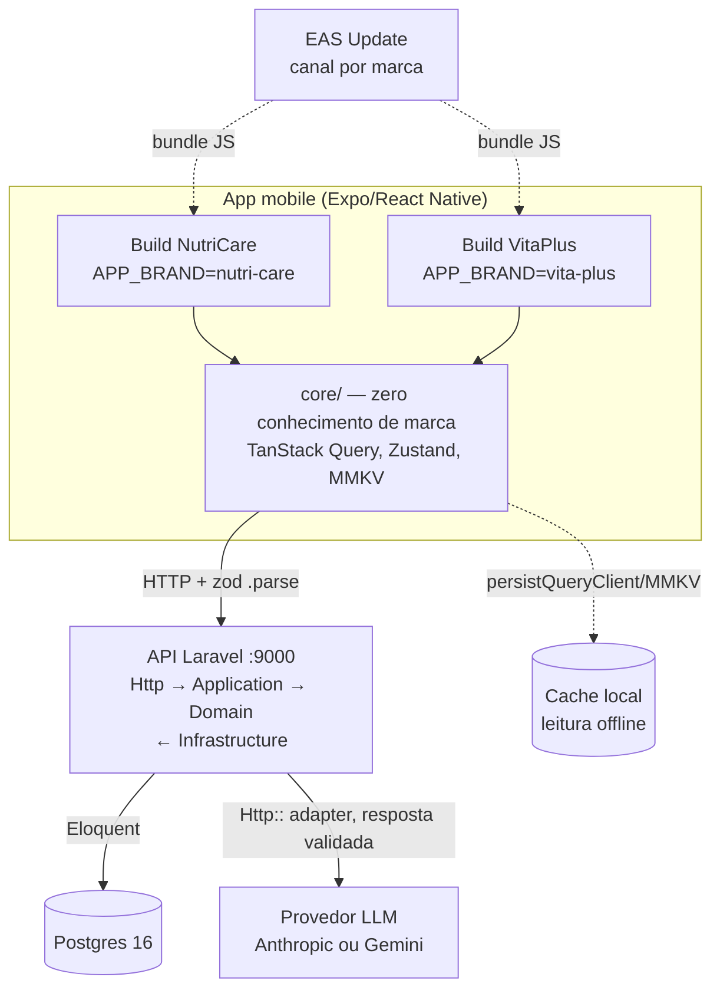

# tecsa-health

App core único e white-label servindo duas marcas (NutriCare e VitaPlus) a partir de uma base
compartilhada, com uma fatia vertical do "app do nutricionista": carteira de pacientes,
biomarcadores e ações de acompanhamento geradas por IA. A arquitetura completa, as regras
invioláveis e as decisões de stack estão documentadas em [`CLAUDE.md`](./CLAUDE.md).

## Como rodar

### Pré-requisitos

- Docker e Docker Compose
- Node.js 20+ e npm
- Um device físico com Expo Go, um simulador iOS ou um emulador Android (para o app mobile)

### 1. Clonar e configurar variáveis de ambiente

```bash
git clone <url-do-repositorio>
cd tecsa-health

cp api/.env.example api/.env
cp mobile/.env.example mobile/.env
```

`api/.env` já vem com valores padrão que funcionam sem edição para rodar localmente via Docker
(banco, filas e cache locais). Para exercitar a geração de ações de IA de verdade, preencha uma das
duas chaves de LLM — `ANTHROPIC_API_KEY` ou `GEMINI_API_KEY` (free tier do Google AI Studio, sem
custo). O backend escolhe o provedor sozinho no boot: se `ANTHROPIC_API_KEY` estiver preenchida,
usa Anthropic; senão, usa Gemini. Com as duas vazias, a geração falha com `502 AI_UNAVAILABLE` —
o resto do app não é afetado. Motivo e alternativas descartadas em
[`docs/adr/0002-selecao-de-provedor-llm.md`](./docs/adr/0002-selecao-de-provedor-llm.md).

`mobile/.env` precisa de `EXPO_PUBLIC_API_URL`. Em simulador iOS ou emulador Android, aponte para
`http://localhost:9000`. **Em device físico**, `localhost` não alcança a máquina host — use o IP da
sua máquina na rede local, por exemplo `http://192.168.0.10:9000` (descubra o IP com `ipconfig
getifaddr en0` no macOS ou `ip addr` no Linux).

### 2. Subir o backend

```bash
docker compose up -d --wait
```

Sem nenhum passo manual adicional, isso sobe o Postgres com healthcheck, espera o banco ficar
saudável, roda `composer install` se o `vendor/` não existir, gera a `APP_KEY` se estiver vazia,
roda as migrations, semeia o banco (mínimo 5.000 pacientes distribuídos entre as duas marcas) se
ele estiver vazio, e sobe a API na porta **9000**.

Use sempre `--wait`: o serviço `api` tem healthcheck próprio (`curl -f http://localhost:9000/up`),
e `--wait` bloqueia o comando até esse healthcheck reportar saudável, não só até o container
iniciar. Sem `--wait` (ou rodando `docker compose up` em foreground e testando antes da linha
`Server running on [http://0.0.0.0:9000]` aparecer no log), um `curl` imediato pode acertar a porta
antes do `composer install`/migrations/seed terminarem e cair em `Connection reset by peer` — não é
erro do backend, é corrida entre o comando e o entrypoint ainda rodando. Num clone limpo (sem cache
de imagem), a primeira subida pode levar até ~1-2 minutos por causa do `composer install`.

Só `api/.env` e a pasta `vendor/` são montados no container (`docker-compose.yml`) — o resto do
código do backend é copiado na imagem no `build`. Depois de editar qualquer arquivo em `api/app/`
(ou outro código-fonte), rode `docker compose up -d --build api` para a mudança valer; `docker
compose restart api` só reinicia o processo com a imagem antiga, não recarrega código novo.

Confirme com:

```bash
curl -f http://localhost:9000/up
```

(`/api/v1/feature-flags` só existe a partir da Fase 1 — `/up` é o health check padrão do Laravel 11
e é o que a Fase 0 garante.)

Para derrubar tudo e recomeçar do zero (inclusive o volume do banco):

```bash
docker compose down -v
```

### 3. Rodar o app mobile

```bash
cd mobile
npm install

APP_BRAND=nutri-care npx expo start
# ou
APP_BRAND=vita-plus npx expo start
```

`APP_BRAND` seleciona a marca em tempo de build (`app.config.ts` lê a variável, valida contra o
registry de marcas e falha com mensagem clara se o valor for desconhecido). Sem `APP_BRAND`
definida, o padrão é `nutri-care`. Abra no Expo Go, num simulador, ou pressione `i`/`a` no
terminal do Metro.

### 4. Rodar os testes e os scripts de fronteira

**Backend** (a partir de `api/`):

```bash
composer test        # roda o guard-rail de camada (11.2) e a suíte Pest
composer lint         # Laravel Pint
composer stan         # PHPStan/Larastan nível 6+
bash scripts/check-layer-boundary.sh   # guard-rail de camada isolado, se quiser rodar sem o resto da suíte
```

**Mobile** (a partir de `mobile/`):

```bash
npm test                                  # roda pretest (lint + guard-rail de marca) e depois o Jest
npm run lint                              # ESLint, incluindo a regra de fronteira de marca em src/core/**
bash scripts/check-brand-boundary.sh      # guard-rail de marca isolado (grep por nome de marca em src/core/)
npx tsc --noEmit                          # checagem de tipos estrita
```

`npm test` já executa `pretest` automaticamente (hook nativo do npm) — não é preciso rodar lint e
o guard-rail à parte antes de testar, mas os comandos acima funcionam isolados quando você quer
depurar só uma das etapas.

## Arquitetura

Visão macro: dois binários mobile (um por marca) contra o mesmo core, falando com uma única API
Laravel em camadas, que persiste em Postgres e delega geração de sugestões a um provedor de LLM
externo. A marca é injetada num único ponto — a raiz do app mobile — e nunca desce para o
backend, que não tem conceito de marca além do `brand_id` usado pra escopar dado.



A marca entra no mobile em um único lugar (`mobile/src/app/_layout.tsx`, via `APP_BRAND` →
`resolveBrand()` → `BrandProvider`); dali pra baixo, todo o `core/` consome só `useTheme()`/
`useFlag()`. O backend nunca fala com o provedor de LLM a partir do app — toda chamada sai do
adapter em `api/app/Infrastructure/Llm/`, atrás da interface `LlmClient` do Domain.

## Por que cada biblioteca

Uma linha por escolha da Stack Fixa (`CLAUDE.md` §3) — o porquê, não só o quê.

| Camada | Escolha | Por que |
|---|---|---|
| Runtime mobile | Expo SDK 57 + TypeScript | Build gerenciado, OTA de primeira classe via `expo-updates`, sem precisar manter projeto nativo à mão para o escopo deste desafio |
| Navegação | Expo Router | Roteamento por arquivo já integrado ao Expo, evita configurar `React Navigation` manualmente para as mesmas rotas |
| Estado de servidor | TanStack Query v5 | Cache, invalidação e mutation otimista prontos; `persistQueryClient` cobre offline sem escrever uma camada de sync própria |
| Estado de cliente | Zustand | Store mínima para o pouco estado que não é servidor (ex.: seletor de marca em dev); Redux seria peso morto para esse volume de estado |
| Persistência | MMKV via `persistQueryClient` | Leitura/escrita síncrona e rápida no device; dispensa um banco embutido (SQLite/WatermelonDB) que o escopo não precisa |
| Lista | `@shopify/flash-list` | Virtualização real para a carteira de 5.000+ pacientes — `FlatList`/`ScrollView` degradam nesse volume |
| Validação/contratos | zod | Schema e tipo (`z.infer`) numa fonte só; substitui o contrato compartilhado que se perde ao trocar o backend de TypeScript para PHP |
| Formulários | react-hook-form | Menos re-render que estado manual campo a campo, integra direto com os schemas zod já existentes |
| OTA | `expo-updates` + EAS Update | CodePush foi descontinuado (App Center); é a alternativa mantida oficialmente pela Expo |
| Biometria | `expo-local-authentication` | Gate de acesso à carteira sem precisar de módulo nativo customizado |
| Ícones | `lucide-react-native` | Um pacote de ícones consistente para as duas marcas, evita glifo Unicode/emoji solto como ícone |
| Linguagem backend | PHP 8.2+ com `strict_types` | Tipagem estrita nos dois lados é regra inviolável do projeto (`CLAUDE.md` §2.3) |
| Framework backend | Laravel 11 | Eloquent, FormRequest, API Resources e Service Container prontos, sem reconstruir infraestrutura básica de API |
| Banco | PostgreSQL 16 | Suporta índice composto e UUID nativamente; volume de 5.000+ pacientes e paginação cursor pedem um banco relacional real, não SQLite |
| Validação backend | FormRequest, um por endpoint de escrita | Mantém `$request->validated()` explícito no controller, impede campo não previsto de chegar ao Service |
| Serialização | API Resources | Formato de resposta desacoplado do Model Eloquent, controle explícito do que sai da API |
| Contrato API↔mobile | OpenAPI via `dedoc/scramble` | Backend deixou de ser TypeScript, então o contrato não é mais compartilhado por código; Scramble lê Resources/FormRequests automaticamente e fica sempre sincronizado com o código real |
| Testes backend | Pest | Sintaxe mais enxuta que PHPUnit puro para o volume de teste deste projeto, roda sobre a mesma infraestrutura do PHPUnit |
| Análise estática | PHPStan/Larastan nível 6+ | Pega classe de erro que teste não cobre (tipo incompatível, retorno nulo não tratado) antes do runtime |
| Infra local | Docker Compose, servidor embutido (`php artisan serve`) | Reprodutibilidade do ambiente pesa mais que fidelidade de produção nesta fase — ver `docs/adr/0001-servidor-http-embutido.md` |

## O que fica de fora, de propósito

Ver [`CLAUDE.md` §15](./CLAUDE.md#15-o-que-fica-de-fora-de-propósito).
